# LexiFlow Premium - Data Flow Architecture

**Generated:** 2025-12-16
**Architect:** EA-8
**Scope:** End-to-end data flow across frontend and backend
**Architecture:** Dual-stack (Offline-first + Backend API)

---

## Overview

This document describes how data flows through LexiFlow Premium's dual-stack architecture, covering:
- Frontend IndexedDB operations
- Backend PostgreSQL operations
- Synchronization between frontend and backend
- Real-time updates via WebSockets
- Queue-based processing

---

## 1. Complete System Data Flow

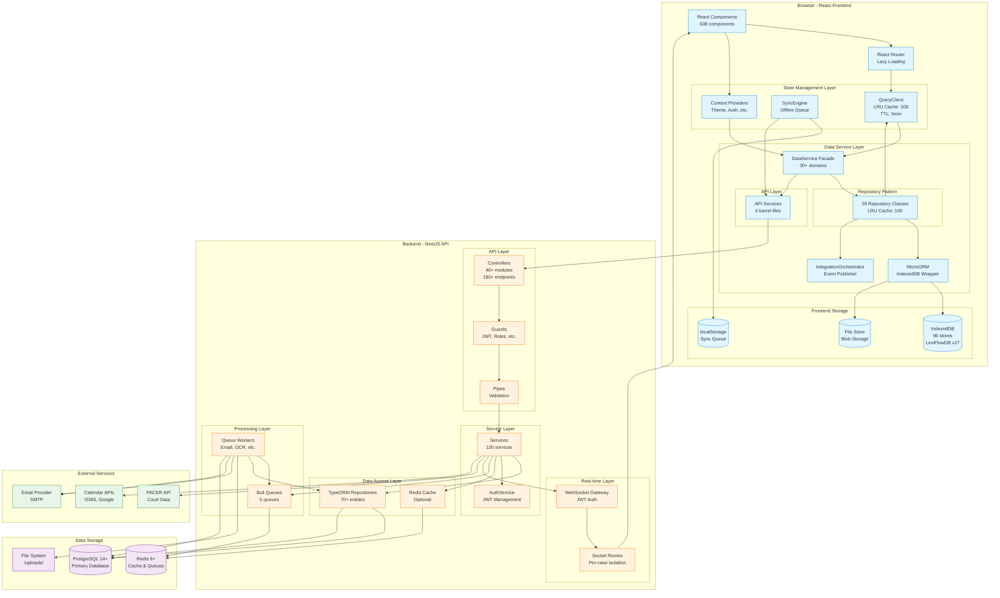
```mermaid
flowchart TB
    subgraph "Browser - React Frontend"
        UI[React Components<br/>638 components]
        Router[React Router<br/>Lazy Loading]

        subgraph "State Management Layer"
            QC[QueryClient<br/>LRU Cache: 100<br/>TTL: 5min]
            SE[SyncEngine<br/>Offline Queue]
            CTX[Context Providers<br/>Theme, Auth, etc.]
        end

        subgraph "Data Service Layer"
            DS[DataService Facade<br/>30+ domains]

            subgraph "Repository Pattern"
                REPOS[28 Repository Classes<br/>LRU Cache: 100]
            end

            subgraph "API Layer"
                API[API Services<br/>6 barrel files]
            end

            MO[MicroORM<br/>IndexedDB Wrapper]
            IO[IntegrationOrchestrator<br/>Event Publisher]
        end

        subgraph "Frontend Storage"
            IDB[(IndexedDB<br/>96 stores<br/>LexiFlowDB v27)]
            LS[(localStorage<br/>Sync Queue)]
            FILES[(File Store<br/>Blob Storage)]
        end
    end

    subgraph "Backend - NestJS API"
        subgraph "API Layer"
            CTRL[Controllers<br/>40+ modules<br/>180+ endpoints]
            GUARDS[Guards<br/>JWT, Roles, etc.]
            PIPES[Pipes<br/>Validation]
        end

        subgraph "Service Layer"
            SVC[Services<br/>120 services]
            AUTH[AuthService<br/>JWT Management]
        end

        subgraph "Data Access Layer"
            TORM[TypeORM Repositories<br/>70+ entities]
            CACHE[Redis Cache<br/>Optional]
        end

        subgraph "Processing Layer"
            QUEUES[Bull Queues<br/>5 queues]
            WORKERS[Queue Workers<br/>Email, OCR, etc.]
        end

        subgraph "Real-time Layer"
            WS[WebSocket Gateway<br/>JWT Auth]
            ROOMS[Socket Rooms<br/>Per-case isolation]
        end
    end

    subgraph "Data Storage"
        PG[(PostgreSQL 14+<br/>Primary Database)]
        REDIS[(Redis 6+<br/>Cache & Queues)]
        FS[File System<br/>/uploads/]
    end

    subgraph "External Services"
        PACER[PACER API<br/>Court Data]
        EMAIL[Email Provider<br/>SMTP]
        CALENDAR[Calendar APIs<br/>O365, Google]
    end

    %% Frontend Flow
    UI --> Router
    Router --> QC
    QC --> DS
    UI --> CTX
    CTX --> DS

    DS --> REPOS
    DS --> API

    REPOS --> MO
    REPOS --> IO
    REPOS --> QC

    MO --> IDB
    MO --> FILES

    SE --> LS
    SE --> API

    %% Backend API Flow
    API --> CTRL
    CTRL --> GUARDS
    GUARDS --> PIPES
    PIPES --> SVC

    SVC --> TORM
    SVC --> AUTH
    SVC --> CACHE
    SVC --> QUEUES
    SVC --> WS

    TORM --> PG
    CACHE --> REDIS
    QUEUES --> REDIS

    WORKERS --> QUEUES
    WORKERS --> TORM
    WORKERS --> FS
    WORKERS --> EMAIL

    WS --> ROOMS
    ROOMS --> UI

    %% External Integrations
    SVC --> PACER
    SVC --> CALENDAR
    WORKERS --> EMAIL

    %% Data Persistence
    TORM --> PG
    WORKERS --> PG

    classDef frontend fill:#e1f5ff,stroke:#0288d1
    classDef backend fill:#fff3e0,stroke:#ff6f00
    classDef storage fill:#f3e5f5,stroke:#7b1fa2
    classDef external fill:#e8f5e9,stroke:#388e3c

    class UI,Router,QC,SE,CTX,DS,REPOS,API,MO,IO,IDB,LS,FILES frontend
    class CTRL,GUARDS,PIPES,SVC,AUTH,TORM,CACHE,QUEUES,WORKERS,WS,ROOMS backend
    class PG,REDIS,FS storage
    class PACER,EMAIL,CALENDAR external
```

---

## 2. Frontend Data Flow (Offline-First)

### 2.1 Read Operation Flow

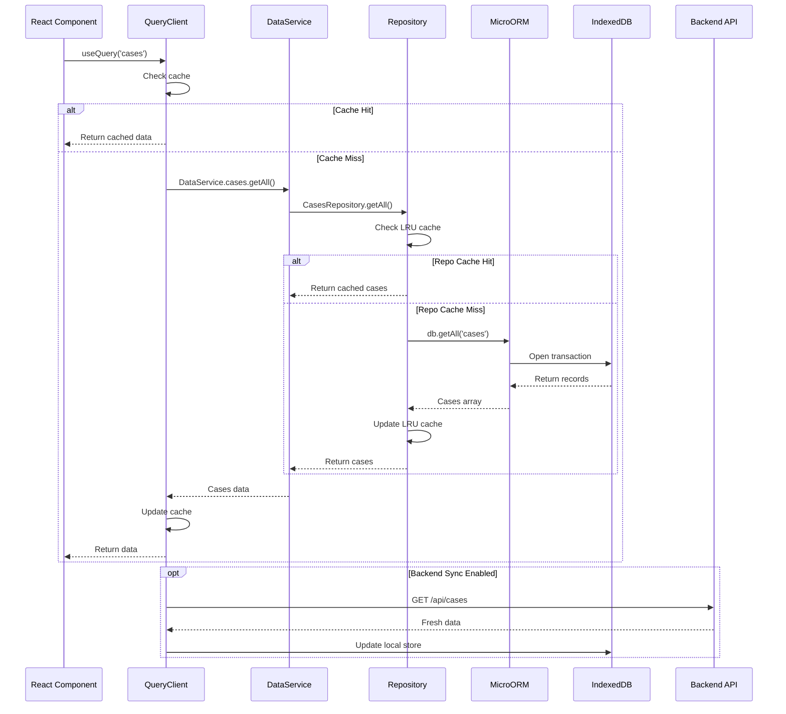
```mermaid
sequenceDiagram
    participant UI as React Component
    participant QC as QueryClient
    participant DS as DataService
    participant Repo as Repository
    participant MO as MicroORM
    participant IDB as IndexedDB
    participant API as Backend API

    UI->>QC: useQuery('cases')
    QC->>QC: Check cache

    alt Cache Hit
        QC-->>UI: Return cached data
    else Cache Miss
        QC->>DS: DataService.cases.getAll()
        DS->>Repo: CasesRepository.getAll()
        Repo->>Repo: Check LRU cache

        alt Repo Cache Hit
            Repo-->>DS: Return cached cases
        else Repo Cache Miss
            Repo->>MO: db.getAll('cases')
            MO->>IDB: Open transaction
            IDB-->>MO: Return records
            MO-->>Repo: Cases array
            Repo->>Repo: Update LRU cache
            Repo-->>DS: Return cases
        end

        DS-->>QC: Cases data
        QC->>QC: Update cache
        QC-->>UI: Return data
    end

    opt Backend Sync Enabled
        QC->>API: GET /api/cases
        API-->>QC: Fresh data
        QC->>IDB: Update local store
    end
```

### 2.2 Write Operation Flow

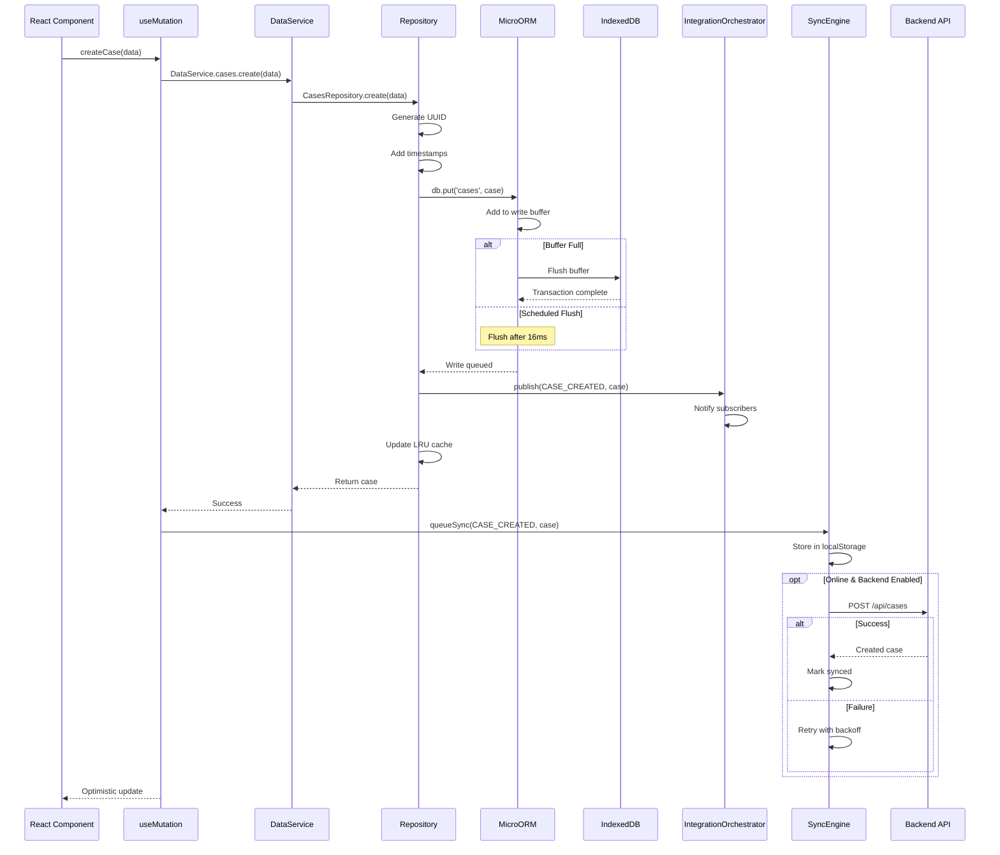
```mermaid
sequenceDiagram
    participant UI as React Component
    participant Mut as useMutation
    participant DS as DataService
    participant Repo as Repository
    participant MO as MicroORM
    participant IDB as IndexedDB
    participant IO as IntegrationOrchestrator
    participant SE as SyncEngine
    participant API as Backend API

    UI->>Mut: createCase(data)
    Mut->>DS: DataService.cases.create(data)
    DS->>Repo: CasesRepository.create(data)

    Repo->>Repo: Generate UUID
    Repo->>Repo: Add timestamps

    Repo->>MO: db.put('cases', case)
    MO->>MO: Add to write buffer

    alt Buffer Full
        MO->>IDB: Flush buffer
        IDB-->>MO: Transaction complete
    else Scheduled Flush
        Note over MO: Flush after 16ms
    end

    MO-->>Repo: Write queued

    Repo->>IO: publish(CASE_CREATED, case)
    IO->>IO: Notify subscribers

    Repo->>Repo: Update LRU cache
    Repo-->>DS: Return case
    DS-->>Mut: Success

    Mut->>SE: queueSync(CASE_CREATED, case)
    SE->>SE: Store in localStorage

    opt Online & Backend Enabled
        SE->>API: POST /api/cases

        alt Success
            API-->>SE: Created case
            SE->>SE: Mark synced
        else Failure
            SE->>SE: Retry with backoff
        end
    end

    Mut-->>UI: Optimistic update
```

### 2.3 Integration Event Flow

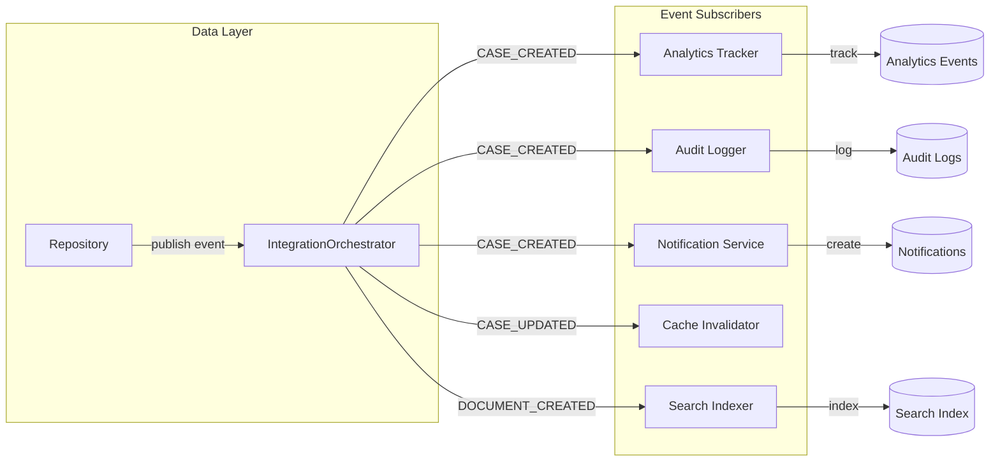
```mermaid
flowchart LR
    subgraph "Data Layer"
        Repo[Repository]
        IO[IntegrationOrchestrator]
    end

    subgraph "Event Subscribers"
        Analytics[Analytics Tracker]
        Audit[Audit Logger]
        Notif[Notification Service]
        Cache[Cache Invalidator]
        Search[Search Indexer]
    end

    Repo -->|publish event| IO
    IO -->|CASE_CREATED| Analytics
    IO -->|CASE_CREATED| Audit
    IO -->|CASE_CREATED| Notif
    IO -->|CASE_UPDATED| Cache
    IO -->|DOCUMENT_CREATED| Search

    Analytics -->|track| Analytics_DB[(Analytics Events)]
    Audit -->|log| Audit_DB[(Audit Logs)]
    Notif -->|create| Notif_DB[(Notifications)]
    Search -->|index| Search_DB[(Search Index)]
```

---

## 3. Backend Data Flow

### 3.1 REST API Request Flow

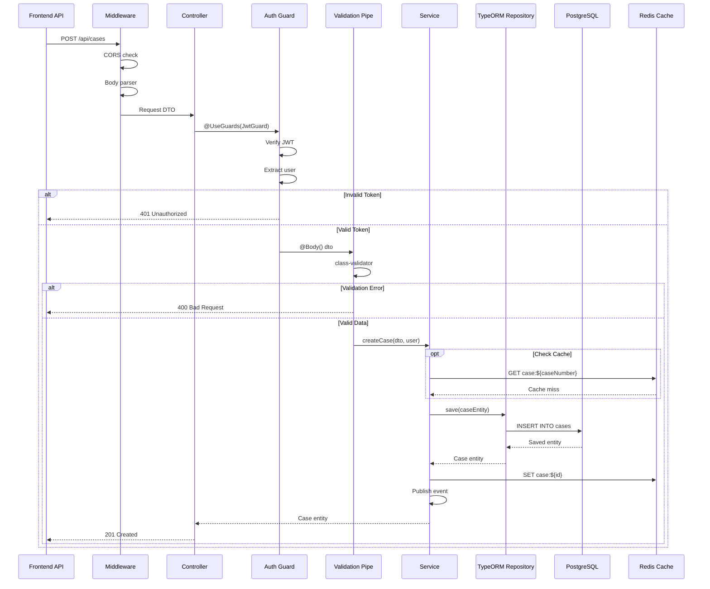
```mermaid
sequenceDiagram
    participant Client as Frontend API
    participant MW as Middleware
    participant CTRL as Controller
    participant GUARD as Auth Guard
    participant PIPE as Validation Pipe
    participant SVC as Service
    participant REPO as TypeORM Repository
    participant PG as PostgreSQL
    participant CACHE as Redis Cache

    Client->>MW: POST /api/cases
    MW->>MW: CORS check
    MW->>MW: Body parser

    MW->>CTRL: Request DTO
    CTRL->>GUARD: @UseGuards(JwtGuard)
    GUARD->>GUARD: Verify JWT
    GUARD->>GUARD: Extract user

    alt Invalid Token
        GUARD-->>Client: 401 Unauthorized
    else Valid Token
        GUARD->>PIPE: @Body() dto
        PIPE->>PIPE: class-validator

        alt Validation Error
            PIPE-->>Client: 400 Bad Request
        else Valid Data
            PIPE->>SVC: createCase(dto, user)

            opt Check Cache
                SVC->>CACHE: GET case:${caseNumber}
                CACHE-->>SVC: Cache miss
            end

            SVC->>REPO: save(caseEntity)
            REPO->>PG: INSERT INTO cases
            PG-->>REPO: Saved entity
            REPO-->>SVC: Case entity

            SVC->>CACHE: SET case:${id}
            SVC->>SVC: Publish event

            SVC-->>CTRL: Case entity
            CTRL-->>Client: 201 Created
        end
    end
```

### 3.2 Queue-Based Processing

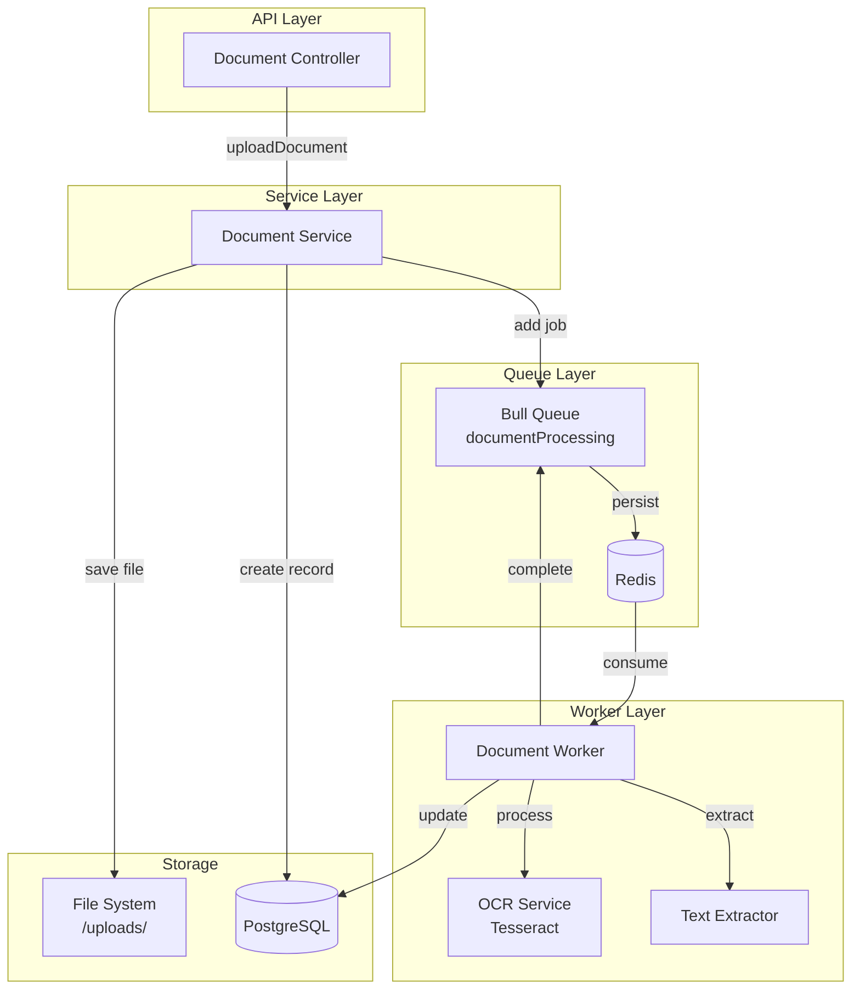
```mermaid
flowchart TB
    subgraph "API Layer"
        CTRL[Document Controller]
    end

    subgraph "Service Layer"
        DOC_SVC[Document Service]
    end

    subgraph "Queue Layer"
        QUEUE[Bull Queue<br/>documentProcessing]
        REDIS[(Redis)]
    end

    subgraph "Worker Layer"
        WORKER[Document Worker]
        OCR[OCR Service<br/>Tesseract]
        EXTRACT[Text Extractor]
    end

    subgraph "Storage"
        FS[File System<br/>/uploads/]
        PG[(PostgreSQL)]
    end

    CTRL -->|uploadDocument| DOC_SVC
    DOC_SVC -->|save file| FS
    DOC_SVC -->|create record| PG
    DOC_SVC -->|add job| QUEUE
    QUEUE -->|persist| REDIS

    REDIS -->|consume| WORKER
    WORKER -->|process| OCR
    WORKER -->|extract| EXTRACT
    WORKER -->|update| PG
    WORKER -->|complete| QUEUE
```

### 3.3 WebSocket Real-Time Flow

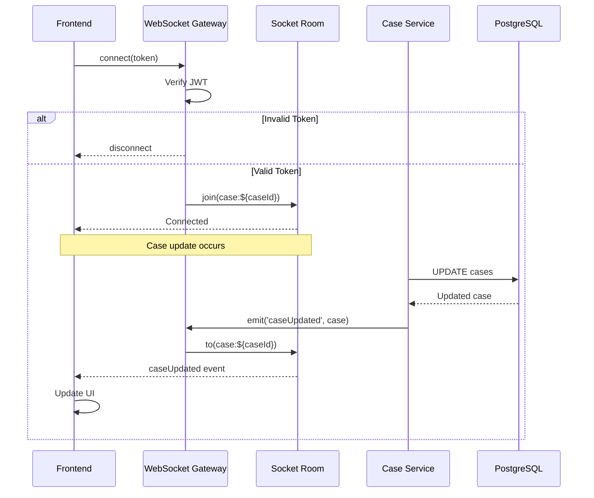
```mermaid
sequenceDiagram
    participant Client as Frontend
    participant Gateway as WebSocket Gateway
    participant Room as Socket Room
    participant SVC as Case Service
    participant PG as PostgreSQL

    Client->>Gateway: connect(token)
    Gateway->>Gateway: Verify JWT

    alt Invalid Token
        Gateway-->>Client: disconnect
    else Valid Token
        Gateway->>Room: join(case:${caseId})
        Room-->>Client: Connected

        Note over Client,Room: Case update occurs

        SVC->>PG: UPDATE cases
        PG-->>SVC: Updated case
        SVC->>Gateway: emit('caseUpdated', case)
        Gateway->>Room: to(case:${caseId})
        Room-->>Client: caseUpdated event

        Client->>Client: Update UI
    end
```

---

## 4. Synchronization Flow (Offline to Online)

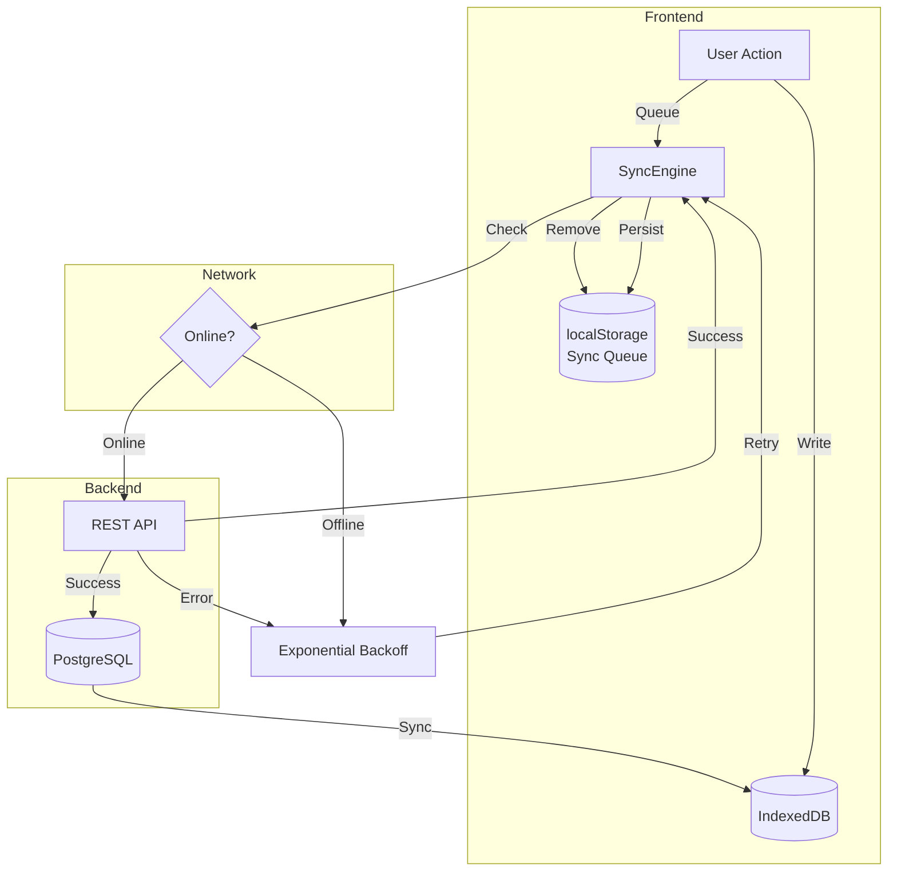
```mermaid
flowchart TB
    subgraph "Frontend"
        UI[User Action]
        SE[SyncEngine]
        LS[(localStorage<br/>Sync Queue)]
        IDB[(IndexedDB)]
    end

    subgraph "Network"
        CONN{Online?}
    end

    subgraph "Backend"
        API[REST API]
        PG[(PostgreSQL)]
    end

    UI -->|Write| IDB
    UI -->|Queue| SE
    SE -->|Persist| LS

    SE -->|Check| CONN

    CONN -->|Online| API
    CONN -->|Offline| Retry[Exponential Backoff]

    API -->|Success| PG
    API -->|Success| SE
    SE -->|Remove| LS

    API -->|Error| Retry
    Retry -->|Retry| SE

    PG -->|Sync| IDB
```

### Sync Engine Algorithm

```typescript
// Simplified SyncEngine logic
class SyncEngine {
  async processQueue() {
    const queue = this.getQueueFromLocalStorage();

    for (const item of queue) {
      if (!navigator.onLine) {
        await this.wait(1000);
        continue;
      }

      try {
        await this.syncToBackend(item);
        this.removeFromQueue(item.id);
      } catch (error) {
        item.retryCount++;
        item.nextRetry = Date.now() + this.backoff(item.retryCount);
        this.updateQueue(item);
      }
    }
  }

  backoff(retryCount: number): number {
    return Math.min(1000 * Math.pow(2, retryCount), 60000);
  }
}
```

---

## 5. Caching Strategy

### 5.1 Frontend Caching Layers

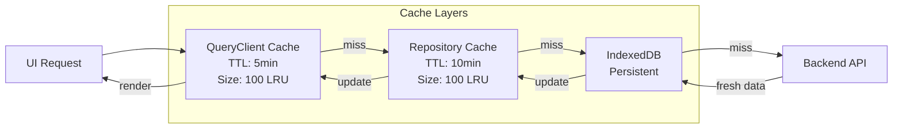
```mermaid
flowchart LR
    UI[UI Request]

    subgraph "Cache Layers"
        L1[QueryClient Cache<br/>TTL: 5min<br/>Size: 100 LRU]
        L2[Repository Cache<br/>TTL: 10min<br/>Size: 100 LRU]
        L3[IndexedDB<br/>Persistent]
    end

    API[Backend API]

    UI --> L1
    L1 -->|miss| L2
    L2 -->|miss| L3
    L3 -->|miss| API

    API -->|fresh data| L3
    L3 -->|update| L2
    L2 -->|update| L1
    L1 -->|render| UI
```

### 5.2 Backend Caching Strategy

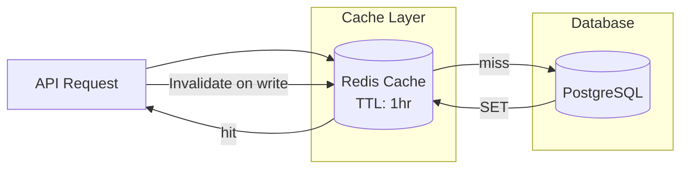
```mermaid
flowchart LR
    API[API Request]

    subgraph "Cache Layer"
        REDIS[(Redis Cache<br/>TTL: 1hr)]
    end

    subgraph "Database"
        PG[(PostgreSQL)]
    end

    API --> REDIS
    REDIS -->|miss| PG
    PG -->|SET| REDIS
    REDIS -->|hit| API

    API -->|Invalidate on write| REDIS
```

---

## 6. File Upload Flow

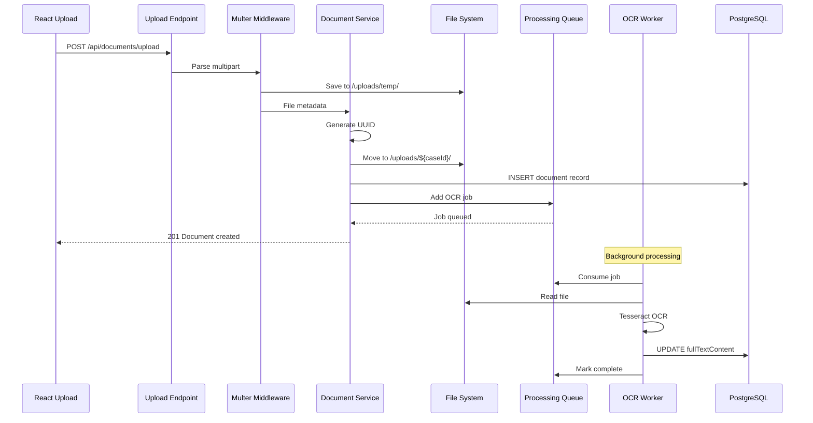
```mermaid
sequenceDiagram
    participant UI as React Upload
    participant API as Upload Endpoint
    participant Multer as Multer Middleware
    participant SVC as Document Service
    participant FS as File System
    participant Queue as Processing Queue
    participant Worker as OCR Worker
    participant PG as PostgreSQL

    UI->>API: POST /api/documents/upload
    API->>Multer: Parse multipart
    Multer->>FS: Save to /uploads/temp/
    Multer->>SVC: File metadata

    SVC->>SVC: Generate UUID
    SVC->>FS: Move to /uploads/${caseId}/
    SVC->>PG: INSERT document record

    SVC->>Queue: Add OCR job
    Queue-->>SVC: Job queued
    SVC-->>UI: 201 Document created

    Note over Worker: Background processing

    Worker->>Queue: Consume job
    Worker->>FS: Read file
    Worker->>Worker: Tesseract OCR
    Worker->>PG: UPDATE fullTextContent
    Worker->>Queue: Mark complete
```

---

## 7. Search & Indexing Flow

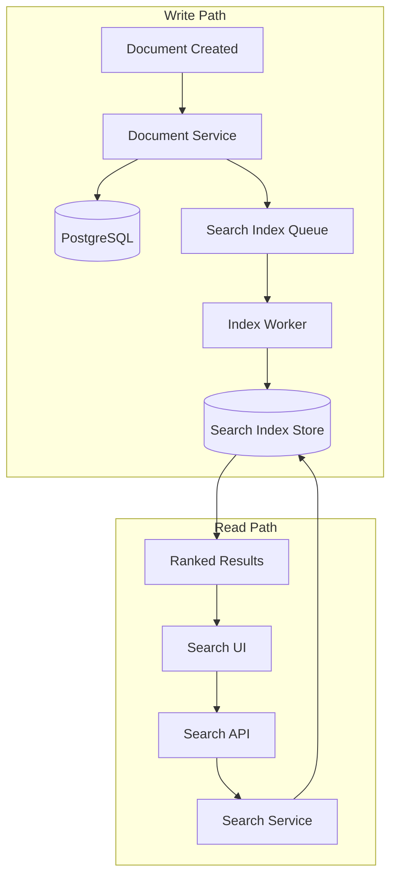
```mermaid
flowchart TB
    subgraph "Write Path"
        DOC[Document Created]
        SVC[Document Service]
        PG[(PostgreSQL)]
        Queue[Search Index Queue]
        Worker[Index Worker]
        SEARCH[(Search Index Store)]
    end

    subgraph "Read Path"
        UI[Search UI]
        API[Search API]
        SRCH_SVC[Search Service]
        RESULT[Ranked Results]
    end

    DOC --> SVC
    SVC --> PG
    SVC --> Queue
    Queue --> Worker
    Worker --> SEARCH

    UI --> API
    API --> SRCH_SVC
    SRCH_SVC --> SEARCH
    SEARCH --> RESULT
    RESULT --> UI
```

---

## 8. Authentication Flow

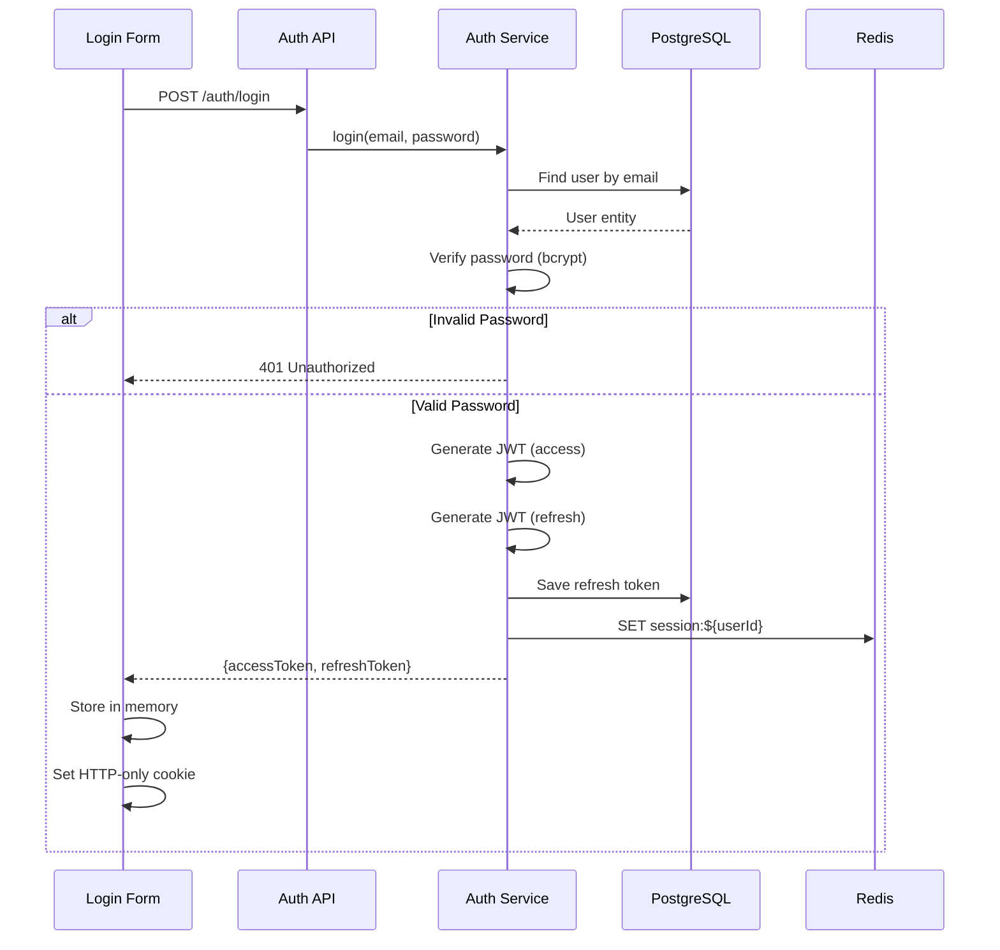
```mermaid
sequenceDiagram
    participant UI as Login Form
    participant API as Auth API
    participant SVC as Auth Service
    participant PG as PostgreSQL
    participant REDIS as Redis

    UI->>API: POST /auth/login
    API->>SVC: login(email, password)
    SVC->>PG: Find user by email
    PG-->>SVC: User entity

    SVC->>SVC: Verify password (bcrypt)

    alt Invalid Password
        SVC-->>UI: 401 Unauthorized
    else Valid Password
        SVC->>SVC: Generate JWT (access)
        SVC->>SVC: Generate JWT (refresh)
        SVC->>PG: Save refresh token
        SVC->>REDIS: SET session:${userId}
        SVC-->>UI: {accessToken, refreshToken}

        UI->>UI: Store in memory
        UI->>UI: Set HTTP-only cookie
    end
```

---

## 9. Audit Trail Flow

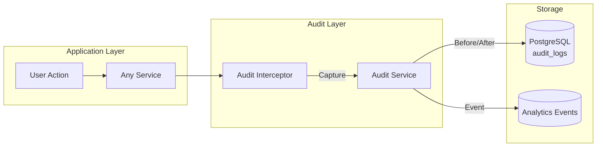
```mermaid
flowchart LR
    subgraph "Application Layer"
        Action[User Action]
        SVC[Any Service]
    end

    subgraph "Audit Layer"
        Interceptor[Audit Interceptor]
        Logger[Audit Service]
    end

    subgraph "Storage"
        PG[(PostgreSQL<br/>audit_logs)]
        ANLT[(Analytics Events)]
    end

    Action --> SVC
    SVC --> Interceptor
    Interceptor -->|Capture| Logger
    Logger -->|Before/After| PG
    Logger -->|Event| ANLT
```

---

## 10. Error Handling & Retry Flow

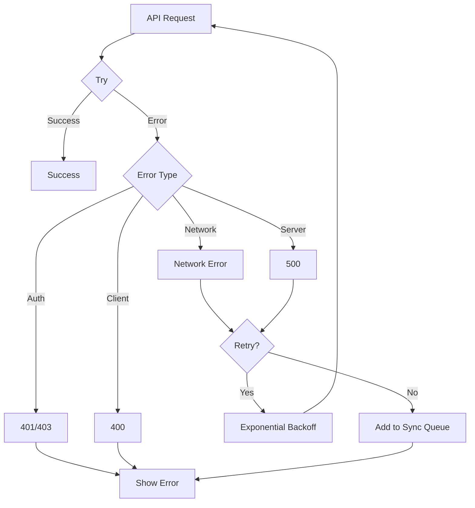
```mermaid
flowchart TB
    Request[API Request]
    Try{Try}
    Success[Success]
    Error{Error Type}

    Network[Network Error]
    Auth[401/403]
    Server[500]
    Client[400]

    Retry{Retry?}
    Backoff[Exponential Backoff]
    Queue[Add to Sync Queue]
    Fail[Show Error]

    Request --> Try
    Try -->|Success| Success
    Try -->|Error| Error

    Error -->|Network| Network
    Error -->|Auth| Auth
    Error -->|Server| Server
    Error -->|Client| Client

    Network --> Retry
    Server --> Retry

    Retry -->|Yes| Backoff
    Retry -->|No| Queue

    Backoff --> Request

    Auth --> Fail
    Client --> Fail
    Queue --> Fail
```

---

## 11. Bulk Operation Flow

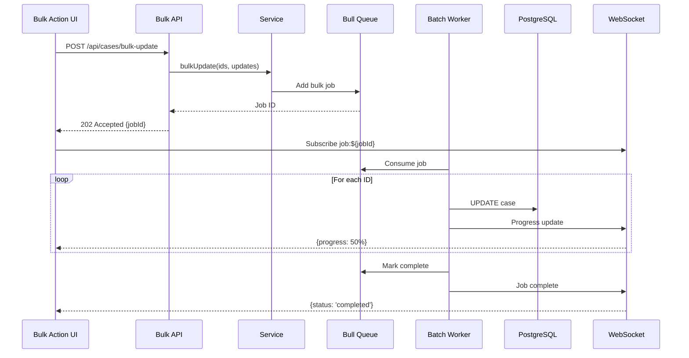
```mermaid
sequenceDiagram
    participant UI as Bulk Action UI
    participant API as Bulk API
    participant SVC as Service
    participant Queue as Bull Queue
    participant Worker as Batch Worker
    participant PG as PostgreSQL
    participant WS as WebSocket

    UI->>API: POST /api/cases/bulk-update
    API->>SVC: bulkUpdate(ids, updates)
    SVC->>Queue: Add bulk job
    Queue-->>API: Job ID
    API-->>UI: 202 Accepted {jobId}

    UI->>WS: Subscribe job:${jobId}

    Worker->>Queue: Consume job

    loop For each ID
        Worker->>PG: UPDATE case
        Worker->>WS: Progress update
        WS-->>UI: {progress: 50%}
    end

    Worker->>Queue: Mark complete
    Worker->>WS: Job complete
    WS-->>UI: {status: 'completed'}
```

---

## 12. Data Migration Flow

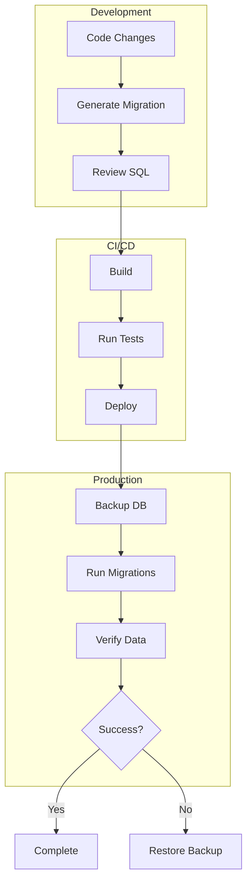
```mermaid
flowchart TB
    subgraph "Development"
        Code[Code Changes]
        Gen[Generate Migration]
        Review[Review SQL]
    end

    subgraph "CI/CD"
        Build[Build]
        Test[Run Tests]
        Deploy[Deploy]
    end

    subgraph "Production"
        Backup[Backup DB]
        Migrate[Run Migrations]
        Verify[Verify Data]
        Rollback{Success?}
    end

    Code --> Gen
    Gen --> Review
    Review --> Build
    Build --> Test
    Test --> Deploy
    Deploy --> Backup
    Backup --> Migrate
    Migrate --> Verify
    Verify --> Rollback

    Rollback -->|Yes| Done[Complete]
    Rollback -->|No| Restore[Restore Backup]
```

---

## 13. Performance Optimization Strategies

### 13.1 Query Optimization

```typescript
// ✗ N+1 Query Problem
const cases = await caseRepo.find();
for (const case of cases) {
  case.client = await clientRepo.findOne(case.clientId);
}

// ✓ Eager Loading
const cases = await caseRepo.find({
  relations: ['client', 'parties', 'documents']
});
```

### 13.2 Batch Processing

```typescript
// ✗ Sequential writes
for (const doc of documents) {
  await db.put('documents', doc);
}

// ✓ Bulk write
await db.bulkPut('documents', documents);
```

### 13.3 Index Usage

```typescript
// ✗ Full table scan
const tasks = (await db.getAll('tasks'))
  .filter(t => t.caseId === caseId && t.status === 'active');

// ✓ Compound index
const tasks = await db.getByIndex('tasks', 'caseId_status', [caseId, 'active']);
```

---

## 14. Data Consistency Patterns

### 14.1 Optimistic Locking

```typescript
// Entity with version
@Entity()
class Case {
  @VersionColumn()
  version: number;
}

// Update with version check
await caseRepo.update(
  { id, version },
  { ...updates, version: version + 1 }
);
```

### 14.2 Eventual Consistency

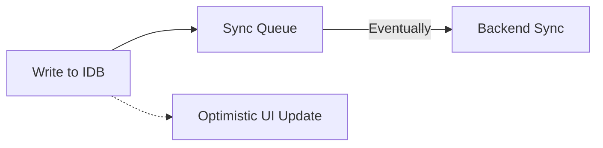
```mermaid
flowchart LR
    Write[Write to IDB]
    Queue[Sync Queue]
    Backend[Backend Sync]

    Write --> Queue
    Queue -->|Eventually| Backend

    Note[Optimistic UI Update]
    Write -.-> Note
```

### 14.3 Two-Phase Commit (Not Implemented)

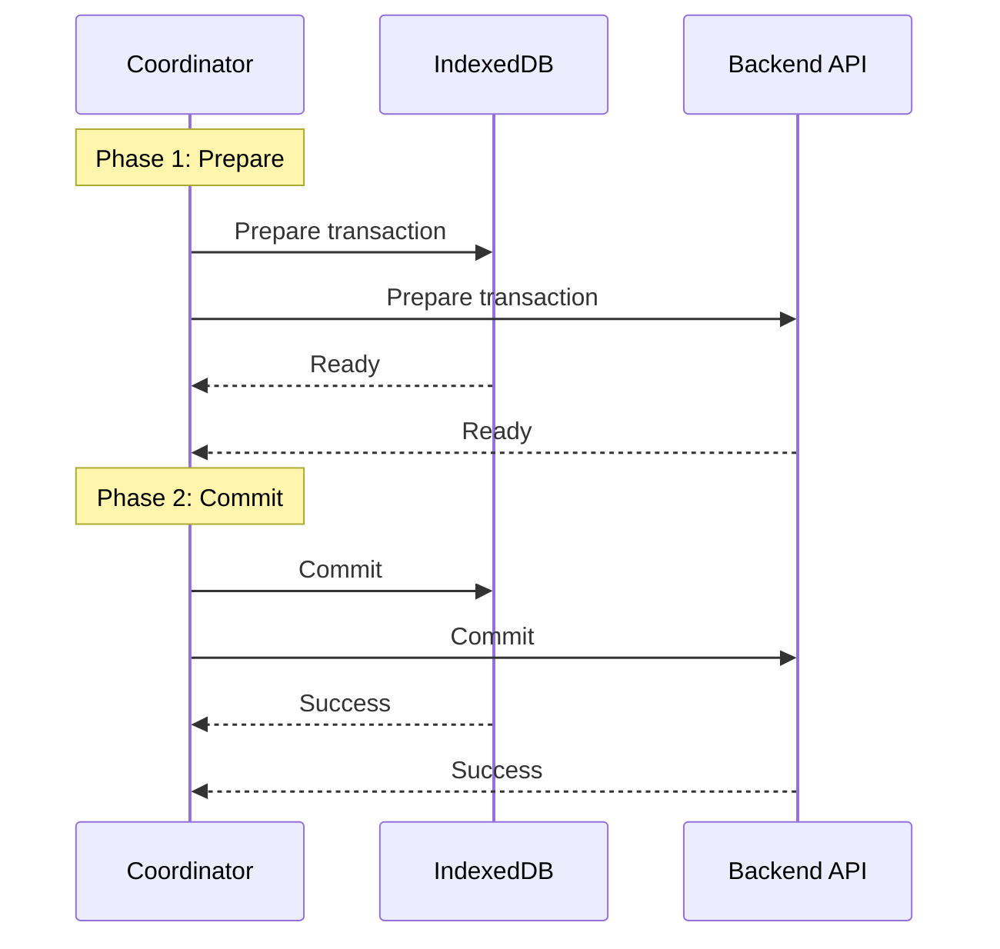
```mermaid
sequenceDiagram
    participant Coord as Coordinator
    participant IDB as IndexedDB
    participant API as Backend API

    Note over Coord: Phase 1: Prepare
    Coord->>IDB: Prepare transaction
    Coord->>API: Prepare transaction
    IDB-->>Coord: Ready
    API-->>Coord: Ready

    Note over Coord: Phase 2: Commit
    Coord->>IDB: Commit
    Coord->>API: Commit
    IDB-->>Coord: Success
    API-->>Coord: Success
```

---

## 15. Monitoring & Observability

### Data Flow Metrics

| Metric | Description | Threshold |
|--------|-------------|-----------|
| Cache Hit Rate | QueryClient + Repository | >80% |
| Sync Queue Size | Pending offline ops | <100 |
| Write Buffer Size | IndexedDB buffer | <500 |
| API Response Time | Backend latency | <200ms |
| IndexedDB Write Time | Transaction time | <50ms |
| WebSocket Latency | Real-time delay | <100ms |

### Logging Points

```typescript
// Frontend
console.log('[DataService] Fetching cases from IDB');
console.log('[SyncEngine] Queued 5 items for sync');
console.log('[MicroORM] Write buffer at 300/1000');

// Backend
logger.log('Processing document job', { jobId, documentId });
logger.error('Failed to sync case', { caseId, error });
logger.warn('Cache miss for case lookup', { caseId });
```

---

## 16. Data Flow Best Practices

### Frontend

1. **Always use DataService** - Never bypass Repository layer
2. **Handle offline gracefully** - Queue writes, show cached data
3. **Optimize re-renders** - Use memoization for expensive computations
4. **Clean up subscriptions** - Prevent memory leaks
5. **Validate before write** - Client-side validation before IndexedDB

### Backend

1. **Use DTOs** - Validate input with class-validator
2. **Implement pagination** - Never return unbounded results
3. **Use transactions** - Ensure data consistency
4. **Cache aggressively** - Reduce database load
5. **Queue long tasks** - Don't block HTTP responses

### Security

1. **Validate all inputs** - Prevent SQL injection
2. **Sanitize outputs** - Prevent XSS
3. **Check permissions** - Row-level security
4. **Audit sensitive ops** - Track all changes
5. **Rate limit APIs** - Prevent abuse

---

## End of Data Flow Architecture Documentation
