[< Back to Index](../../00-ENTERPRISE-TAXONOMY-INDEX.md) | [< Back to Primary Flow](../PRIMARY-FLOW.md)

# Matter Intake - SECONDARY FLOW

##  Operational Objective
Streamlined client onboarding with automated conflict checking, engagement letter generation, and digital signatures.

---

##  DETAILED WORKFLOW

```mermaid
graph TB
    Start([New Matter Inquiry]) --> LeadSource{Lead<br/>Source}
    
    LeadSource -->|Website| WebForm[Web Intake Form]
    LeadSource -->|Referral| ReferralIntake[Referral Intake]
    LeadSource -->|Phone| PhoneIntake[Phone Call Log]
    LeadSource -->|Walk-In| WalkInIntake[In-Person Intake]
    
    WebForm --> CaptureInfo[Capture Client Info]
    ReferralIntake --> CaptureInfo
    PhoneIntake --> CaptureInfo
    WalkInIntake --> CaptureInfo
    
    CaptureInfo --> BasicDetails{Required<br/>Fields Complete?}
    BasicDetails -->|No| RequestInfo[Request Missing Info]
    BasicDetails -->|Yes| ConflictCheck[Run Conflict Check]
    RequestInfo --> BasicDetails
    
    ConflictCheck --> ConflictDB[(Conflict Database)]
    ConflictDB --> AIConflictEngine[AI Conflict Detection]
    
    AIConflictEngine --> EntityResolution[Entity Resolution]
    EntityResolution --> FuzzyMatch[Fuzzy Name Matching]
    FuzzyMatch --> CorporateStructure[Corporate Structure Check]
    CorporateStructure --> RelationshipGraph[Relationship Graph Analysis]
    
    RelationshipGraph --> ConflictResult{Conflict<br/>Detected?}
    ConflictResult -->|None| ClearConflict[Clear - No Conflict]
    ConflictResult -->|Potential| PotentialConflict[Potential Conflict Flagged]
    ConflictResult -->|Direct| DirectConflict[Direct Conflict]
    
    ClearConflict --> PracticeAreaAssign[Assign Practice Area]
    
    PotentialConflict --> EthicsReview[Ethics Committee Review]
    EthicsReview --> EthicsDecision{Ethics<br/>Decision}
    EthicsDecision -->|Approved with Waiver| ConflictWaiver[Document Conflict Waiver]
    EthicsDecision -->|Declined| DeclineEngagement[Decline Engagement]
    ConflictWaiver --> PracticeAreaAssign
    
    DirectConflict --> DeclineEngagement
    DeclineEngagement --> DeclineLetter[Send Decline Letter]
    DeclineLetter --> LogDecline[Log Declined Matter]
    LogDecline --> End([Intake Complete - Declined])
    
    PracticeAreaAssign --> AttorneyAssignment[Assign Lead Attorney]
    AttorneyAssignment --> StaffingCheck{Capacity<br/>Check}
    StaffingCheck -->|Overbooked| ReassignAttorney[Reassign Attorney]
    StaffingCheck -->|Available| GenerateEngagement[Generate Engagement Letter]
    ReassignAttorney --> GenerateEngagement
    
    GenerateEngagement --> TemplateSelect[Select Letter Template]
    TemplateSelect --> MergeData[Merge Client Data]
    MergeData --> FeeStructure[Define Fee Structure]
    
    FeeStructure --> FeeType{Fee<br/>Type}
    FeeType -->|Hourly| HourlyRates[Set Hourly Rates]
    FeeType -->|Flat Fee| FlatFee[Set Flat Fee]
    FeeType -->|Contingency| ContingencyPct[Set Contingency %]
    FeeType -->|Hybrid| HybridFee[Set Hybrid Structure]
    
    HourlyRates --> Retainer[Define Retainer Amount]
    FlatFee --> Retainer
    ContingencyPct --> Retainer
    HybridFee --> Retainer
    
    Retainer --> ScopeOfWork[Define Scope of Work]
    ScopeOfWork --> LimitationsClause[Add Limitations Clause]
    LimitationsClause --> TermsConditions[Standard Terms & Conditions]
    TermsConditions --> FinalReview[Attorney Review]
    
    FinalReview --> ReviewApproved{Approved?}
    ReviewApproved -->|No| ReviseEngagement[Revise Engagement Letter]
    ReviewApproved -->|Yes| SendForSignature[Send for E-Signature]
    ReviseEngagement --> FinalReview
    
    SendForSignature --> DocuSignAPI[DocuSign API]
    DocuSignAPI --> ClientNotification[Notify Client]
    ClientNotification --> AwaitSignature{Client<br/>Signed?}
    
    AwaitSignature -->|Not Yet| ReminderSchedule[Schedule Reminders]
    ReminderSchedule --> ReminderSent[Send Reminder]
    ReminderSent --> AwaitSignature
    
    AwaitSignature -->|Signed| VerifySignature[Verify Signature]
    VerifySignature --> CounterSign[Attorney Countersign]
    CounterSign --> FullyExecuted[Fully Executed Agreement]
    
    FullyExecuted --> CreateMatterRecord[Create Matter Record]
    CreateMatterRecord --> MatterNumber[Generate Matter Number]
    MatterNumber --> MatterDB[(Matter Database)]
    
    MatterDB --> InitializeBilling[Initialize Billing Config]
    InitializeBilling --> CreateTrustAccount[Create Trust Account]
    CreateTrustAccount --> SetupCalendar[Setup Matter Calendar]
    SetupCalendar --> AssignTeam[Assign Support Team]
    
    AssignTeam --> IntakeChecklist[Complete Intake Checklist]
    IntakeChecklist --> NotifyTeam[Notify Legal Team]
    NotifyTeam --> ClientPortalAccess[Grant Client Portal Access]
    ClientPortalAccess --> WelcomePackage[Send Welcome Package]
    
    WelcomePackage --> IntakeComplete[Mark Intake Complete]
    IntakeComplete --> AnalyticsCapture[Capture Intake Analytics]
    AnalyticsCapture --> End2([Intake Complete - Accepted])
    
    style Start fill:#4f46e5,stroke:#312e81,stroke-width:3px,color:#fff
    style AIConflictEngine fill:#10b981,stroke:#065f46,stroke-width:2px,color:#fff
    style DocuSignAPI fill:#8b5cf6,stroke:#5b21b6,stroke-width:2px,color:#fff
    style CreateMatterRecord fill:#f59e0b,stroke:#92400e,stroke-width:2px,color:#fff
    style End fill:#ef4444,stroke:#991b1b,stroke-width:2px,color:#fff
    style End2 fill:#6366f1,stroke:#312e81,stroke-width:3px,color:#fff
```

---

##  TERTIARY WORKFLOWS

### T1: AI Conflict Detection Engine
- **Input:** Client name, opposing parties, related entities
- **Process:** 
  1. Fuzzy name matching (Levenshtein distance < 3)
  2. Entity resolution (corporate subsidiaries, DBAs)
  3. Relationship graph traversal (BFS up to 3 degrees)
  4. Historical matter analysis
- **Output:** Conflict score (0-100), flagged relationships, recommendation

### T2: E-Signature Integration
- **Providers:** DocuSign, Adobe Sign, HelloSign
- **Workflow:**
  1. Generate PDF from engagement letter template
  2. Define signature fields programmatically
  3. Send via API with webhook callback
  4. Receive signed document with certificate
  5. Store in document vault with blockchain hash

### T3: Matter Numbering Convention
- **Format:** `[YEAR]-[PRACTICE_AREA]-[SEQUENCE]`
- **Example:** `2025-LIT-00123` (2025, Litigation, 123rd matter)
- **Customizable:** Firm can define own format
- **Validation:** Check for uniqueness, increment sequence

---

##  RECOMMENDED ENHANCEMENTS

### AI-Powered Lead Qualification
Train ML model to predict:
- Matter acceptance probability
- Estimated case value
- Resource requirements
- Risk factors

### Automated Background Checks
Integrate with:
- LexisNexis Public Records
- Westlaw PeopleMap
- State bar disciplinary databases
- PACER bankruptcy search

### Smart Engagement Letter Templates
- NLP-powered clause suggestion
- Risk-based terms adjustment
- Jurisdiction-specific language
- Practice area best practices

---

##  METRICS

| KPI | Target | Measurement |
|-----|--------|-------------|
| Intake Time | <15 min | From inquiry to conflict check |
| Conflict Check Duration | <5 min | Automated processing time |
| Engagement Signature Rate | >85% | Signed / Sent |
| Time to First Signature | <48 hours | Avg time client signs |

---

**Implementation Priority:** P1 (Critical)  
**Dependencies:** Conflict database, e-signature API, matter database  
**Estimated Effort:** 6 weeks (2 devs)
