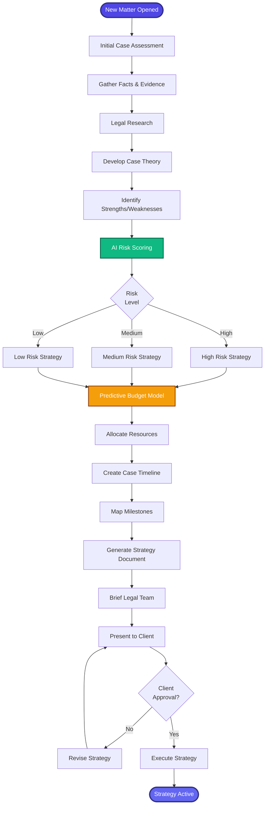

[< Back to Index](../../00-ENTERPRISE-TAXONOMY-INDEX.md) | [< Back to Primary Flow](../PRIMARY-FLOW.md)

# Case Strategy - SECONDARY FLOW

##  Operational Objective
Develop comprehensive case theory, risk assessment, and budget forecasting using AI-powered analytics.

##  DETAILED WORKFLOW

##  TERTIARY WORKFLOWS
- **T1:** AI Risk Scoring Algorithm (ML model: win probability, settlement value, cost prediction)
- **T2:** Budget Forecasting Engine (historical data analysis, attorney rate optimization)
- **T3:** Case Theory Builder (legal research integration, precedent analysis)

##  METRICS
- Strategy Development Time: <4 hours
- Budget Accuracy: >85% variance
- Risk Score Correlation: >0.80 with actual outcomes
