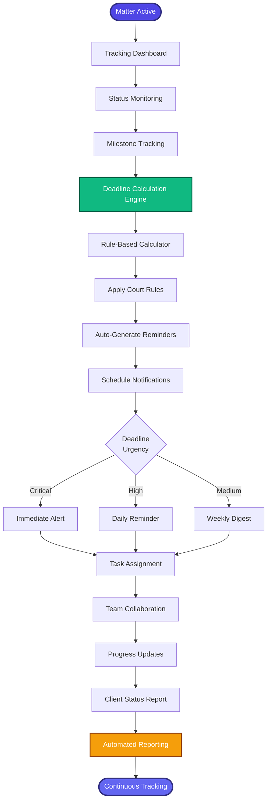

[< Back to Index](../../00-ENTERPRISE-TAXONOMY-INDEX.md) | [< Back to Primary Flow](../PRIMARY-FLOW.md)

# Matter Tracking - SECONDARY FLOW

##  Operational Objective
Real-time matter monitoring with automated deadline management, status updates, and team collaboration.

##  DETAILED WORKFLOW

##  TERTIARY WORKFLOWS
- **T1:** Deadline Calculator (FRCP/state rules engine with business day logic)
- **T2:** Smart Notification Router (ML-powered urgency classification)
- **T3:** Status Update Generator (NLP auto-generation from matter activity)

##  METRICS
- On-Time Task Completion: >95%
- Missed Deadline Rate: <0.1%
- Client Satisfaction with Updates: >4.5/5
