[< Back to Index](../../00-ENTERPRISE-TAXONOMY-INDEX.md) | [< Back to Primary Flow](../PRIMARY-FLOW.md)

# Matter Closure - SECONDARY FLOW

##  Operational Objective
Systematic matter closure with final billing, document archival, analytics capture, and client satisfaction assessment.

##  DETAILED WORKFLOW

```mermaid
graph TB
    Start([Matter Resolution]) --> ClosureInitiation[Initiate Closure Process]
    ClosureInitiation --> FinalBillingReview[Final Billing Review]
    FinalBillingReview --> OutstandingTime[Review Outstanding Time]
    OutstandingTime --> WriteOffAnalysis[Write-Off Analysis]
    
    WriteOffAnalysis --> FinalInvoice[Generate Final Invoice]
    FinalInvoice --> ClientApproval{Client<br/>Approval}
    ClientApproval -->|Rejected| BillingDispute[Resolve Dispute]
    ClientApproval -->|Approved| PaymentCollection[Collect Payment]
    BillingDispute --> FinalInvoice
    
    PaymentCollection --> DocumentArchival[Document Archival]
    DocumentArchival --> ClassifyDocuments[Classify Documents]
    ClassifyDocuments --> RetentionPolicy[Apply Retention Policy]
    RetentionPolicy --> ArchiveStorage[Move to Archive Storage]
    
    ArchiveStorage --> ClientSurvey[Send Client Survey]
    ClientSurvey --> SatisfactionScore[Collect Satisfaction Score]
    SatisfactionScore --> FeedbackAnalysis[Analyze Feedback]
    FeedbackAnalysis --> FollowUpNeeded{Follow-Up<br/>Needed?}
    
    FollowUpNeeded -->|Yes| ClientOutreach[Client Outreach]
    FollowUpNeeded -->|No| AnalyticsCapture[Capture Analytics]
    ClientOutreach --> AnalyticsCapture
    
    AnalyticsCapture --> OutcomeData[Record Outcome Data]
    OutcomeData --> BudgetVariance[Calculate Budget Variance]
    BudgetVariance --> TimelineAnalysis[Timeline Analysis]
    TimelineAnalysis --> LessonsLearned[Document Lessons Learned]
    
    LessonsLearned --> ClosureReport[Generate Closure Report]
    ClosureReport --> MarkClosed[Mark Matter Closed]
    MarkClosed --> End([Matter Closed])
    
    style Start fill:#4f46e5,stroke:#312e81,stroke-width:3px,color:#fff
    style DocumentArchival fill:#10b981,stroke:#065f46,stroke-width:2px,color:#fff
    style AnalyticsCapture fill:#f59e0b,stroke:#92400e,stroke-width:2px,color:#fff
    style End fill:#6366f1,stroke:#312e81,stroke-width:3px,color:#fff
```

##  TERTIARY WORKFLOWS
- **T1:** Automated Document Classification (ML model for doc types)
- **T2:** Retention Policy Engine (jurisdiction-specific rules)
- **T3:** Post-Matter Analytics (budget variance, timeline analysis, profitability)

##  METRICS
- Closure Time: <1 business day
- Final Invoice Dispute Rate: <5%
- Client Survey Response Rate: >60%
- NPS Score: >50
