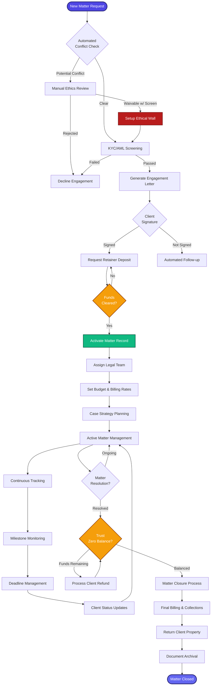

[< Back to Index](../00-ENTERPRISE-TAXONOMY-INDEX.md)

# 01. Matter Lifecycle Management - PRIMARY FLOW

##  Strategic Objective
Complete matter management from initial client contact through case closure, enforcing strict ethical compliance (KYC, Conflicts, Trust Accounting) while automating administrative overhead.

##  Competitive Positioning
- **Competes with:** Clio Manage, LexisNexis CaseMap, PracticePanther, MyCase
- **Differentiation:** "Compliance-First" architecture (Auto-Ethical Walls, Trust-Gated Workflows), AI-powered conflict detection, predictive budget forecasting.

---

## 🚨 CRITICAL GAPS IDENTIFIED & RESOLVED
The following critical legal operations requirements have been integrated into this flow:
1.  **Trust Accounting (IOLTA) Gates:** Work cannot commence until the retainer is deposited and cleared.
2.  **Ethical Walls (Screening):** Automated permission restrictions applied immediately upon conflict waiver approval.
3.  **KYC/AML Compliance:** Mandatory identity and sanctions checks before engagement letter generation.
4.  **Trust Reconciliation:** Hard block on matter closure until trust account balance is zeroed/refunded.

---

##  PRIMARY DOMAIN FLOW



---

##  SECONDARY MODULE INTERACTIONS

```mermaid
graph LR
    subgraph "01-Matter Intake"
        Intake[Intake Form] --> ConflictDB[(Conflict Database)]
        ConflictDB --> Compliance[KYC/AML Service]
        Compliance --> Engagement[Engagement Letter]
    end
    
    subgraph "02-Case Strategy"
        Engagement --> Trust[Trust Accounting]
        Trust --> Strategy[Strategy Builder]
        Strategy --> Budget[Budget Model]
    end
    
    subgraph "03-Matter Tracking"
        Budget --> Timeline[Timeline Manager]
        Timeline --> Tasks[Task Tracking]
        Tasks --> Notifications[Smart Notifications]
    end
    
    subgraph "04-Matter Closure"
        Notifications --> Resolution{Resolution Event}
        Resolution --> TrustAudit[Trust Audit]
        TrustAudit --> FinalBill[Final Billing]
        FinalBill --> Archive[Archival System]
    end
    
    style Intake fill:#8b5cf6,color:#fff
    style Trust fill:#f59e0b,color:#fff
    style Strategy fill:#ec4899,color:#fff
    style TrustAudit fill:#f59e0b,color:#fff
```



---

##  ENTERPRISE REQUIREMENTS vs. CURRENT STATE

### LexisNexis CaseMap Comparison
| Feature | LexisNexis | LexiFlow Current | LexiFlow Target | Gap |
|---------|-----------|------------------|-----------------|-----|
| Conflict Checking | Manual | Automated | AI-Powered | ️ Need ML model |
| Ethical Walls | Manual | None | Automated RBAC | 🔴 Critical Security Gap |
| Trust Accounting | Basic | None | Integrated IOLTA | 🔴 Critical Compliance Gap |
| Budget Forecasting | Basic | Manual | Predictive |  Not implemented |
| Client Portal | Yes | No | Yes |  Build required |

---

##  RECOMMENDED ENHANCEMENTS

### Phase 1: Compliance & Security (Immediate)
1.  **Trust Accounting Integration**
    - Implement `TrustLedger` entity and double-entry bookkeeping logic.
    - Build "Retainer Gate" preventing matter activation without funds.
2.  **Automated Ethical Walls**
    - Integrate Conflict Check result with RBAC system.
    - Create "Negative Permissions" capability (deny access to specific users).
3.  **KYC/AML Service**
    - Integrate with external sanctions list API (OFAC, etc.).

### Phase 2: Core Improvements (Q1 2026)
4.  **AI Conflict Detection**
    - Train ML model on historical conflict data.
    - Implement fuzzy matching for party names.
5.  **Predictive Budget Forecasting**
    - Analyze historical matter data by type.

---

##  TECHNICAL ARCHITECTURE (Backend-First)

### NestJS Modules & Entities
The architecture follows the strict `src/[domain]/` module structure.

**Core Entities (`src/matters/entities/`):**
```typescript
// Matter Entity
@Entity()
export class Matter extends BaseEntity {
  @Column() title: string;
  @Column() status: MatterStatus; // PENDING_RETAINER, ACTIVE, CLOSED
  
  @OneToOne(() => TrustAccount)
  trustAccount: TrustAccount;

  @ManyToMany(() => User)
  @JoinTable()
  assignedTeam: User[];

  @ManyToMany(() => User)
  @JoinTable()
  ethicalWallRestrictedUsers: User[]; // Users explicitly blocked
}

// Trust Account Entity
@Entity()
export class TrustAccount extends BaseEntity {
  @Column('decimal') balance: number;
  @Column() accountNumber: string;
  @OneToMany(() => TrustTransaction)
  transactions: TrustTransaction[];
}
```

### API Endpoints (REST)
```
POST   /api/matters/intake           - Submit new matter request
POST   /api/compliance/conflict-check - Run conflict & KYC check
POST   /api/matters/:id/ethical-wall - Add restricted users (Screening)
POST   /api/trust/deposits           - Record retainer deposit
POST   /api/matters/:id/activate     - Activate matter (requires trust > 0)
GET    /api/matters/:id/ledger       - Get trust account history
POST   /api/matters/:id/close        - Initiate closure (requires trust == 0)
```

### Integration Points
- **Conflict/Compliance** → `backend/src/compliance/` (New Module Required)
- **Trust Accounting** → `backend/src/billing/trust-accounting.service.ts`
- **Matter Management** → `backend/src/matters/`
- **Access Control** → `backend/src/auth/guards/ethical-wall.guard.ts`

---

##  IMPLEMENTATION PRIORITY

**Priority 1 (Critical - Compliance/Risk):**
- [ ] **Trust Accounting Module** (Ledgers, Deposits, Reconciliation)
- [ ] **Ethical Wall Logic** (RBAC Deny-lists)
- [ ] **KYC/AML Integration**

**Priority 2 (Core Functionality):**
- [ ] Client Portal Development
- [ ] AI Conflict Detection System
- [ ] Budget Forecasting Model

**Priority 3 (Enhancement):**
- [ ] E-Filing Integration (PACER)
- [ ] Mobile App Development

---

**See secondary module flows in subdirectories:**
- [01-SECONDARY-matter-intake](./01-SECONDARY-matter-intake/SECONDARY-FLOW.md)
- [02-SECONDARY-case-strategy](./02-SECONDARY-case-strategy/SECONDARY-FLOW.md)
- [03-SECONDARY-matter-tracking](./03-SECONDARY-matter-tracking/SECONDARY-FLOW.md)
- [04-SECONDARY-matter-closure](./04-SECONDARY-matter-closure/SECONDARY-FLOW.md)


## Secondary Flows
- [Matter Intake](./01-SECONDARY-matter-intake/SECONDARY-FLOW.md)
- [Case Strategy](./02-SECONDARY-case-strategy/SECONDARY-FLOW.md)
- [Matter Tracking](./03-SECONDARY-matter-tracking/SECONDARY-FLOW.md)
- [Matter Closure](./04-SECONDARY-matter-closure/SECONDARY-FLOW.md)
