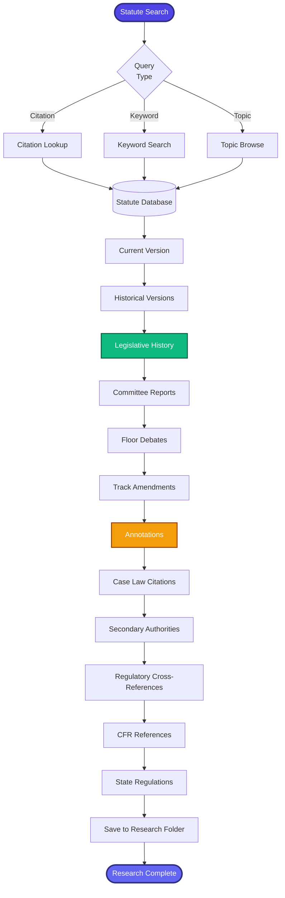

[< Back to Index](../../00-ENTERPRISE-TAXONOMY-INDEX.md) | [< Back to Primary Flow](../PRIMARY-FLOW.md)

# Statutory Research - SECONDARY FLOW

##  Operational Objective
Comprehensive statutory research with legislative history, annotations, and regulatory cross-references.

##  DETAILED WORKFLOW

##  TERTIARY WORKFLOWS
- **T1:** Statute Citation Parser (USC, state code formats)
- **T2:** Legislative History Aggregator (Congress.gov API)
- **T3:** Regulatory Cross-Referencer (CFR linkage)
