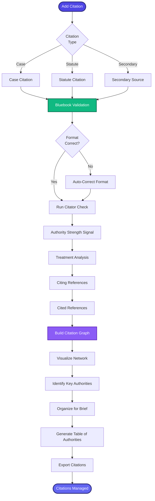

[< Back to Index](../../00-ENTERPRISE-TAXONOMY-INDEX.md) | [< Back to Primary Flow](../PRIMARY-FLOW.md)

# Citation Management - SECONDARY FLOW

##  Operational Objective
Comprehensive citation tracking with Bluebook compliance, authority strength signals, and citation graphs.

##  DETAILED WORKFLOW

##  TERTIARY WORKFLOWS
- **T1:** Bluebook Formatter (regex validation, auto-correction)
- **T2:** Citation Graph Builder (D3.js network visualization)
- **T3:** Table of Authorities Generator (Bluebook-compliant sorting)
