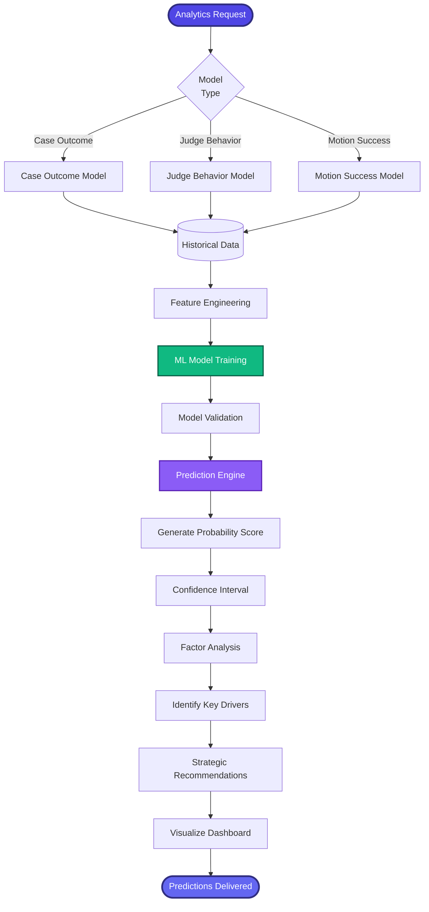

[< Back to Index](../../00-ENTERPRISE-TAXONOMY-INDEX.md) | [< Back to Primary Flow](../PRIMARY-FLOW.md)

# Predictive Analytics - SECONDARY FLOW

##  Operational Objective
AI-powered predictive models for case outcomes, judge behavior, and motion success rates.

##  DETAILED WORKFLOW

##  TERTIARY WORKFLOWS
- **T1:** Judge Behavior Model (random forest: grant rate, avg trial length, plaintiff win rate)
- **T2:** Case Outcome Model (XGBoost: settlement prob, verdict prediction)
- **T3:** Motion Success Model (logistic regression: MTD, MSJ success rates)

##  METRICS
- Prediction Accuracy: >75%
- Model AUC-ROC: >0.80
- Feature Importance Interpretability: High
