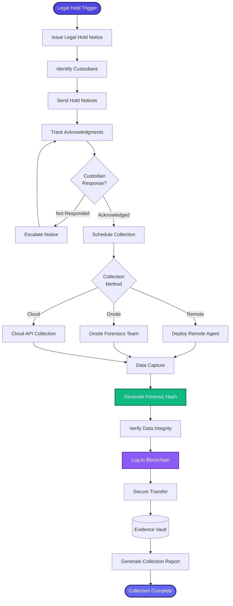

[< Back to Index](../../00-ENTERPRISE-TAXONOMY-INDEX.md) | [< Back to Primary Flow](../PRIMARY-FLOW.md)

# eDiscovery Collection - SECONDARY FLOW

##  Operational Objective
Forensically sound data collection with legal hold management and custodian coordination.

##  DETAILED WORKFLOW

##  TERTIARY WORKFLOWS
- **T1:** Legal Hold Notice Generator (email templates, tracking)
- **T2:** Remote Collection Agent (silent background capture)
- **T3:** Cloud API Integrations (O365, GSuite, Slack, Teams)

##  METRICS
- Custodian Response Time: <24 hours
- Collection Forensic Integrity: 100%
- Data Transfer Security: AES-256 encryption
