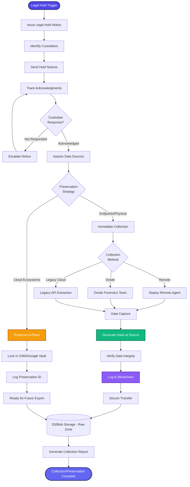

[< Back to Index](../../00-ENTERPRISE-TAXONOMY-INDEX.md) | [< Back to Primary Flow](../PRIMARY-FLOW.md)

# eDiscovery Collection - SECONDARY FLOW

## Operational Objective
Forensically sound data preservation and collection, prioritizing "Preserve-in-Place" strategies for cloud ecosystems to minimize data movement and storage costs while ensuring chain of custody.

## DETAILED WORKFLOW

## TERTIARY WORKFLOWS
- **T1:** Legal Hold Notice Generator (email templates, tracking)
- **T2:** Remote Collection Agent (silent background capture for endpoints)
- **T3:** Cloud Preservation Integrations (Microsoft Graph API, Google Vault API)
- **T4:** Chain of Custody Logger (hashing at source, blockchain notary)

## METRICS
- Custodian Response Time: <24 hours
- Preservation-in-Place Rate: >80% of cloud data (vs. full collection)
- Collection Forensic Integrity: 100% (SHA-256 verification)
- Data Transfer Security: TLS 1.3 + AES-256 encryption
