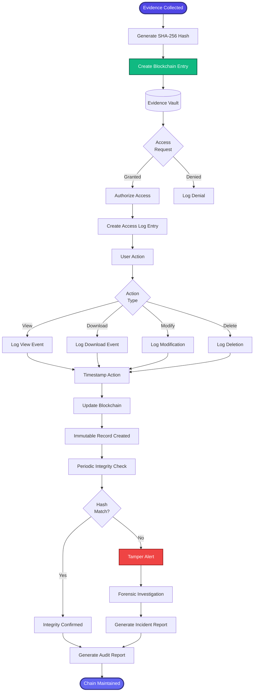

[< Back to Index](../../00-ENTERPRISE-TAXONOMY-INDEX.md) | [< Back to Primary Flow](../PRIMARY-FLOW.md)

# Evidence Chain of Custody - SECONDARY FLOW

##  Operational Objective
Blockchain-verified chain of custody with immutable audit trails and forensic defensibility.

##  DETAILED WORKFLOW

##  TERTIARY WORKFLOWS
- **T1:** Blockchain Logger (Hyperledger Fabric implementation)
- **T2:** Tamper Detection (hash verification, anomaly detection)
- **T3:** Forensic Report Generator (court-admissible chain-of-custody docs)

##  METRICS
- Evidence Integrity: 100%
- Tamper Detection Rate: Real-time
- Audit Trail Completeness: 100%
