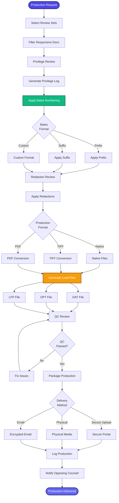

[< Back to Index](../../00-ENTERPRISE-TAXONOMY-INDEX.md) | [< Back to Primary Flow](../PRIMARY-FLOW.md)

# Production Management - SECONDARY FLOW

##  Operational Objective
Automated document production with Bates numbering, privilege review, and load file generation.

##  DETAILED WORKFLOW

##  TERTIARY WORKFLOWS
- **T1:** Bates Stamping Engine (customizable formats, OCR-aware placement)
- **T2:** Load File Generator (Concordance DAT, IPRO OPT, Summation LFP)
- **T3:** Automated Redaction (AI-powered PII detection)

##  METRICS
- Production Turnaround: <48 hours
- QC Error Rate: <1%
- Load File Accuracy: 99.9%
