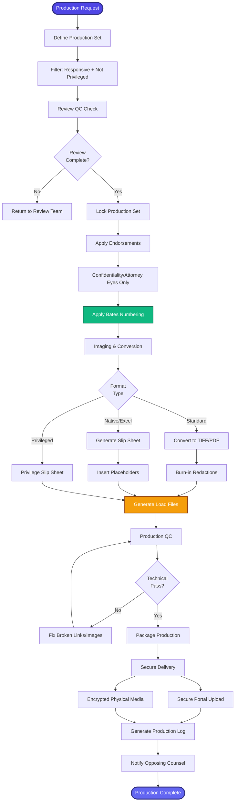

[< Back to Index](../../00-ENTERPRISE-TAXONOMY-INDEX.md) | [< Back to Primary Flow](../PRIMARY-FLOW.md)

# Production Management - SECONDARY FLOW

## Operational Objective
Execute the technical production of discoverable documents following the "Review" phase. This workflow transforms reviewed documents into a deliverable format (TIFF/PDF/Native) with Bates numbering, confidentiality endorsements, and industry-standard load files, ensuring strict adherence to the ESI protocol.

## DETAILED WORKFLOW

## TERTIARY WORKFLOWS
- **T1: Bates Stamping Engine:** Sequential numbering across document families, handling gaps and prefixes.
- **T2: Endorsement & Redaction Burn-in:** Permanently applying "CONFIDENTIAL" stamps and burning in redaction boxes so text is unrecoverable in images.
- **T3: Load File Generator:** Creating Concordance (DAT/OPT/LFP) and EDRM XML deliverables.
- **T4: Slip Sheet Generation:** Automatically creating placeholder pages for native files (e.g., Excel spreadsheets) or withheld privileged documents.

## METRICS
- **Production Turnaround:** < 24 hours from "Set Locked" to "Delivered".
- **Bates Continuity:** 100% (Zero gaps or duplicates).
- **Load File Integrity:** 100% (No broken links between DAT and images).
- **Redaction Safety:** 100% (Zero text bleed-through on burned images).
