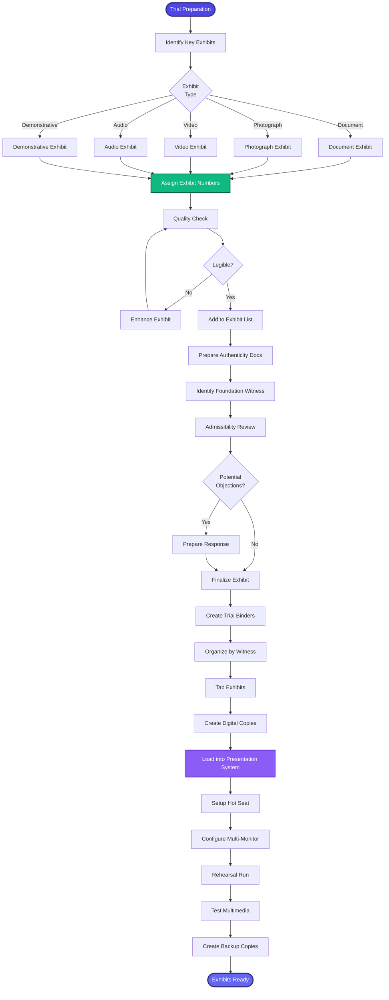

[< Back to Index](../../00-ENTERPRISE-TAXONOMY-INDEX.md) | [< Back to Primary Flow](../PRIMARY-FLOW.md)

# Exhibit Preparation - SECONDARY FLOW

##  Operational Objective
Trial exhibit organization with multimedia support, exhibit lists, and presentation integration.

##  DETAILED WORKFLOW

##  TERTIARY WORKFLOWS
- **T1:** Exhibit Numbering System (sequential, witness-based, theme-based)
- **T2:** Trial Presentation Software (courtroom display mode)
- **T3:** Exhibit Binder Generator (PDF compilation with tabs)

##  METRICS
- Exhibit Preparation Time: <2 weeks before trial
- Multimedia Playback Success: 100%
- Exhibit Admissibility Rate: >95%
