[< Back to Index](../00-ENTERPRISE-TAXONOMY-INDEX.md)

# 03. Discovery & Evidence Management - PRIMARY FLOW

##  Strategic Objective
Enterprise-grade e-discovery platform with blockchain-verified chain of custody, production management, and trial exhibit preparation competing with Relativity and Everlaw.

##  Competitive Positioning
- **Competes with:** Relativity, Everlaw, Logikcull, Disco, CloudNine
- **Differentiation:** Blockchain chain-of-custody, integrated evidence vault, automated privilege review

---

##  PRIMARY DOMAIN FLOW

```mermaid
graph TB
    Start([Discovery Event]) --> TriggerType{Trigger<br/>Type}
    
    TriggerType -->|Litigation Hold| LegalHold[Issue Legal Hold]
    TriggerType -->|Discovery Request| DiscoveryReq[Process Discovery Request]
    TriggerType -->|ESI Preservation| ESIPreserve[Preserve ESI]
    
    LegalHold --> NotifyCustodians[Notify Custodians]
    NotifyCustodians --> CustodianAck{Custodian<br/>Acknowledgment}
    CustodianAck -->|Acknowledged| Collection[Data Collection]
    CustodianAck -->|Not Acknowledged| EscalateHold[Escalate Hold]
    EscalateHold --> CustodianAck
    
    DiscoveryReq --> MeetConfer[Meet & Confer]
    MeetConfer --> Collection
    ESIPreserve --> Collection
    
    Collection --> CollectionMethod{Collection<br/>Method}
    CollectionMethod -->|Remote| RemoteCollection[Remote Collection Agent]
    CollectionMethod -->|Onsite| OnsiteCollection[Onsite Forensics]
    CollectionMethod -->|Cloud| CloudCollection[Cloud API Collection]
    
    RemoteCollection --> ForensicIntegrity[Forensic Hash Verification]
    OnsiteCollection --> ForensicIntegrity
    CloudCollection --> ForensicIntegrity
    
    ForensicIntegrity --> BlockchainHash[Blockchain Chain-of-Custody]
    BlockchainHash --> EvidenceVault[(Evidence Vault)]
    
    EvidenceVault --> Processing[Data Processing]
    Processing --> Deduplication[Deduplication]
    Deduplication --> OCR[OCR & Text Extraction]
    OCR --> MetadataExtraction[Metadata Extraction]
    MetadataExtraction --> Indexing[Full-Text Indexing]
    
    Indexing --> Review{Review<br/>Stage}
    Review -->|First Pass| FirstPassReview[First Pass Review]
    Review -->|Privilege| PrivilegeReview[Privilege Review]
    Review -->|Responsiveness| ResponsivenessReview[Responsiveness Review]
    
    FirstPassReview --> AITechnologyReview[AI-Assisted TAR]
    PrivilegeReview --> AITechnologyReview
    ResponsivenessReview --> AITechnologyReview
    
    AITechnologyReview --> QualityControl[QC Review]
    QualityControl --> PrivilegeLog[Generate Privilege Log]
    PrivilegeLog --> ProductionSet[Create Production Set]
    
    ProductionSet --> BatesStamp[Apply Bates Numbering]
    BatesStamp --> Redaction[Apply Redactions]
    Redaction --> ProductionFormat{Production<br/>Format}
    
    ProductionFormat -->|Native| NativeProduction[Native Files]
    ProductionFormat -->|TIFF| TIFFProduction[TIFF + Load Files]
    ProductionFormat -->|PDF| PDFProduction[Searchable PDF]
    
    NativeProduction --> DeliverProduction[Deliver Production]
    TIFFProduction --> DeliverProduction
    PDFProduction --> DeliverProduction
    
    DeliverProduction --> ProductionLog[Log Production Event]
    ProductionLog --> OpposingCounsel[Transmit to Opposing Counsel]
    
    OpposingCounsel --> ExhibitPrep{Prepare<br/>for Trial?}
    ExhibitPrep -->|Yes| ExhibitManager[Exhibit Manager]
    ExhibitPrep -->|No| ArchiveProduction[Archive Production]
    
    ExhibitManager --> ExhibitList[Generate Exhibit List]
    ExhibitList --> ExhibitBinders[Create Trial Binders]
    ExhibitBinders --> WarRoom[War Room Integration]
    WarRoom --> TrialReady[Trial Ready]
    
    ArchiveProduction --> End([Discovery Complete])
    TrialReady --> End
    
    style Start fill:#4f46e5,stroke:#312e81,stroke-width:3px,color:#fff
    style BlockchainHash fill:#10b981,stroke:#065f46,stroke-width:2px,color:#fff
    style AITechnologyReview fill:#8b5cf6,stroke:#5b21b6,stroke-width:2px,color:#fff
    style ProductionSet fill:#f59e0b,stroke:#92400e,stroke-width:2px,color:#fff
    style End fill:#6366f1,stroke:#312e81,stroke-width:3px,color:#fff
```



---

##  SECONDARY MODULE INTERACTIONS

```mermaid
graph LR
    subgraph "01-eDiscovery Collection"
        Hold[Legal Hold] --> Custodians[Custodian Manager]
        Custodians --> Collect[Collection Agents]
        Collect --> Hash[Forensic Hashing]
    end
    
    subgraph "02-Chain of Custody"
        Hash --> Blockchain[Blockchain Logger]
        Blockchain --> Vault[(Evidence Vault)]
        Vault --> Audit[Audit Trail]
    end
    
    subgraph "03-Production Management"
        Audit --> Processing[Doc Processing]
        Processing --> Review[Review Platform]
        Review --> Bates[Bates Engine]
        Bates --> Production[Production Sets]
    end
    
    subgraph "04-Exhibit Preparation"
        Production --> Exhibits[Exhibit Manager]
        Exhibits --> Binders[Trial Binders]
        Binders --> Presentation[Trial Presentation]
    end
    
    style Custodians fill:#8b5cf6,color:#fff
    style Blockchain fill:#10b981,color:#fff
    style Review fill:#ec4899,color:#fff
    style Exhibits fill:#f97316,color:#fff
```



---

##  ENTERPRISE REQUIREMENTS vs. CURRENT STATE

### Relativity Comparison
| Feature | Relativity | LexiFlow Current | LexiFlow Target | Gap |
|---------|-----------|------------------|-----------------|-----|
| TAR (Technology-Assisted Review) | ⭐⭐⭐⭐⭐ | ⭐⭐ | ⭐⭐⭐⭐⭐ | ️ Enhance AI model |
| Processing Speed | 100GB/hr | 20GB/hr | 80GB/hr | ️ Optimize pipeline |
| Privilege Detection | AI-Powered | Manual | AI-Powered |  Build required |
| Production Formats | All | Limited | All | ️ Add formats |
| Cloud Collection | Yes | No | Yes |  Not implemented |
| Analytics | Advanced | Basic | Advanced | ️ Enhance dashboards |

### Everlaw Comparison
| Feature | Everlaw | LexiFlow Current | LexiFlow Target | Gap |
|---------|---------|------------------|-----------------|-----|
| Story Builder | ⭐⭐⭐⭐⭐ | ⭐ | ⭐⭐⭐⭐ |  Build required |
| Real-time Collaboration | Yes | Limited | Yes | ️ Enhance features |
| Deposition Management | Yes | No | Yes |  Not implemented |
| Visual Timeline | Yes | No | Yes |  Build required |

---

##  RECOMMENDED ENHANCEMENTS

### Phase 1: Core eDiscovery (Q1 2026)
1. **TAR 2.0 Implementation**
   - Continuous Active Learning (CAL)
   - Predictive coding with confidence scores
   - Automated training set optimization
   - Quality control dashboards

2. **Blockchain Chain-of-Custody**
   - SHA-256 hashing at collection
   - Immutable blockchain logging (Hyperledger)
   - Forensic defensibility reports
   - Automated tampering detection

3. **Cloud Collection APIs**
   - Microsoft 365 / Exchange Online
   - Google Workspace
   - Slack / Teams
   - Dropbox / Box

### Phase 2: Advanced Review (Q2 2026)
4. **AI Privilege Detection**
   - Train NLP model on privilege communications
   - Automated privilege log generation
   - Reviewer suggestions with explanations
   - False positive minimization

5. **Production Automation**
   - Automated Bates numbering with customizable formats
   - Intelligent redaction detection
   - Load file generation (DAT, OPT, LFP)
   - Native-TIFF-PDF hybrid productions

6. **Story Builder**
   - Visual timeline of events
   - Document clustering by theme
   - Chronological narrative generation
   - Exhibit sequencing

### Phase 3: Trial Integration (Q3 2026)
7. **Deposition Management**
   - Video deposition integration
   - Transcript synchronization
   - Clip creation for trial
   - Exhibit linking

8. **Trial Presentation System**
   - Courtroom display mode
   - Real-time annotation
   - Hot seat exhibits
   - Multi-monitor support

---

##  TECHNICAL ARCHITECTURE

### Database Schema
```typescript
interface DiscoveryProject {
  id: string;
  matterId: string;
  name: string;
  legalHolds: LegalHold[];
  custodians: Custodian[];
  collections: Collection[];
  reviewSets: ReviewSet[];
  productions: Production[];
}

interface Evidence {
  id: string;
  projectId: string;
  filePath: string;
  forensicHash: string;
  blockchainTxId: string; // Immutable chain-of-custody
  metadata: {
    dateCreated: Date;
    dateModified: Date;
    fileSize: number;
    author: string;
    custodian: string;
  };
  reviewStatus: 'not-reviewed' | 'responsive' | 'non-responsive' | 'privileged';
  batesNumber?: string;
  tags: string[];
}

interface Production {
  id: string;
  projectId: string;
  productionNumber: string;
  batesRange: { start: string; end: string };
  format: 'native' | 'tiff' | 'pdf';
  documents: string[]; // Evidence IDs
  deliveryDate: Date;
  deliveryMethod: 'secure-upload' | 'physical-media' | 'email';
  privilegeLog: PrivilegeLogEntry[];
}
```

### API Endpoints
```
POST   /api/discovery/projects            - Create discovery project
POST   /api/discovery/legal-holds         - Issue legal hold
POST   /api/discovery/collections         - Start collection
POST   /api/discovery/evidence/upload     - Upload evidence
GET    /api/discovery/evidence/:id/hash   - Verify forensic hash
POST   /api/discovery/review              - Start review workflow
POST   /api/discovery/productions         - Create production set
GET    /api/discovery/productions/:id/download - Download production
POST   /api/discovery/exhibits            - Prepare trial exhibits
```

### Integration Points
- **Evidence Vault** → `components/litigation/evidence/EvidenceVault.tsx`
- **Discovery Platform** → `components/litigation/discovery/DiscoveryPlatform.tsx`
- **Exhibit Manager** → `components/litigation/exhibits/ExhibitManager.tsx`
- **Chain Service** → `services/chainService.ts` (blockchain)
- **OCR Queue** → `backend/src/ocr/` (Tesseract)

---

##  SUCCESS METRICS

| Metric | Current | Target | Industry Benchmark |
|--------|---------|--------|-------------------|
| Processing Speed (GB/hr) | 20 | 80 | 100 (Relativity) |
| TAR Recall Rate | 70% | 95% | 92% (Industry) |
| TAR Precision Rate | 65% | 90% | 85% (Industry) |
| Review Speed (docs/hr) | 30 | 75 | 50 (Manual avg) |
| Privilege Log Accuracy | 85% | 98% | 95% (Best-in-class) |
| Production Turnaround | 5 days | 2 days | 3 days (Average) |

---

##  IMPLEMENTATION PRIORITY

**Priority 1 (Critical):**
- [ ] TAR 2.0 with Continuous Active Learning
- [ ] Blockchain Chain-of-Custody System
- [ ] Cloud Collection APIs (O365, GSuite)

**Priority 2 (High):**
- [ ] AI Privilege Detection
- [ ] Automated Production Workflows
- [ ] Story Builder & Timeline

**Priority 3 (Medium):**
- [ ] Deposition Management
- [ ] Trial Presentation System
- [ ] Advanced Analytics Dashboards

---

**See secondary module flows in subdirectories:**
- [01-SECONDARY-ediscovery-collection/](01-SECONDARY-ediscovery-collection/)
- [02-SECONDARY-evidence-chain-of-custody/](02-SECONDARY-evidence-chain-of-custody/)
- [03-SECONDARY-production-management/](03-SECONDARY-production-management/)
- [04-SECONDARY-exhibit-preparation/](04-SECONDARY-exhibit-preparation/)


## Secondary Flows
- [Ediscovery Collection](./01-SECONDARY-ediscovery-collection/SECONDARY-FLOW.md)
- [Evidence Chain Of Custody](./02-SECONDARY-evidence-chain-of-custody/SECONDARY-FLOW.md)
- [Production Management](./03-SECONDARY-production-management/SECONDARY-FLOW.md)
- [Exhibit Preparation](./04-SECONDARY-exhibit-preparation/SECONDARY-FLOW.md)
