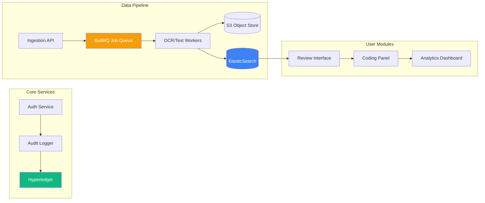

[< Back to Index](../00-ENTERPRISE-TAXONOMY-INDEX.md)

# 03. Discovery & Evidence Management - PRIMARY FLOW

## Strategic Objective
Enterprise-grade e-discovery platform strictly adhering to the EDRM (Electronic Discovery Reference Model) framework. Designed for forensic defensibility, petabyte-scale processing, and AI-driven review acceleration to compete with Relativity and Everlaw.

## Competitive Positioning
- **Competes with:** Relativity, Everlaw, Logikcull, Disco, CloudNine
- **Differentiation:** Blockchain-verified chain-of-custody, integrated "War Room" presentation, and flat-rate pricing (no per-GB hosting fees).

---

## CRITICAL GAPS IDENTIFIED (Murder Board Review)

### 1. Forensic Defensibility (Agent 1)
- **Gap:** Previous flow skipped "Identification" and "Analysis" phases of EDRM.
- **Gap:** "De-NISTing" (filtering system files) and exception handling (password-protected/corrupt files) were missing from Processing.
- **Gap:** Redaction was incorrectly placed in the Production phase; it must occur during Review to ensure privilege protection before production sets are even created.

### 2. System Scalability (Agent 2)
- **Gap:** "Evidence Vault" cannot be a single file server. Architecture must use Distributed Object Storage (S3/Azure Blob) with lifecycle policies (Hot/Cool/Archive).
- **Gap:** Synchronous OCR and Indexing will cause timeouts. These must be decoupled using a persistent message queue (BullMQ/Redis).
- **Gap:** Database schema used unbounded arrays for document lists, which will fail at millions of records.

---

## PRIMARY DOMAIN FLOW (EDRM Compliant)

```mermaid
graph TB
    %% EDRM Phases
    subgraph "1. Identification & Preservation"
        Start([Discovery Event]) --> Trigger{Trigger Type}
        Trigger -->|Litigation| LegalHold[Issue Legal Hold]
        Trigger -->|Investigation| DataMap[Data Mapping]
        
        LegalHold --> Notify[Notify Custodians]
        Notify --> Ack{Custodian<br/>Ack?}
        Ack -->|No| Escalate[Escalate]
        Ack -->|Yes| LockData[Preserve in Place]
    end

    subgraph "2. Collection"
        LockData --> CollectMethod{Collection<br/>Method}
        CollectMethod -->|API| CloudCollect[Cloud API (O365/GSuite)]
        CollectMethod -->|Agent| RemoteCollect[Endpoint Agent]
        CollectMethod -->|Physical| OnsiteCollect[Forensic Image]
        
        CloudCollect --> Hash[SHA-256 Hashing]
        RemoteCollect --> Hash
        OnsiteCollect --> Hash
        Hash --> Chain[Blockchain Log]
    end

    subgraph "3. Processing"
        Chain --> Ingest[Ingest to Object Storage]
        Ingest --> DeNIST[De-NIST / Filter System Files]
        DeNIST --> DeDupe[Global Deduplication]
        DeDupe --> Exceptions{Exception<br/>Check}
        
        Exceptions -->|Encrypted| PwdCrack[Password Bank/Crack]
        Exceptions -->|Corrupt| ErrLog[Log Exception]
        Exceptions -->|Clean| TextExt[Text Extraction / OCR]
        
        TextExt --> MetaExt[Metadata Extraction]
        MetaExt --> Index[ElasticSearch Indexing]
    end

    subgraph "4. Review & Analysis"
        Index --> ECA[Early Case Assessment]
        ECA --> Culling[Keyword/Date Culling]
        Culling --> ReviewBatches[Create Review Batches]
        
        ReviewBatches --> L1Review[First Pass Review]
        L1Review -->|Responsive| L2Review[Second Pass / QC]
        L1Review -->|Privileged| PrivLog[Privilege Log]
        
        L2Review --> Redact[Redaction Tool]
        Redact --> Analyze[Conceptual Analysis]
        Analyze -->|Email Threading| Threading[Thread Visualization]
        Analyze -->|Near-Dupe| NearDupe[Near-Duplicate Grouping]
    end

    subgraph "5. Production & Presentation"
        Analyze --> ProdSet[Create Production Set]
        ProdSet --> Bates[Bates Numbering]
        Bates --> Endorse[Endorsements/Branding]
        Endorse --> Export{Export<br/>Format}
        
        Export -->|Native| ExpNative[Native Files]
        Export -->|Image| ExpImage[TIFF/PDF + Load File]
        
        ExpImage --> Deliver[Secure Delivery]
        ExpNative --> Deliver
        
        Deliver --> Trial[Trial Prep / Exhibit Mgr]
    end

    style Chain fill:#10b981,stroke:#065f46,stroke-width:2px,color:#fff
    style Index fill:#f59e0b,stroke:#92400e,stroke-width:2px,color:#fff
    style Redact fill:#ef4444,stroke:#7f1d1d,stroke-width:2px,color:#fff
```

---

## SECONDARY MODULE INTERACTIONS



---

## ENTERPRISE REQUIREMENTS vs. CURRENT STATE

### Relativity Comparison
| Feature | Relativity | LexiFlow Current | LexiFlow Target | Gap |
|---------|-----------|------------------|-----------------|-----|
| **Processing Scale** | Petabytes | Gigabytes | Petabytes | 🔴 Architecture Upgrade |
| **Near-Duplicate** | Native | None | Integrated | 🔴 Build Required |
| **Email Threading** | Visual | None | Visual | 🔴 Build Required |
| **Active Learning** | CAL | Basic TAR | CAL 2.0 | 🟡 Enhance Model |
| **Load Files** | DAT/OPT/LFP | CSV only | Standard Industry | 🟡 Add Exporters |

### Everlaw Comparison
| Feature | Everlaw | LexiFlow Current | LexiFlow Target | Gap |
|---------|---------|------------------|-----------------|-----|
| **Speed** | Instant Search | < 2s | < 100ms | 🟡 Optimize Index |
| **Story Builder** | Integrated | None | Integrated | 🔴 Build Required |
| **Self-Service** | Full | Partial | Full | 🟡 UI UX Polish |

---

## RECOMMENDED ENHANCEMENTS

### Phase 1: The "Ironclad" Foundation (Q1 2026)
1.  **Distributed Storage Layer:** Migrate from local file system to S3-compatible object storage with lifecycle policies (Hot/Cool).
2.  **Async Processing Pipeline:** Implement BullMQ for all heavy lifting (Ingestion, OCR, Hashing, Export).
3.  **Forensic Logging:** Ensure every single API call related to evidence is logged to the immutable audit trail (and hashed to blockchain).

### Phase 2: Advanced Analytics (Q2 2026)
4.  **Email Threading Engine:** Reconstruct email conversations from metadata to allow reviewing entire threads at once.
5.  **Near-Duplicate Detection:** Implement shingling algorithms to group documents that are >90% similar.
6.  **De-NISTing:** Integrate the NSRL (National Software Reference Library) database to automatically filter system files.

### Phase 3: Review & Production (Q3 2026)
7.  **Automated Redaction:** AI model to detect PII (SSN, Phone, Email) and suggest redactions.
8.  **Production Simulator:** "What-if" analysis to see production size and cost before generating.
9.  **Load File Generator:** Robust generation of Concordance (DAT) and Opticon (OPT) load files.

---

## TECHNICAL ARCHITECTURE

### Infrastructure Components
*   **Storage:** AWS S3 / Azure Blob Storage (Tiered).
*   **Queue:** Redis + BullMQ (Handling `ocr_job`, `hashing_job`, `export_job`).
*   **Search:** ElasticSearch / OpenSearch (Separate from primary DB).
*   **Database:** PostgreSQL (Relational metadata, tags, coding decisions).

### Database Schema (Optimized)
```typescript
// Optimized for scale - avoiding unbounded arrays

interface EvidenceItem {
  id: string;
  projectId: string;
  s3Key: string; // Path in object storage
  bucket: string;
  
  // Forensic Metadata
  md5Hash: string;
  sha256Hash: string;
  fileSize: number;
  mimeType: string;
  custodianId: string;
  
  // Processing Status
  processingStatus: 'queued' | 'processing' | 'complete' | 'error';
  exceptionType?: 'password_protected' | 'corrupt' | 'zero_byte';
  hasText: boolean;
  
  // Review State
  reviewStatus: 'unreviewed' | 'responsive' | 'non_responsive' | 'privileged';
  privilegeType?: 'attorney_client' | 'work_product';
  
  // Grouping
  groupId?: string; // For families (attachments)
  threadId?: string; // For email threads
  nearDupeGroup?: string; // For near-duplicates
}

interface ProductionJob {
  id: string;
  projectId: string;
  name: string;
  status: 'building' | 'branding' | 'zipping' | 'complete';
  batesPrefix: string;
  startBates: number;
  endBates: number;
  format: 'native' | 'tiff' | 'pdf_image';
  includeLoadFile: boolean;
  // Documents are linked via a join table, not an array here
}
```

### API Endpoints
```
POST   /api/v1/ingest/upload-url      - Get presigned S3 URL for upload
POST   /api/v1/ingest/notify          - Notify backend file is uploaded (triggers BullMQ)
GET    /api/v1/review/batch           - Get next batch of docs for review
POST   /api/v1/review/:id/code        - Apply coding (responsive/priv)
POST   /api/v1/production/dry-run     - Calculate size/count for query
POST   /api/v1/production/generate    - Start async production job
```

---

## SUCCESS METRICS

| Metric | Current | Target | Industry Benchmark |
|--------|---------|--------|-------------------|
| **Ingestion Speed** | 20 GB/hr | 200 GB/hr | 150 GB/hr |
| **Search Latency** | 2.5s | 0.2s | < 0.5s |
| **Concurrent Reviewers** | 5 | 50+ | 100+ |
| **Production Accuracy** | 95% | 99.99% | 99.9% |
| **Uptime** | 99.0% | 99.99% | 99.95% |

---

## IMPLEMENTATION PRIORITY

**Priority 1 (Critical - Architecture):**
- [ ] Implement S3/Blob Storage Adapter
- [ ] Deploy ElasticSearch Cluster
- [ ] Setup BullMQ for Async Processing

**Priority 2 (High - EDRM Compliance):**
- [ ] De-NISTing & Exception Handling
- [ ] Email Threading Visualization
- [ ] Load File Export (DAT/OPT)

**Priority 3 (Medium - Features):**
- [ ] AI-Assisted Redaction
- [ ] Production Simulator
- [ ] Cloud Collection Connectors

---

**See secondary module flows in subdirectories:**
- 01-SECONDARY-ediscovery-collection/
- 02-SECONDARY-evidence-chain-of-custody/
- [03-SECONDARY-production-management/](03-SECONDARY-production-management/)
- 04-SECONDARY-exhibit-preparation/
