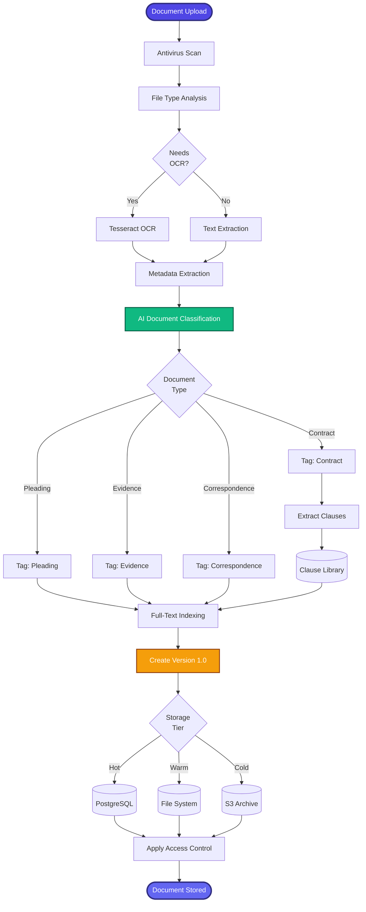

[< Back to Index](../../00-ENTERPRISE-TAXONOMY-INDEX.md) | [< Back to Primary Flow](../PRIMARY-FLOW.md)

# Document Lifecycle - SECONDARY FLOW

##  Operational Objective
Complete document lifecycle management from upload through archival with AI classification and full-text indexing.

##  DETAILED WORKFLOW

##  TERTIARY WORKFLOWS
- **T1:** OCR Engine (Tesseract, AWS Textract for handwriting)
- **T2:** AI Document Classifier (fine-tuned BERT model)
- **T3:** Tiered Storage Manager (hot/warm/cold lifecycle policies)
