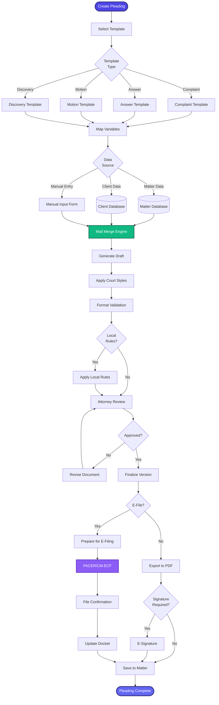

[< Back to Index](../../00-ENTERPRISE-TAXONOMY-INDEX.md) | [< Back to Primary Flow](../PRIMARY-FLOW.md)

# Pleading Automation - SECONDARY FLOW

##  Operational Objective
Automated pleading generation with template engine, mail merge, and e-filing integration.

##  DETAILED WORKFLOW

##  TERTIARY WORKFLOWS
- **T1:** Template Engine (Jinja2-style variable substitution)
- **T2:** Local Rules Validator (jurisdiction-specific formatting)
- **T3:** E-Filing API Integration (PACER, state courts)
