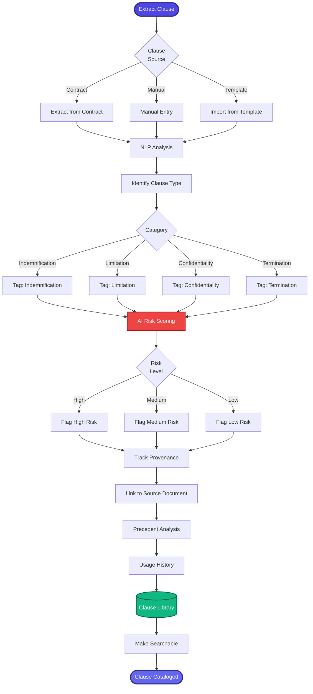

[< Back to Index](../../00-ENTERPRISE-TAXONOMY-INDEX.md) | [< Back to Primary Flow](../PRIMARY-FLOW.md)

# Clause Library - SECONDARY FLOW

##  Operational Objective
Reusable clause management with AI risk scoring, provenance tracking, and precedent analysis.

##  DETAILED WORKFLOW

##  TERTIARY WORKFLOWS
- **T1:** Clause Extraction (NER model for clause boundaries)
- **T2:** Risk Scoring Model (ML model trained on adverse outcomes)
- **T3:** Provenance Tracker (blockchain-style lineage)
