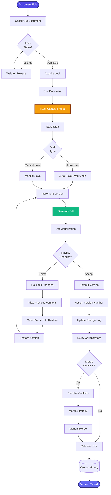

[< Back to Index](../../00-ENTERPRISE-TAXONOMY-INDEX.md) | [< Back to Primary Flow](../PRIMARY-FLOW.md)

# Version Control - SECONDARY FLOW

##  Operational Objective
Git-like document versioning with diff visualization, rollback capabilities, and collaboration tracking.

##  DETAILED WORKFLOW

##  TERTIARY WORKFLOWS
- **T1:** Diff Algorithm (Myers diff, word-level granularity)
- **T2:** Merge Conflict Resolution (3-way merge visualization)
- **T3:** Version History Viewer (git-log style interface)
