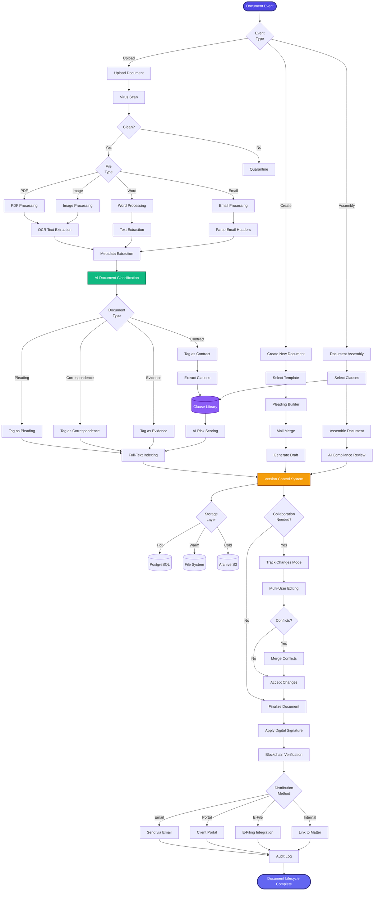

[< Back to Index](../00-ENTERPRISE-TAXONOMY-INDEX.md)

# 04. Document Management & Automation - PRIMARY FLOW

##  Strategic Objective
Intelligent document lifecycle management with AI-powered pleading generation, clause library, and Git-like version control competing with NetDocuments and iManage.

##  Competitive Positioning
- **Competes with:** NetDocuments, iManage Work, LexisNexis Draft, Smokeball
- **Differentiation:** AI clause library with risk scoring, blockchain document verification, integrated pleading automation

---

##  PRIMARY DOMAIN FLOW

---

##  KEY ENHANCEMENTS

### Phase 1: Core Document Management (Q1 2026)
1. **AI Document Classification** - Auto-tag by type (pleading, contract, correspondence)
2. **Clause Library with Risk Scoring** - Extract reusable clauses, score risk
3. **Git-Like Version Control** - Diff view, rollback, branching
4. **Blockchain Document Verification** - Immutable proof of existence

### Phase 2: Automation (Q2 2026)
5. **Pleading Builder Pro** - Template engine, mail merge, e-filing
6. **Contract Assembly** - Drag-drop clause builder
7. **AI Compliance Review** - Check for missing clauses, inconsistencies
8. **Multi-User Real-Time Editing** - Google Docs-style collaboration

---

**See secondary module flows in subdirectories:**
- [01-SECONDARY-document-lifecycle/](01-SECONDARY-document-lifecycle/)
- [02-SECONDARY-pleading-automation/](02-SECONDARY-pleading-automation/)
- [03-SECONDARY-clause-library/](03-SECONDARY-clause-library/)
- [04-SECONDARY-version-control/](04-SECONDARY-version-control/)

## Secondary Flows
- [Document Lifecycle](./01-SECONDARY-document-lifecycle/SECONDARY-FLOW.md)
- [Pleading Automation](./02-SECONDARY-pleading-automation/SECONDARY-FLOW.md)
- [Clause Library](./03-SECONDARY-clause-library/SECONDARY-FLOW.md)
- [Version Control](./04-SECONDARY-version-control/SECONDARY-FLOW.md)
