[< Back to Index](../../00-ENTERPRISE-TAXONOMY-INDEX.md) | [< Back to Primary Flow](../PRIMARY-FLOW.md)

# Litigation Strategy - SECONDARY FLOW

##  Operational Objective
Comprehensive litigation strategy development with case theory, witness planning, and theme creation.

##  DETAILED WORKFLOW

```mermaid
graph TB
    Start([Case Filed]) --> CaseAnalysis[Initial Case Analysis]
    CaseAnalysis --> FactPattern[Analyze Fact Pattern]
    FactPattern --> LegalIssues[Identify Legal Issues]
    LegalIssues --> ResearchLaw[Research Applicable Law]
    
    ResearchLaw --> TheoryDevelopment[Develop Case Theory]
    TheoryDevelopment --> ThemeCreation[Create Case Theme]
    ThemeCreation --> NarrativeBuilding[Build Narrative]
    
    NarrativeBuilding --> WitnessPlanning[Witness Planning]
    WitnessPlanning --> IdentifyWitnesses[Identify Key Witnesses]
    IdentifyWitnesses --> WitnessRoles[Assign Witness Roles]
    WitnessRoles --> PreparationSchedule[Schedule Prep Sessions]
    
    PreparationSchedule --> ExpertWitnesses{Expert<br/>Witnesses?}
    ExpertWitnesses -->|Yes| ExpertRetention[Retain Experts]
    ExpertWitnesses -->|No| EvidenceMapping[Map Evidence to Theory]
    ExpertRetention --> EvidenceMapping
    
    EvidenceMapping --> StrengthsWeaknesses[Analyze Strengths/Weaknesses]
    StrengthsWeaknesses --> RiskAssessment[Risk Assessment]
    RiskAssessment --> SettlementValue[Calculate Settlement Value]
    
    SettlementValue --> StrategyMemo[Draft Strategy Memo]
    StrategyMemo --> TeamBriefing[Brief Litigation Team]
    TeamBriefing --> ClientPresentation[Present to Client]
    
    ClientPresentation --> End([Strategy Approved])
    
    style Start fill:#4f46e5,stroke:#312e81,stroke-width:3px,color:#fff
    style TheoryDevelopment fill:#10b981,stroke:#065f46,stroke-width:2px,color:#fff
    style RiskAssessment fill:#f59e0b,stroke:#92400e,stroke-width:2px,color:#fff
    style End fill:#6366f1,stroke:#312e81,stroke-width:3px,color:#fff
```

##  TERTIARY WORKFLOWS
- **T1:** Case Theory Builder (mind mapping tool integration)
- **T2:** Witness Preparation Tracker (session notes, Q&A scripts)
- **T3:** Settlement Value Calculator (ML-based valuation)
