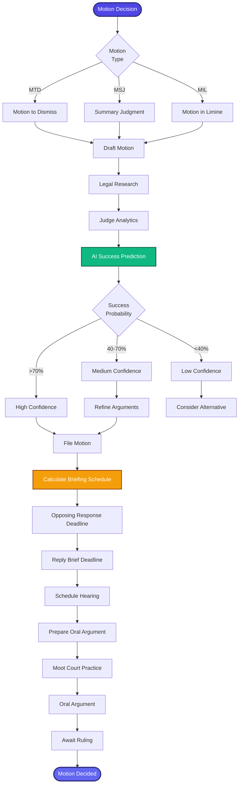

[< Back to Index](../../00-ENTERPRISE-TAXONOMY-INDEX.md) | [< Back to Primary Flow](../PRIMARY-FLOW.md)

# Motion Practice - SECONDARY FLOW

##  Operational Objective
AI-powered motion practice with success prediction, briefing schedules, and judicial analytics.

##  DETAILED WORKFLOW

##  TERTIARY WORKFLOWS
- **T1:** Motion Success Predictor (logistic regression on judge history)
- **T2:** Briefing Calendar (rule-based deadline calculator)
- **T3:** Oral Argument Prep (Q&A generator based on brief)
