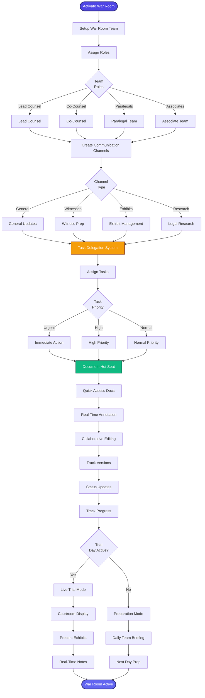

[< Back to Index](../../00-ENTERPRISE-TAXONOMY-INDEX.md) | [< Back to Primary Flow](../PRIMARY-FLOW.md)

# War Room Collaboration - SECONDARY FLOW

##  Operational Objective
Real-time trial team coordination with document hot seat, task delegation, and live collaboration.

##  DETAILED WORKFLOW

##  TERTIARY WORKFLOWS
- **T1:** Real-Time Messaging (WebSocket implementation)
- **T2:** Document Hot Seat (instant search across all trial docs)
- **T3:** Task Assignment System (priority queue with notifications)
