[< Back to Index](../../00-ENTERPRISE-TAXONOMY-INDEX.md) | [< Back to Primary Flow](../PRIMARY-FLOW.md)

# Trial Preparation - SECONDARY FLOW

##  Operational Objective
Comprehensive trial preparation with witness prep, exhibit organization, and opening/closing statements.

##  DETAILED WORKFLOW

```mermaid
graph TB
    Start([Trial Date Set]) --> TrialPrepTimeline[Create Prep Timeline]
    TrialPrepTimeline --> WitnessPrep[Witness Preparation]
    WitnessPrep --> WitnessList[Finalize Witness List]
    
    WitnessList --> PrepSessions[Schedule Prep Sessions]
    PrepSessions --> DirectExam[Direct Examination Prep]
    DirectExam --> CrossExam[Cross-Examination Prep]
    CrossExam --> MockTestimony[Mock Testimony]
    
    MockTestimony --> WitnessNotes[Create Witness Notes]
    WitnessNotes --> ExhibitOrganization[Organize Exhibits]
    ExhibitOrganization --> ExhibitList[Finalize Exhibit List]
    
    ExhibitList --> TrialBinders[Create Trial Binders]
    TrialBinders --> BinderSets{Binder<br/>Sets}
    BinderSets -->|Master| MasterBinder[Master Set]
    BinderSets -->|Witness| WitnessBinder[Witness Sets]
    BinderSets -->|Exhibit| ExhibitBinder[Exhibit Sets]
    
    MasterBinder --> DigitalBinders[Create Digital Versions]
    WitnessBinder --> DigitalBinders
    ExhibitBinder --> DigitalBinders
    
    DigitalBinders --> OpeningStatement[Draft Opening Statement]
    OpeningStatement --> OpeningRehearse[Rehearse Opening]
    OpeningRehearse --> OpeningRefine[Refine Opening]
    
    OpeningRefine --> ClosingStatement[Draft Closing Statement]
    ClosingStatement --> ClosingRehearse[Rehearse Closing]
    ClosingRehearse --> ClosingRefine[Refine Closing]
    
    ClosingRefine --> MockTrial[Conduct Mock Trial]
    MockTrial --> FeedbackSession[Feedback Session]
    FeedbackSession --> Adjustments[Make Adjustments]
    
    Adjustments --> TechSetup[Setup Technology]
    TechSetup --> CourtroomWalkthrough[Courtroom Walkthrough]
    CourtroomWalkthrough --> FinalChecklist[Final Checklist]
    
    FinalChecklist --> TrialReady[Trial Ready]
    TrialReady --> End([Ready for Trial])
    
    style Start fill:#4f46e5,stroke:#312e81,stroke-width:3px,color:#fff
    style MockTrial fill:#f59e0b,stroke:#92400e,stroke-width:2px,color:#fff
    style TrialReady fill:#10b981,stroke:#065f46,stroke-width:2px,color:#fff
    style End fill:#6366f1,stroke:#312e81,stroke-width:3px,color:#fff
```

##  TERTIARY WORKFLOWS
- **T1:** Witness Prep Tracker (session notes, Q&A scripts, video review)
- **T2:** Trial Binder Generator (automated PDF compilation with indexing)
- **T3:** Mock Trial Simulator (scoring system, timer, objection tracker)
