[< Back to Index](../00-ENTERPRISE-TAXONOMY-INDEX.md)

# 05. Litigation & Trial Management - PRIMARY FLOW

##  Strategic Objective
Comprehensive litigation workflow from strategy development through trial preparation with real-time war room collaboration.

##  Competitive Positioning
- **Competes with:** CaseFleet, Litera, TrialDirector, Casetext Compose
- **Differentiation:** Integrated war room, AI motion prediction, real-time trial presentation

---

##  PRIMARY DOMAIN FLOW

```mermaid
graph TB
    Start([Litigation Matter]) --> CaseType{Case<br/>Type}
    
    CaseType -->|Civil| CivilStrategy[Civil Litigation Strategy]
    CaseType -->|Criminal| CrimStrategy[Criminal Defense Strategy]
    CaseType -->|Arbitration| ArbStrategy[Arbitration Strategy]
    
    CivilStrategy --> TheoryDev[Develop Case Theory]
    CrimStrategy --> TheoryDev
    ArbStrategy --> TheoryDev
    
    TheoryDev --> IssueSpotting[Issue Spotting]
    IssueSpotting --> LegalResearch[Legal Research]
    LegalResearch --> ThemeCreation[Theme Creation]
    ThemeCreation --> WitnessPlanning[Witness Planning]
    
    WitnessPlanning --> MotionPractice[Motion Practice]
    MotionPractice --> MotionType{Motion<br/>Type}
    
    MotionType -->|MTD| MotionToDismiss[Motion to Dismiss]
    MotionType -->|MSJ| SummaryJudgment[Summary Judgment]
    MotionType -->|MIL| MotionInLimine[Motion in Limine]
    MotionType -->|Discovery| DiscoveryMotion[Discovery Motion]
    
    MotionToDismiss --> DraftMotion[Draft Motion]
    SummaryJudgment --> DraftMotion
    MotionInLimine --> DraftMotion
    DiscoveryMotion --> DraftMotion
    
    DraftMotion --> PredictiveAnalytics[AI Success Prediction]
    PredictiveAnalytics --> SuccessProb{Success<br/>Probability}
    
    SuccessProb -->|High| FileMotion[File Motion]
    SuccessProb -->|Medium| RefineMotion[Refine Motion]
    SuccessProb -->|Low| AlternativeStrategy[Alternative Strategy]
    RefineMotion --> FileMotion
    
    FileMotion --> MotionBriefing[Briefing Schedule]
    MotionBriefing --> OpposingResponse[Await Opposition]
    OpposingResponse --> Reply[File Reply]
    Reply --> Hearing[Oral Argument]
    Hearing --> Ruling[Court Ruling]
    
    Ruling --> RulingOutcome{Outcome}
    RulingOutcome -->|Granted| ReevaluateCase[Reevaluate Case]
    RulingOutcome -->|Denied| ProceedTrial[Proceed to Trial]
    RulingOutcome -->|Partial| ProceedTrial
    
    AlternativeStrategy --> Settlement{Settlement<br/>Possible?}
    Settlement -->|Yes| Mediation[Mediation]
    Settlement -->|No| ProceedTrial
    
    Mediation --> Settled{Settled?}
    Settled -->|Yes| CloseCase[Close Case]
    Settled -->|No| ProceedTrial
    
    ProceedTrial --> WarRoom[War Room Activation]
    WarRoom --> TeamAssignment[Team Assignments]
    TeamAssignment --> TaskDelegation[Task Delegation]
    TaskDelegation --> Collaboration[Real-Time Collaboration]
    
    Collaboration --> TrialPrep[Trial Preparation]
    TrialPrep --> WitnessPrep[Witness Preparation]
    WitnessPrep --> ExhibitOrg[Exhibit Organization]
    ExhibitOrg --> OpeningStatement[Opening Statement Draft]
    OpeningStatement --> ClosingStatement[Closing Statement Draft]
    
    ClosingStatement --> MockTrial[Mock Trial]
    MockTrial --> Refinement[Refinement]
    Refinement --> TrialBinders[Prepare Trial Binders]
    
    TrialBinders --> TrialDay[Trial Day]
    TrialDay --> TrialPresentation[Trial Presentation System]
    TrialPresentation --> RealTimeAdaptation[Real-Time Adaptation]
    RealTimeAdaptation --> Verdict[Verdict]
    
    Verdict --> VerdictOutcome{Verdict<br/>Outcome}
    VerdictOutcome -->|Favorable| CelebratoryAnalysis[Post-Trial Analysis]
    VerdictOutcome -->|Unfavorable| AppealEvaluation[Evaluate Appeal]
    
    CelebratoryAnalysis --> FinalReport[Final Report]
    AppealEvaluation --> AppealDecision{File<br/>Appeal?}
    AppealDecision -->|Yes| AppellateProcess[Appellate Process]
    AppealDecision -->|No| FinalReport
    
    AppellateProcess --> FinalReport
    FinalReport --> End([Litigation Complete])
    
    ReevaluateCase --> Settlement
    CloseCase --> FinalReport
    
    style Start fill:#4f46e5,stroke:#312e81,stroke-width:3px,color:#fff
    style PredictiveAnalytics fill:#10b981,stroke:#065f46,stroke-width:2px,color:#fff
    style WarRoom fill:#f59e0b,stroke:#92400e,stroke-width:2px,color:#fff
    style TrialPresentation fill:#8b5cf6,stroke:#5b21b6,stroke-width:2px,color:#fff
    style End fill:#6366f1,stroke:#312e81,stroke-width:3px,color:#fff
```

---

##  KEY ENHANCEMENTS

### Phase 1: Motion Practice (Q1 2026)
1. **AI Motion Success Prediction** - Predict outcome based on judge, jurisdiction, case type
2. **Automated Briefing Schedules** - Calculate deadlines based on local rules
3. **Motion Library** - Reusable motion templates

### Phase 2: War Room (Q2 2026)
4. **Real-Time War Room** - Slack-like interface for trial team
5. **Task Delegation System** - Assign research, witness prep, exhibit tasks
6. **Document Hot Seat** - Quick access to trial docs

### Phase 3: Trial Presentation (Q3 2026)
7. **Courtroom Display Mode** - Present exhibits, annotate in real-time
8. **Witness Prep Module** - Track witness interviews, prep sessions
9. **Mock Trial Simulator** - Run mock trials with scoring

---

**See secondary module flows in subdirectories:**
- [01-SECONDARY-litigation-strategy/](01-SECONDARY-litigation-strategy/)
- [02-SECONDARY-motion-practice/](02-SECONDARY-motion-practice/)
- [03-SECONDARY-war-room-collaboration/](03-SECONDARY-war-room-collaboration/)
- [04-SECONDARY-trial-preparation/](04-SECONDARY-trial-preparation/)

## Secondary Flows
- [Litigation Strategy](./01-SECONDARY-litigation-strategy/SECONDARY-FLOW.md)
- [Motion Practice](./02-SECONDARY-motion-practice/SECONDARY-FLOW.md)
- [War Room Collaboration](./03-SECONDARY-war-room-collaboration/SECONDARY-FLOW.md)
- [Trial Preparation](./04-SECONDARY-trial-preparation/SECONDARY-FLOW.md)
