[< Back to Index](../../00-ENTERPRISE-TAXONOMY-INDEX.md) | [< Back to Primary Flow](../PRIMARY-FLOW.md)

# Billing & Financials - SECONDARY FLOW

##  Operational Objective
LEDES-compliant billing with blockchain trust accounting, automated invoicing, and AR management.

##  DETAILED WORKFLOW

```mermaid
graph TB
    Start([Time Entry]) --> TimeCapture[Capture Billable Time]
    TimeCapture --> TimeValidation[Validate Time Entry]
    TimeValidation --> BillableCheck{Billable?}
    
    BillableCheck -->|Yes| BillableTime[(Billable Time DB)]
    BillableCheck -->|No| NonBillableTime[(Non-Billable DB)]
    
    BillableTime --> BillingCycle[Monthly Billing Cycle]
    BillingCycle --> AggregateTime[Aggregate Time Entries]
    AggregateTime --> AggregateExpenses[Aggregate Expenses]
    
    AggregateExpenses --> GenerateInvoice[Generate Invoice]
    GenerateInvoice --> LEDESFormat[Apply LEDES Format]
    LEDESFormat --> LEDESValidation[LEDES Validation]
    
    LEDESValidation --> ClientReview[Send to Client for Review]
    ClientReview --> ClientApproval{Client<br/>Approval?}
    
    ClientApproval -->|Rejected| BillingAdjustment[Billing Adjustment]
    ClientApproval -->|Approved| FinalizeInvoice[Finalize Invoice]
    BillingAdjustment --> GenerateInvoice
    
    FinalizeInvoice --> PaymentRequest[Send Payment Request]
    PaymentRequest --> PaymentTracking[Track Payment]
    PaymentTracking --> PaymentReceived{Payment<br/>Received?}
    
    PaymentReceived -->|No| ARFollowUp[AR Follow-Up]
    PaymentReceived -->|Yes| TrustDeposit[Deposit to Trust Account]
    ARFollowUp --> PaymentTracking
    
    TrustDeposit --> BlockchainLog[Log to Blockchain]
    BlockchainLog --> IOLTACompliance[IOLTA Compliance Check]
    IOLTACompliance --> DisbursementApproval[Approve Disbursement]
    
    DisbursementApproval --> TransferFunds[Transfer to Operating Account]
    TransferFunds --> RevenueRecognition[Revenue Recognition]
    RevenueRecognition --> FinancialReporting[Financial Reporting]
    
    FinancialReporting --> End([Billing Complete])
    
    style Start fill:#4f46e5,stroke:#312e81,stroke-width:3px,color:#fff
    style LEDESFormat fill:#10b981,stroke:#065f46,stroke-width:2px,color:#fff
    style BlockchainLog fill:#8b5cf6,stroke:#5b21b6,stroke-width:2px,color:#fff
    style End fill:#6366f1,stroke:#312e81,stroke-width:3px,color:#fff
```

##  TERTIARY WORKFLOWS
- **T1:** LEDES Billing Engine (LEDES 98BI and 2.0 full support)
- **T2:** Blockchain Trust Ledger (Hyperledger immutable trust accounting)
- **T3:** AR Aging Dashboard (real-time collection tracking)

##  METRICS
- LEDES Validation Pass Rate: >98%
- Trust Account Compliance: 100%
- AR Collection Rate: >90% within 60 days
