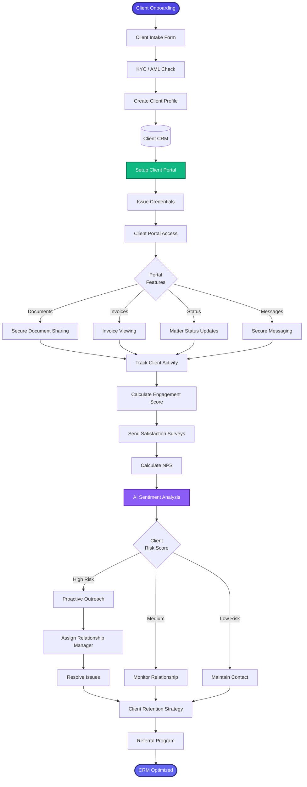

[< Back to Index](../../00-ENTERPRISE-TAXONOMY-INDEX.md) | [< Back to Primary Flow](../PRIMARY-FLOW.md)

# Client Relationship Management - SECONDARY FLOW

##  Operational Objective
Comprehensive CRM with client portal, satisfaction tracking, and relationship analytics.

##  DETAILED WORKFLOW

##  TERTIARY WORKFLOWS
- **T1:** Client Portal (React app with secure auth, document sharing, e-signatures)
- **T2:** NPS Calculator (automated survey distribution, sentiment analysis)
- **T3:** Churn Prediction Model (ML model for client retention risk)
