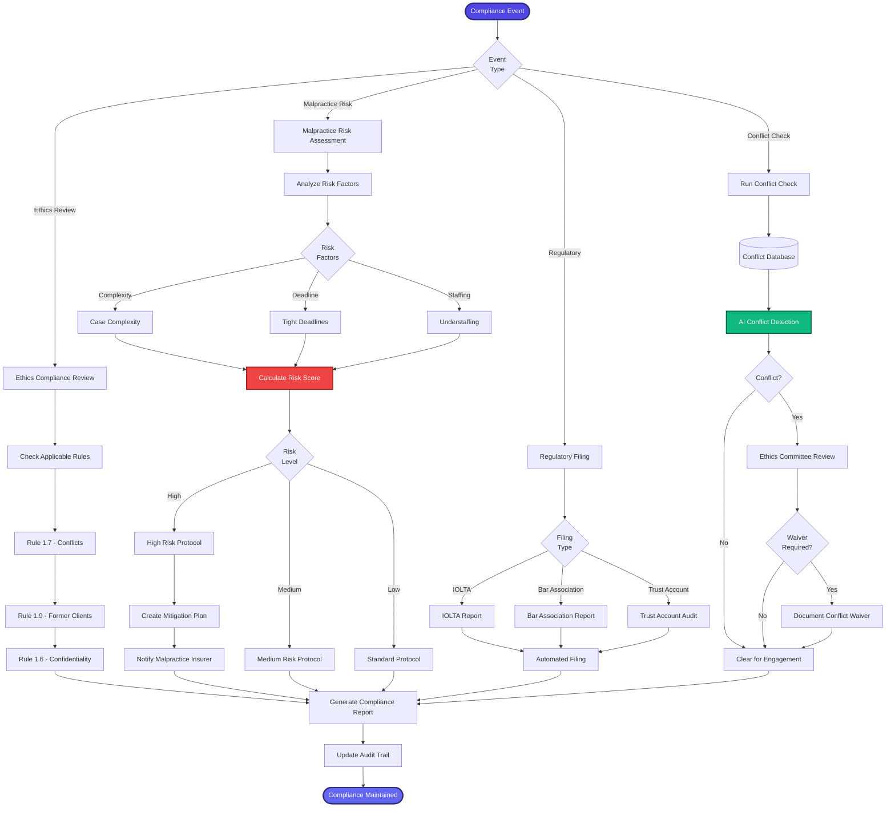

[< Back to Index](../../00-ENTERPRISE-TAXONOMY-INDEX.md) | [< Back to Primary Flow](../PRIMARY-FLOW.md)

# Compliance & Risk Management - SECONDARY FLOW

##  Operational Objective
Ethics compliance, conflict checking, malpractice risk scoring, and regulatory reporting.

##  DETAILED WORKFLOW

##  TERTIARY WORKFLOWS
- **T1:** AI Conflict Detection (ML model with entity resolution)
- **T2:** Malpractice Risk Scorer (predictive model based on matter characteristics)
- **T3:** Automated Compliance Reporting (state bar, IOLTA, trust account audits)
