[< Back to Index](../../00-ENTERPRISE-TAXONOMY-INDEX.md) | [< Back to Primary Flow](../PRIMARY-FLOW.md)

# HR & Resource Management - SECONDARY FLOW

##  Operational Objective
Attorney and staff management with utilization tracking, performance reviews, and compensation planning.

##  DETAILED WORKFLOW

```mermaid
graph TB
    Start([HR Event]) --> EventType{Event<br/>Type}
    
    EventType -->|Onboarding| StaffOnboarding[Staff Onboarding]
    EventType -->|Utilization| UtilizationTracking[Utilization Tracking]
    EventType -->|Performance| PerformanceReview[Performance Review]
    EventType -->|Compensation| CompensationPlanning[Compensation Planning]
    
    StaffOnboarding --> CreateProfile[Create Employee Profile]
    CreateProfile --> RoleAssignment[Assign Role]
    RoleAssignment --> SystemAccess[Grant System Access]
    SystemAccess --> TrainingSchedule[Schedule Training]
    
    TrainingSchedule --> OnboardingComplete[Onboarding Complete]
    OnboardingComplete --> UtilizationTracking
    
    UtilizationTracking --> TimeEntryAnalysis[Analyze Time Entries]
    TimeEntryAnalysis --> BillableVsNonBillable[Billable vs Non-Billable]
    BillableVsNonBillable --> UtilizationRate[Calculate Utilization Rate]
    
    UtilizationRate --> TargetComparison{Meets<br/>Target?}
    TargetComparison -->|Below Target| CapacityAnalysis[Capacity Analysis]
    TargetComparison -->|Meets Target| BenchmarkComparison[Benchmark Comparison]
    TargetComparison -->|Above Target| OverbookedAnalysis[Overbooked Analysis]
    
    CapacityAnalysis --> CoachingPlan[Create Coaching Plan]
    OverbookedAnalysis --> WorkloadBalance[Balance Workload]
    BenchmarkComparison --> PerformanceMetrics[Track Performance Metrics]
    
    CoachingPlan --> PerformanceMetrics
    WorkloadBalance --> PerformanceMetrics
    
    PerformanceMetrics --> PerformanceReview
    PerformanceReview --> Review360[360-Degree Feedback]
    Review360 --> ClientFeedback[Client Feedback]
    ClientFeedback --> PeerFeedback[Peer Feedback]
    PeerFeedback --> SupervisorFeedback[Supervisor Feedback]
    
    SupervisorFeedback --> AggregateScores[Aggregate Scores]
    AggregateScores --> PerformanceRating[Performance Rating]
    PerformanceRating --> DevelopmentPlan[Development Plan]
    
    DevelopmentPlan --> CompensationPlanning
    CompensationPlanning --> MarketData[Analyze Market Data]
    MarketData --> InternalEquity[Internal Equity Analysis]
    InternalEquity --> MeritIncrease[Merit Increase Calculation]
    
    MeritIncrease --> BonusCalculation[Bonus Calculation]
    BonusCalculation --> TotalCompensation[Total Compensation Package]
    TotalCompensation --> BudgetApproval{Budget<br/>Approved?}
    
    BudgetApproval -->|No| ReviseComp[Revise Compensation]
    BudgetApproval -->|Yes| CompensationOffer[Present Compensation]
    ReviseComp --> BudgetApproval
    
    CompensationOffer --> RetentionRisk[Assess Retention Risk]
    RetentionRisk --> TalentRetention[Retention Strategy]
    TalentRetention --> End([HR Optimized])
    
    style Start fill:#4f46e5,stroke:#312e81,stroke-width:3px,color:#fff
    style UtilizationRate fill:#10b981,stroke:#065f46,stroke-width:2px,color:#fff
    style PerformanceRating fill:#f59e0b,stroke:#92400e,stroke-width:2px,color:#fff
    style End fill:#6366f1,stroke:#312e81,stroke-width:3px,color:#fff
```

##  TERTIARY WORKFLOWS
- **T1:** Utilization Calculator (billable hours / total hours target: 1800 annual)
- **T2:** 360 Review System (anonymous feedback aggregation)
- **T3:** Compensation Benchmarking (market data from Clio Legal Trends)
