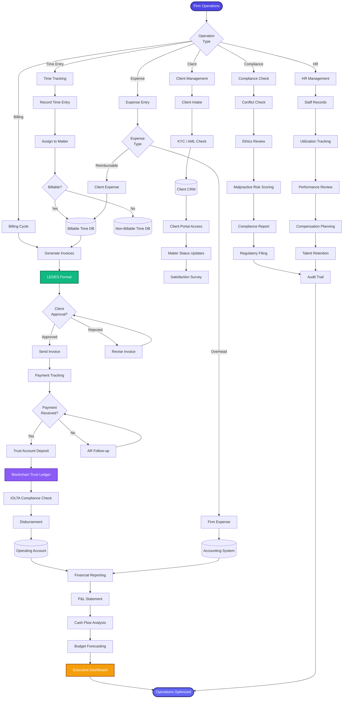

[< Back to Index](../00-ENTERPRISE-TAXONOMY-INDEX.md)

# 06. Firm Operations & Administration - PRIMARY FLOW

##  Strategic Objective
Complete law firm management system with LEDES billing, trust accounting, CRM, compliance, and HR management.

##  Competitive Positioning
- **Competes with:** Clio Manage, PracticePanther, Legal Files, Smokeball
- **Differentiation:** LEDES-compliant billing, blockchain trust accounting, integrated compliance

---

##  PRIMARY DOMAIN FLOW

---

##  KEY ENHANCEMENTS

### Phase 1: Billing & Trust Accounting (Q1 2026)
1. **LEDES Billing Engine** - Full LEDES 98BI, 2.0 support
2. **Blockchain Trust Accounting** - Immutable trust ledger
3. **IOLTA Compliance** - Automated compliance checks
4. **Real-Time AR Dashboard** - Track outstanding invoices

### Phase 2: CRM & Compliance (Q2 2026)
5. **Client Portal Pro** - Secure document sharing, e-signatures
6. **AI Conflict Detection** - ML-powered conflict checking
7. **Malpractice Risk Scoring** - Predictive risk models
8. **Ethics Compliance Engine** - Rule 1.7 / 1.9 compliance

### Phase 3: HR & Analytics (Q3 2026)
9. **Attorney Utilization Dashboard** - Billable vs non-billable
10. **Performance Review System** - 360-degree feedback
11. **Financial Forecasting** - Predictive revenue models
12. **Executive Analytics** - Real-time firm performance

---

**See secondary module flows in subdirectories:**
- [01-SECONDARY-billing-financials/](01-SECONDARY-billing-financials/)
- [02-SECONDARY-client-relationship-management/](02-SECONDARY-client-relationship-management/)
- [03-SECONDARY-compliance-risk-management/](03-SECONDARY-compliance-risk-management/)
- [04-SECONDARY-hr-resource-management/](04-SECONDARY-hr-resource-management/)

## Secondary Flows
- [Billing Financials](./01-SECONDARY-billing-financials/SECONDARY-FLOW.md)
- [Client Relationship Management](./02-SECONDARY-client-relationship-management/SECONDARY-FLOW.md)
- [Compliance Risk Management](./03-SECONDARY-compliance-risk-management/SECONDARY-FLOW.md)
- [Hr Resource Management](./04-SECONDARY-hr-resource-management/SECONDARY-FLOW.md)
