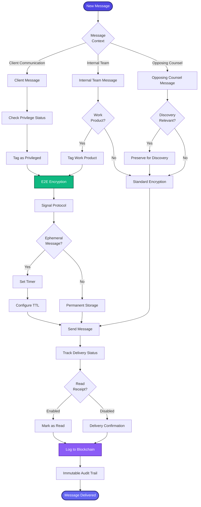

[< Back to Index](../../00-ENTERPRISE-TAXONOMY-INDEX.md) | [< Back to Primary Flow](../PRIMARY-FLOW.md)

# Secure Messaging - SECONDARY FLOW

##  Operational Objective
End-to-end encrypted messaging with attorney-client privilege protection and ephemeral message support.

##  DETAILED WORKFLOW

##  TERTIARY WORKFLOWS
- **T1:** Signal Protocol (double ratchet algorithm, forward secrecy)
- **T2:** Ephemeral Messaging (automatic deletion with blockchain log)
- **T3:** Privilege Tagger (NLP-based privilege detection)
