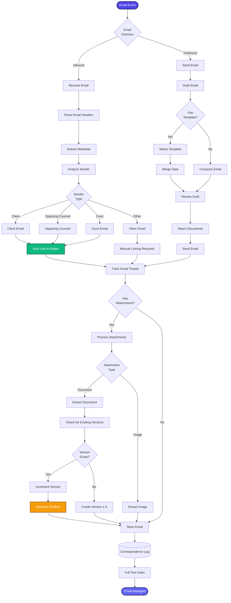

[< Back to Index](../../00-ENTERPRISE-TAXONOMY-INDEX.md) | [< Back to Primary Flow](../PRIMARY-FLOW.md)

# Correspondence Management - SECONDARY FLOW

##  Operational Objective
Email integration with automatic matter linking, thread tracking, and version control for attachments.

##  DETAILED WORKFLOW

##  TERTIARY WORKFLOWS
- **T1:** Email Parser (MIME parsing, header extraction)
- **T2:** Matter Linker (ML-based auto-linking by subject/sender)
- **T3:** Redline Generator (diff algorithm for document versions)
