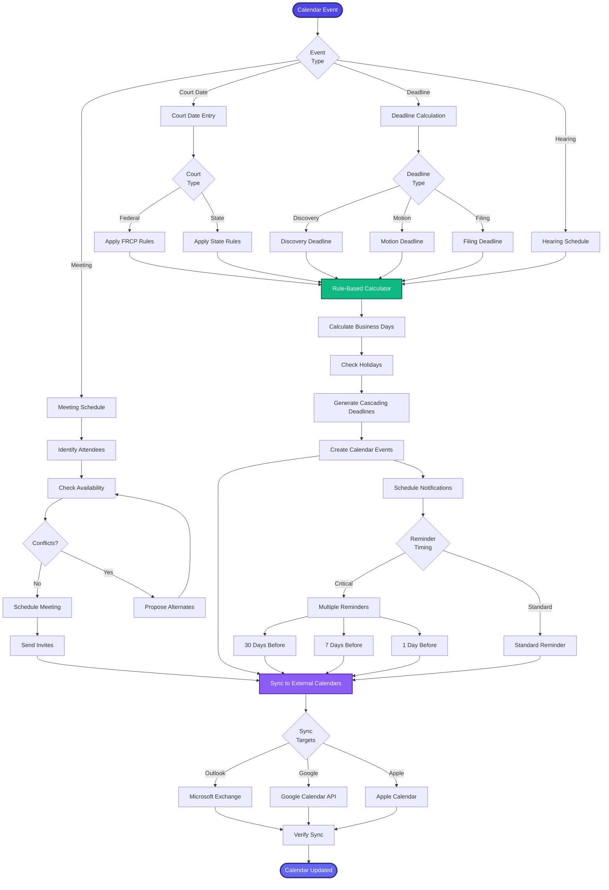

[< Back to Index](../../00-ENTERPRISE-TAXONOMY-INDEX.md) | [< Back to Primary Flow](../PRIMARY-FLOW.md)

# Calendar & Scheduling - SECONDARY FLOW

##  Operational Objective
Rule-based deadline calculation with multi-calendar sync and intelligent conflict resolution.

##  DETAILED WORKFLOW

##  TERTIARY WORKFLOWS
- **T1:** Deadline Calculator (FRCP/state rules engine with business day logic)
- **T2:** Conflict Resolver (ML-based optimal meeting time finder)
- **T3:** Multi-Calendar Sync (bidirectional Outlook/Google/Apple CalDAV)
