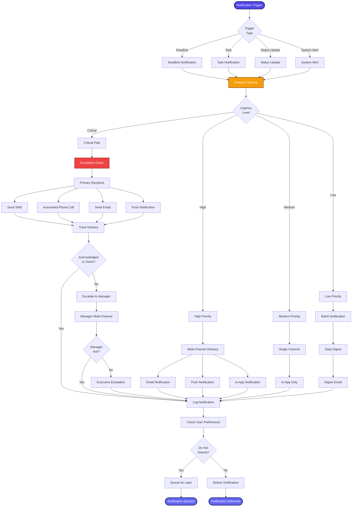

[< Back to Index](../../00-ENTERPRISE-TAXONOMY-INDEX.md) | [< Back to Primary Flow](../PRIMARY-FLOW.md)

# Notification System - SECONDARY FLOW

##  Operational Objective
Intelligent notification routing with urgency-based escalation and multi-channel delivery.

##  DETAILED WORKFLOW

##  TERTIARY WORKFLOWS
- **T1:** Urgency Classifier (ML model based on deadline proximity, matter importance)
- **T2:** Escalation Engine (multi-tier escalation with acknowledgment tracking)
- **T3:** Multi-Channel Orchestrator (SMS via Twilio, email via SendGrid, push via FCM)
