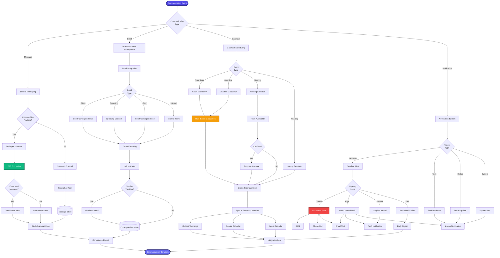

[< Back to Index](../00-ENTERPRISE-TAXONOMY-INDEX.md)

# 07. Communication & Collaboration - PRIMARY FLOW

##  Strategic Objective
Secure, privilege-protected communication system with end-to-end encryption, correspondence management, and intelligent notification system.

##  Competitive Positioning
- **Competes with:** Microsoft Teams (Legal Hold), Slack Enterprise, Rocket Matter
- **Differentiation:** Attorney-client privilege protection, ephemeral messaging, blockchain audit trails

---

##  PRIMARY DOMAIN FLOW

---

##  KEY ENHANCEMENTS

### Phase 1: Secure Messaging (Q1 2026)
1. **E2E Encryption** - Signal Protocol implementation
2. **Ephemeral Messaging** - Self-destructing messages
3. **Privilege Tagging** - Auto-tag attorney-client communications
4. **Blockchain Audit Log** - Immutable communication log

### Phase 2: Correspondence Management (Q2 2026)
5. **Email Integration** - Bi-directional Outlook/Gmail sync
6. **Thread Tracking** - Automatic matter linking
7. **Version Control** - Track document revisions in emails
8. **Redlining** - Visual diff for email attachments

### Phase 3: Calendar & Notifications (Q3 2026)
9. **Rule-Based Deadline Calculator** - FRCP/state rules engine
10. **Smart Escalation** - Intelligent notification routing
11. **Multi-Calendar Sync** - Outlook, Google, Apple
12. **Court Date Scraping** - Auto-import from PACER

---

**See secondary module flows in subdirectories:**
- [01-SECONDARY-secure-messaging/](01-SECONDARY-secure-messaging/)
- [02-SECONDARY-correspondence-management/](02-SECONDARY-correspondence-management/)
- [03-SECONDARY-calendar-scheduling/](03-SECONDARY-calendar-scheduling/)
- [04-SECONDARY-notification-system/](04-SECONDARY-notification-system/)

## Secondary Flows
- [Secure Messaging](./01-SECONDARY-secure-messaging/SECONDARY-FLOW.md)
- [Correspondence Management](./02-SECONDARY-correspondence-management/SECONDARY-FLOW.md)
- [Calendar Scheduling](./03-SECONDARY-calendar-scheduling/SECONDARY-FLOW.md)
- [Notification System](./04-SECONDARY-notification-system/SECONDARY-FLOW.md)
