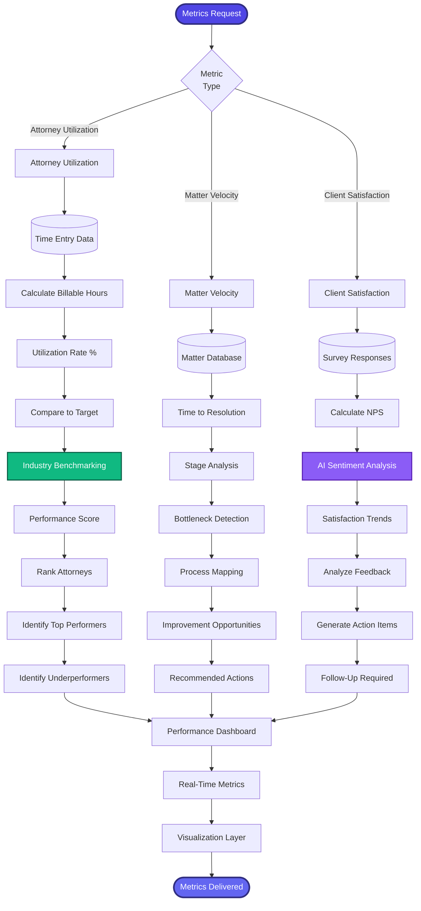

[< Back to Index](../../00-ENTERPRISE-TAXONOMY-INDEX.md) | [< Back to Primary Flow](../PRIMARY-FLOW.md)

# Performance Metrics - SECONDARY FLOW

##  Operational Objective
Real-time attorney utilization tracking, matter velocity analysis, and client satisfaction measurement.

##  DETAILED WORKFLOW

##  TERTIARY WORKFLOWS
- **T1:** Utilization Calculator (billable hours / available hours, target: 75-85%)
- **T2:** Matter Velocity Tracker (stage duration analysis, bottleneck identification)
- **T3:** NPS Calculator (Promoters - Detractors / Total × 100)
