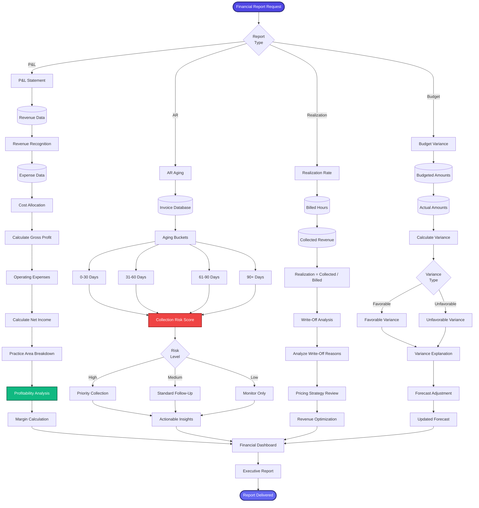

[< Back to Index](../../00-ENTERPRISE-TAXONOMY-INDEX.md) | [< Back to Primary Flow](../PRIMARY-FLOW.md)

# Financial Reporting - SECONDARY FLOW

##  Operational Objective
Comprehensive financial analysis with P&L statements, AR aging, realization rates, and budget variance tracking.

##  DETAILED WORKFLOW

##  TERTIARY WORKFLOWS
- **T1:** P&L Generator (GAAP-compliant accounting, practice area allocation)
- **T2:** AR Aging Engine (automated collection risk scoring)
- **T3:** Realization Calculator (collected / billed × 100, target: >90%)
