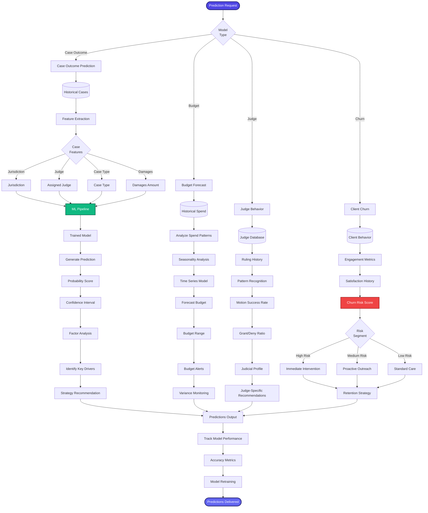

[< Back to Index](../../00-ENTERPRISE-TAXONOMY-INDEX.md) | [< Back to Primary Flow](../PRIMARY-FLOW.md)

# Predictive Modeling - SECONDARY FLOW

##  Operational Objective
Machine learning models for case outcome prediction, budget forecasting, judge behavior, and client churn.

##  DETAILED WORKFLOW

##  TERTIARY WORKFLOWS
- **T1:** Case Outcome Model (XGBoost, features: judge, jurisdiction, damages, case type)
- **T2:** Budget Forecast Model (ARIMA time series, seasonality adjustment)
- **T3:** Judge Behavior Model (random forest, historical ruling patterns)
- **T4:** Churn Prediction Model (logistic regression, engagement + satisfaction scores)

##  METRICS
- Case Outcome Accuracy: >75%
- Budget Forecast MAE: <15%
- Judge Prediction AUC: >0.80
- Churn Prediction Recall: >70%
