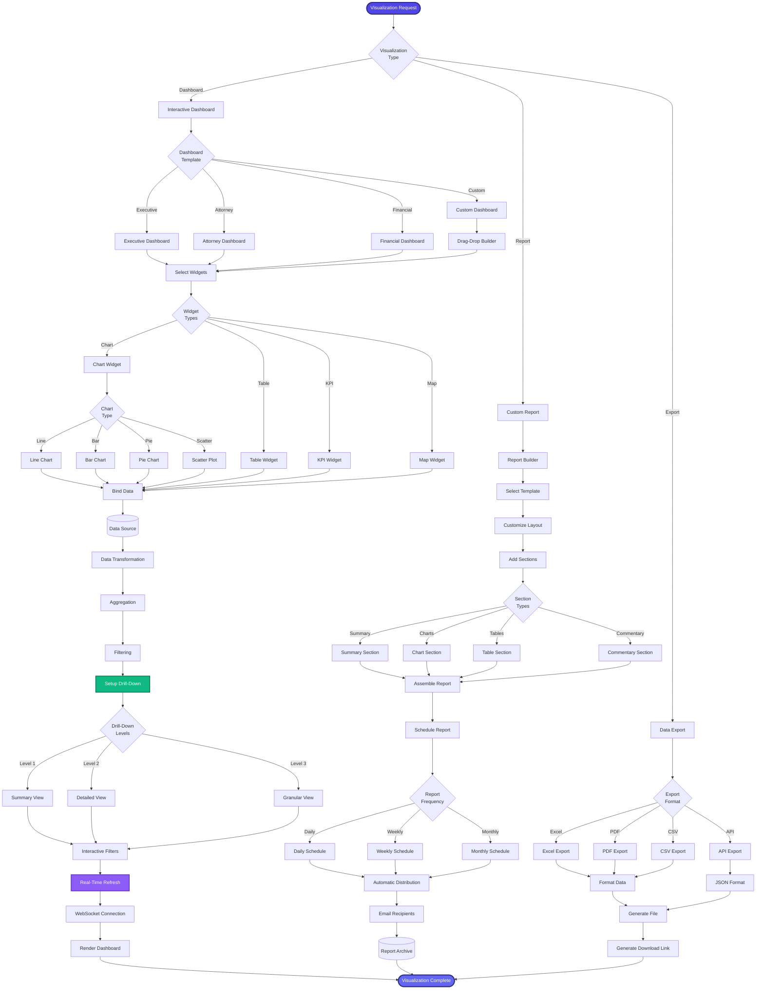

[< Back to Index](../../00-ENTERPRISE-TAXONOMY-INDEX.md) | [< Back to Primary Flow](../PRIMARY-FLOW.md)

# Data Visualization - SECONDARY FLOW

##  Operational Objective
Interactive dashboards, custom reports, and data exports with drill-down capabilities and real-time refresh.

##  DETAILED WORKFLOW

##  TERTIARY WORKFLOWS
- **T1:** Dashboard Builder (Recharts/D3.js, drag-drop interface)
- **T2:** Real-Time Data Sync (WebSocket for live dashboard updates)
- **T3:** Report Scheduler (cron-based automated report generation)
- **T4:** Export Engine (Excel XLSX, PDF via wkhtmltopdf, CSV, REST API)

##  METRICS
- Dashboard Load Time: <1 second
- Real-Time Refresh Latency: <500ms
- Report Generation Time: <30 seconds
- Export Success Rate: >99.5%
