[< Back to Index](../00-ENTERPRISE-TAXONOMY-INDEX.md)

# 08. Analytics & Business Intelligence - PRIMARY FLOW

##  Strategic Objective
Data-driven decision making with real-time dashboards, predictive modeling, and attorney performance benchmarking.

##  Competitive Positioning
- **Competes with:** Bloomberg Law Analytics, LexisNexis CounselLink, Clio Manage (Analytics)
- **Differentiation:** Real-time predictive models, attorney benchmarking, judge behavior analytics

---

##  PRIMARY DOMAIN FLOW

```mermaid
graph TB
    Start([Analytics Request]) --> AnalyticsType{Analytics<br/>Type}
    
    AnalyticsType -->|Performance| PerformanceMetrics[Performance Metrics]
    AnalyticsType -->|Financial| FinancialReporting[Financial Reporting]
    AnalyticsType -->|Predictive| PredictiveModeling[Predictive Modeling]
    AnalyticsType -->|Visualization| DataVisualization[Data Visualization]
    
    PerformanceMetrics --> MetricType{Metric<br/>Type}
    MetricType -->|Attorney| AttorneyUtil[Attorney Utilization]
    MetricType -->|Matter| MatterVelocity[Matter Velocity]
    MetricType -->|Client| ClientSatisfaction[Client Satisfaction]
    MetricType -->|Firm| FirmPerformance[Firm Performance]
    
    AttorneyUtil --> BillableHours[Billable Hours Analysis]
    BillableHours --> UtilizationRate[Utilization Rate %]
    UtilizationRate --> Benchmarking[Industry Benchmarking]
    Benchmarking --> PerformanceScore[Performance Score]
    
    MatterVelocity --> TimeToResolution[Time to Resolution]
    TimeToResolution --> StageAnalysis[Stage Analysis]
    StageAnalysis --> BottleneckDetection[Bottleneck Detection]
    BottleneckDetection --> ProcessImprovement[Process Improvement]
    
    ClientSatisfaction --> SurveyData[Survey Data Collection]
    SurveyData --> SentimentAnalysis[AI Sentiment Analysis]
    SentimentAnalysis --> NPS[Net Promoter Score]
    NPS --> ClientRetention[Client Retention Rate]
    
    FirmPerformance --> KPIDashboard[KPI Dashboard]
    KPIDashboard --> RealtimeMetrics[Real-Time Metrics]
    RealtimeMetrics --> TrendAnalysis[Trend Analysis]
    TrendAnalysis --> ExecutiveReport[Executive Report]
    
    FinancialReporting --> FinancialType{Financial<br/>Type}
    FinancialType -->|P&L| ProfitLoss[P&L Statement]
    FinancialType -->|AR| AccountsReceivable[AR Aging]
    FinancialType -->|Realization| RealizationRate[Realization Rate]
    FinancialType -->|Budget| BudgetVariance[Budget Variance]
    
    ProfitLoss --> RevenueAnalysis[Revenue Analysis]
    RevenueAnalysis --> PracticeAreaBreakdown[Practice Area Breakdown]
    PracticeAreaBreakdown --> ProfitabilityAnalysis[Profitability Analysis]
    
    AccountsReceivable --> AgingReport[AR Aging Report]
    AgingReport --> CollectionRisk[Collection Risk Score]
    CollectionRisk --> ActionableInsights[Actionable Insights]
    
    RealizationRate --> WriteOffAnalysis[Write-Off Analysis]
    WriteOffAnalysis --> PricingStrategy[Pricing Strategy]
    PricingStrategy --> RevenueOptimization[Revenue Optimization]
    
    BudgetVariance --> ActualVsBudget[Actual vs Budget]
    ActualVsBudget --> VarianceExplanation[Variance Explanation]
    VarianceExplanation --> ForecastAdjustment[Forecast Adjustment]
    
    PredictiveModeling --> ModelType{Model<br/>Type}
    ModelType -->|Case Outcome| OutcomePrediction[Case Outcome Prediction]
    ModelType -->|Budget| BudgetForecast[Budget Forecast]
    ModelType -->|Judge| JudgeBehavior[Judge Behavior]
    ModelType -->|Client Churn| ChurnPrediction[Client Churn Prediction]
    
    OutcomePrediction --> HistoricalData[Historical Case Data]
    HistoricalData --> MLModel[Machine Learning Model]
    MLModel --> ProbabilityScore[Probability Score]
    ProbabilityScore --> ConfidenceInterval[Confidence Interval]
    ConfidenceInterval --> StrategyRecommendation[Strategy Recommendation]
    
    BudgetForecast --> HistoricalSpend[Historical Spend Data]
    HistoricalSpend --> SeasonalityAnalysis[Seasonality Analysis]
    SeasonalityAnalysis --> PredictiveBudget[Predictive Budget]
    PredictiveBudget --> BudgetAlerts[Budget Alerts]
    
    JudgeBehavior --> JudgeDatabase[(Judge Database)]
    JudgeDatabase --> RulingPatterns[Ruling Patterns]
    RulingPatterns --> MotionSuccessRate[Motion Success Rate]
    MotionSuccessRate --> JudicialProfile[Judicial Profile]
    
    ChurnPrediction --> ClientBehavior[Client Behavior Analysis]
    ClientBehavior --> ChurnRiskScore[Churn Risk Score]
    ChurnRiskScore --> RetentionStrategy[Retention Strategy]
    RetentionStrategy --> ProactiveOutreach[Proactive Outreach]
    
    DataVisualization --> VizType{Visualization<br/>Type}
    VizType -->|Dashboard| InteractiveDashboard[Interactive Dashboard]
    VizType -->|Reports| CustomReports[Custom Reports]
    VizType -->|Exports| DataExports[Data Exports]
    
    InteractiveDashboard --> DrillDown[Drill-Down Capability]
    DrillDown --> FilterOptions[Filter Options]
    FilterOptions --> RealTimeRefresh[Real-Time Refresh]
    RealTimeRefresh --> UserDashboard[User Dashboard]
    
    CustomReports --> ReportBuilder[Report Builder]
    ReportBuilder --> ScheduledReports[Scheduled Reports]
    ScheduledReports --> AutomaticDistribution[Automatic Distribution]
    AutomaticDistribution --> ReportArchive[(Report Archive)]
    
    DataExports --> ExportFormat{Export<br/>Format}
    ExportFormat -->|Excel| ExcelExport[Excel Export]
    ExportFormat -->|PDF| PDFExport[PDF Export]
    ExportFormat -->|CSV| CSVExport[CSV Export]
    ExportFormat -->|API| APIExport[API Export]
    
    PerformanceScore --> AnalyticsOutput[Analytics Output]
    ProcessImprovement --> AnalyticsOutput
    ClientRetention --> AnalyticsOutput
    ExecutiveReport --> AnalyticsOutput
    ActionableInsights --> AnalyticsOutput
    RevenueOptimization --> AnalyticsOutput
    ForecastAdjustment --> AnalyticsOutput
    StrategyRecommendation --> AnalyticsOutput
    BudgetAlerts --> AnalyticsOutput
    JudicialProfile --> AnalyticsOutput
    ProactiveOutreach --> AnalyticsOutput
    UserDashboard --> AnalyticsOutput
    ReportArchive --> AnalyticsOutput
    ExcelExport --> AnalyticsOutput
    PDFExport --> AnalyticsOutput
    CSVExport --> AnalyticsOutput
    APIExport --> AnalyticsOutput
    
    AnalyticsOutput --> End([Analytics Delivered])
    
    style Start fill:#4f46e5,stroke:#312e81,stroke-width:3px,color:#fff
    style MLModel fill:#10b981,stroke:#065f46,stroke-width:2px,color:#fff
    style KPIDashboard fill:#f59e0b,stroke:#92400e,stroke-width:2px,color:#fff
    style InteractiveDashboard fill:#8b5cf6,stroke:#5b21b6,stroke-width:2px,color:#fff
    style End fill:#6366f1,stroke:#312e81,stroke-width:3px,color:#fff
```

---

##  KEY ENHANCEMENTS

### Phase 1: Core Analytics (Q1 2026)
1. **Real-Time KPI Dashboards** - Attorney utilization, matter velocity, client satisfaction
2. **Financial Reporting Suite** - P&L, AR aging, realization rates
3. **Attorney Benchmarking** - Compare against industry standards
4. **Executive Summary Reports** - Automated weekly/monthly reports

### Phase 2: Predictive Models (Q2 2026)
5. **Case Outcome Prediction** - ML models trained on historical data
6. **Budget Forecasting** - Predictive budget models with confidence intervals
7. **Judge Behavior Analytics** - Motion success prediction by judge
8. **Client Churn Prediction** - Identify at-risk clients

### Phase 3: Advanced Visualization (Q3 2026)
9. **Interactive Dashboards** - Drill-down, filter, real-time refresh
10. **Custom Report Builder** - Drag-drop report designer
11. **Scheduled Reports** - Automated distribution
12. **API Exports** - RESTful API for external BI tools

---

##  SUCCESS METRICS

| Metric | Current | Target | Industry Benchmark |
|--------|---------|--------|-------------------|
| Dashboard Load Time | 3s | <1s | 2s (Tableau) |
| Prediction Accuracy | N/A | 75% | 70% (Bloomberg) |
| Report Generation Time | 5min | 30s | 2min (Average) |
| User Adoption | 40% | 90% | 65% (Industry) |
| Data Freshness | 1 hour | Real-time | 15 min (Best-in-class) |

---

**See secondary module flows in subdirectories:**
- [01-SECONDARY-performance-metrics/](01-SECONDARY-performance-metrics/)
- [02-SECONDARY-financial-reporting/](02-SECONDARY-financial-reporting/)
- [03-SECONDARY-predictive-modeling/](03-SECONDARY-predictive-modeling/)
- [04-SECONDARY-data-visualization/](04-SECONDARY-data-visualization/)

## Secondary Flows
- [Performance Metrics](./01-SECONDARY-performance-metrics/SECONDARY-FLOW.md)
- [Financial Reporting](./02-SECONDARY-financial-reporting/SECONDARY-FLOW.md)
- [Predictive Modeling](./03-SECONDARY-predictive-modeling/SECONDARY-FLOW.md)
- [Data Visualization](./04-SECONDARY-data-visualization/SECONDARY-FLOW.md)
