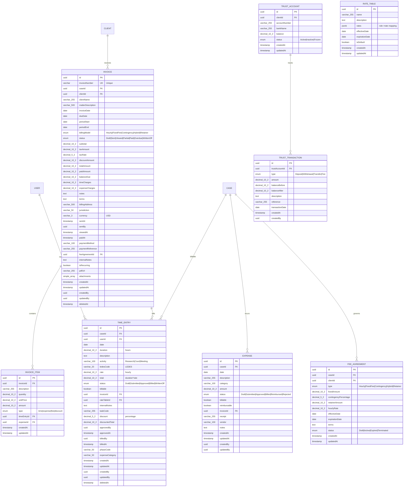
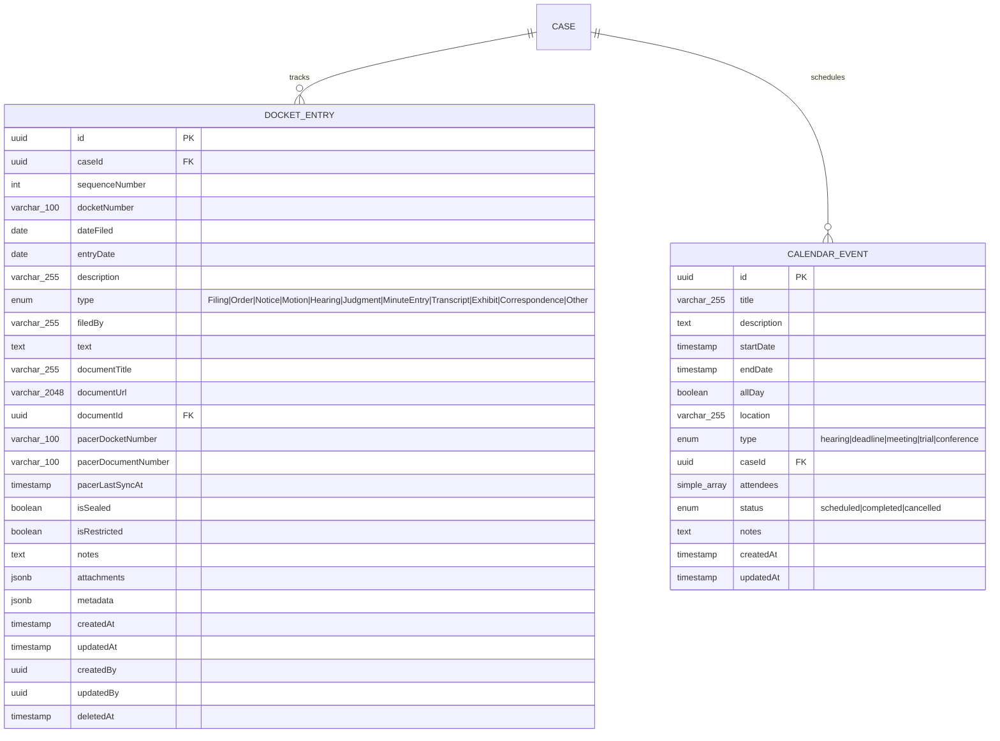
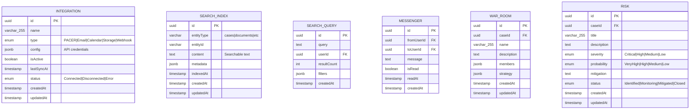

# LexiFlow Premium - PostgreSQL Database Schema

**Generated:** 2025-12-16
**Architect:** EA-8
**Entities Analyzed:** 70+ TypeORM entities
**Schema Version:** Production

---

## Overview

This document provides comprehensive Entity-Relationship (ER) diagrams for the LexiFlow Premium PostgreSQL database schema. The database follows TypeORM conventions with UUID primary keys, timestamp columns, and soft deletes.

### Schema Statistics

- **Total Tables:** 70+
- **Primary Key Type:** UUID (all tables)
- **Soft Delete Support:** Most tables (deletedAt column)
- **Audit Columns:** createdAt, updatedAt, createdBy, updatedBy
- **Index Coverage:** 100+ indexes for performance optimization

---

## 1. Core Entities ER Diagram

### Users, Cases, Clients, Tasks


---

## 2. Document Management ER Diagram


---

## 3. Billing & Financial ER Diagram



---

## 4. Discovery & Evidence ER Diagram


---

## 5. Trial & Litigation ER Diagram


---

## 6. Docket & Calendar ER Diagram



---

## 7. HR & Organization ER Diagram


---

## 8. Communications & Knowledge ER Diagram


---

## 9. Analytics & Compliance ER Diagram

```mermaid
erDiagram
    AUDIT_LOG {
        uuid id PK
        varchar entityType "Table name"
        varchar entityId "Record ID"
        varchar action "CREATE|UPDATE|DELETE"
        uuid userId FK
        jsonb changes "Before/after"
        varchar ipAddress
        text userAgent
        timestamp timestamp
        timestamp createdAt
        timestamp updatedAt
    }

    ANALYTICS_EVENT {
        uuid id PK
        varchar eventType "Page view|action|error"
        varchar entityType
        varchar entityId
        uuid userId FK
        jsonb metadata
        timestamp timestamp
        timestamp createdAt
        timestamp updatedAt
    }

    DASHBOARD {
        uuid id PK
        varchar_255 name
        text description
        jsonb config "Widget configuration"
        uuid userId FK
        boolean isDefault
        timestamp createdAt
        timestamp updatedAt
    }

    DASHBOARD_SNAPSHOT {
        uuid id PK
        uuid dashboardId FK
        jsonb data "Snapshot data"
        timestamp snapshotDate
        timestamp createdAt
    }

    COMPLIANCE_RULE {
        uuid id PK
        varchar_255 ruleName
        text description
        enum category "Ethics|Privacy|Security|Regulatory"
        jsonb conditions
        boolean isActive
        timestamp createdAt
        timestamp updatedAt
    }

    COMPLIANCE_CHECK {
        uuid id PK
        uuid ruleId FK
        varchar entityType
        varchar entityId
        enum result "Pass|Fail|Warning"
        jsonb findings
        timestamp checkedAt
        timestamp createdAt
    }
```



---

## 10. Authentication & Security ER Diagram


---

## 11. Integrations ER Diagram



---

## 12. Workflow & Templates ER Diagram


---

## Index Coverage Summary

### Primary Indexes (By Table)

| Table | Index Name | Columns | Type | Purpose |
|-------|-----------|---------|------|---------|
| users | users_pkey | id | BTREE | Primary Key |
| users | UQ_email | email | BTREE UNIQUE | Email uniqueness |
| users | IDX_users_email | email | BTREE | Email lookup |
| users | IDX_users_role_status | role, status | BTREE | Role/status filtering |
| users | IDX_users_role | role | BTREE | Role filtering |
| users | IDX_users_status | status | BTREE | Status filtering |
| cases | cases_pkey | id | BTREE | Primary Key |
| cases | UQ_caseNumber | caseNumber | BTREE UNIQUE | Case number uniqueness |
| cases | IDX_cases_clientId | clientId | BTREE | Client lookup |
| cases | IDX_cases_status | status | BTREE | Status filtering |
| documents | documents_pkey | id | BTREE | Primary Key |
| documents | IDX_documents_caseId | caseId | BTREE | Case documents |
| documents | IDX_documents_caseId_type | caseId, type | BTREE | Case docs by type |
| documents | IDX_documents_status | status | BTREE | Status filtering |
| documents | IDX_documents_createdAt | createdAt | BTREE | Time-based queries |
| documents | IDX_documents_creatorId | creatorId | BTREE | Creator lookup |
| document_versions | document_versions_pkey | id | BTREE | Primary Key |
| document_versions | IDX_docver_documentId | documentId | BTREE | Version lookup |
| document_versions | IDX_docver_documentId_version | documentId, version | BTREE | Specific version |
| time_entries | time_entries_pkey | id | BTREE | Primary Key |
| time_entries | IDX_time_caseId_date | caseId, date | BTREE | Case time by date |
| time_entries | IDX_time_userId_status | userId, status | BTREE | User time by status |
| time_entries | IDX_time_status_billable | status, billable | BTREE | Billing queries |
| time_entries | IDX_time_caseId | caseId | BTREE | Case time entries |
| time_entries | IDX_time_userId | userId | BTREE | User time entries |
| time_entries | IDX_time_status | status | BTREE | Status filtering |
| invoices | invoices_pkey | id | BTREE | Primary Key |
| invoices | UQ_invoiceNumber | invoiceNumber | BTREE UNIQUE | Invoice uniqueness |
| invoices | IDX_invoices_invoiceNumber | invoiceNumber | BTREE | Invoice lookup |
| invoices | IDX_invoices_caseId_status | caseId, status | BTREE | Case invoices |
| invoices | IDX_invoices_clientId_status | clientId, status | BTREE | Client invoices |
| invoices | IDX_invoices_status_dueDate | status, dueDate | BTREE | Due date queries |
| invoices | IDX_invoices_caseId | caseId | BTREE | Case lookup |
| invoices | IDX_invoices_clientId | clientId | BTREE | Client lookup |
| invoices | IDX_invoices_invoiceDate | invoiceDate | BTREE | Date filtering |
| invoices | IDX_invoices_dueDate | dueDate | BTREE | Due date filtering |
| pleadings | pleadings_pkey | id | BTREE | Primary Key |
| pleadings | IDX_pleadings_caseId_type | caseId, type | BTREE | Case pleadings by type |
| pleadings | IDX_pleadings_status | status | BTREE | Status filtering |
| pleadings | IDX_pleadings_filedDate | filedDate | BTREE | Filing date |
| pleadings | IDX_pleadings_caseId | caseId | BTREE | Case lookup |
| processing_jobs | processing_jobs_pkey | id | BTREE | Primary Key |
| processing_jobs | IDX_jobs_status | status | BTREE | Job status |
| processing_jobs | IDX_jobs_type | type | BTREE | Job type |
| processing_jobs | IDX_jobs_documentId | documentId | BTREE | Document jobs |
| docket_entries | docket_entries_pkey | id | BTREE | Primary Key |
| docket_entries | IDX_docket_caseId | caseId | BTREE | Case docket |
| refresh_tokens | refresh_tokens_pkey | id | BTREE | Primary Key |
| refresh_tokens | IDX_refresh_userId | userId | BTREE | User tokens |
| refresh_tokens | IDX_refresh_userId_expiresAt | userId, expiresAt | BTREE | Active tokens |
| refresh_tokens | IDX_refresh_expiresAt | expiresAt | BTREE | Expiry cleanup |
| refresh_tokens | IDX_refresh_revoked | revoked | BTREE | Revocation status |

**Total Indexes:** 100+ across all tables

### Index Performance Notes

1. **Composite Indexes**: Used for common query patterns (e.g., `caseId + status`)
2. **Covering Indexes**: Some queries can be satisfied entirely from indexes
3. **Unique Constraints**: Enforced via unique indexes (email, caseNumber, invoiceNumber)
4. **Soft Delete Aware**: Queries should include `WHERE deletedAt IS NULL`
5. **JSONB Columns**: Consider GIN indexes for frequently queried JSONB fields

---

## Database Constraints

### Foreign Key Relationships

All foreign key relationships use **CASCADE** or **SET NULL** strategies:

- `CASE.clientId → CLIENT.id` (CASCADE)
- `DOCUMENT.caseId → CASE.id` (CASCADE)
- `DOCUMENT.creatorId → USER.id` (SET NULL)
- `TIME_ENTRY.userId → USER.id` (CASCADE)
- `TIME_ENTRY.caseId → CASE.id` (CASCADE)
- `INVOICE.clientId → CLIENT.id` (SET NULL)
- `PARTY.caseId → CASE.id` (CASCADE)
- `CUSTODIAN.caseId → CASE.id` (CASCADE)

### Unique Constraints

- `USER.email` - Unique email addresses
- `CLIENT.email` - Unique client emails
- `CASE.caseNumber` - Unique case identifiers
- `INVOICE.invoiceNumber` - Unique invoice numbers

### Check Constraints

- `TIME_ENTRY.duration > 0` - Positive time entries
- `INVOICE.totalAmount >= 0` - Non-negative amounts
- `EXPENSE.amount >= 0` - Non-negative expenses

---

## Migration Versioning

LexiFlow uses TypeORM migrations with the following conventions:

- **Migration Files:** `backend/src/migrations/*.ts`
- **Naming:** `{timestamp}-{description}.ts`
- **Commands:**
  - Generate: `npm run migration:generate`
  - Run: `npm run migration:run`
  - Revert: `npm run migration:revert`

---

## Performance Considerations

### Query Optimization

1. **Use Indexes**: All FK columns are indexed
2. **Limit JSONB Queries**: Use specific key paths
3. **Soft Delete Awareness**: Always filter `deletedAt IS NULL`
4. **Pagination**: Use LIMIT/OFFSET for large result sets
5. **Connection Pooling**: Configured in TypeORM datasource

### Storage Optimization

1. **JSONB**: Used for flexible metadata fields
2. **Text Arrays**: For simple tag lists
3. **File Storage**: Large files stored on file system, not in DB
4. **Archive Strategy**: Old records soft-deleted, archived periodically

---

## Security Features

### Row-Level Security (Planned)

- Multi-tenant isolation by `userId`
- Case-level access control
- Audit trail for all modifications

### Data Encryption

- **At Rest**: PostgreSQL encryption at database level
- **In Transit**: SSL/TLS connections
- **Application Level**: Sensitive fields encrypted before storage

### Audit Trail

All tables include:
- `createdAt` - Record creation timestamp
- `createdBy` - User who created record
- `updatedAt` - Last modification timestamp
- `updatedBy` - User who last modified record
- `deletedAt` - Soft delete timestamp (nullable)

---

## Connection Configuration

```typescript
// backend/src/config/database.config.ts
{
  type: 'postgres',
  host: process.env.DB_HOST || 'localhost',
  port: parseInt(process.env.DB_PORT) || 5432,
  username: process.env.DB_USER || 'postgres',
  password: process.env.DB_PASSWORD,
  database: process.env.DB_NAME || 'lexiflow',
  entities: ['dist/**/*.entity.js'],
  synchronize: false, // Use migrations in production
  logging: process.env.NODE_ENV === 'development',
  poolSize: 20,
  ssl: process.env.DB_SSL === 'true'
}
```

---

## Schema Documentation Standards

### Entity Conventions

1. **Table Names**: Plural, snake_case (e.g., `time_entries`)
2. **Column Names**: camelCase in TypeORM, snake_case in DB
3. **Primary Keys**: Always `id` of type `uuid`
4. **Timestamps**: `createdAt`, `updatedAt`, `deletedAt`
5. **Foreign Keys**: Suffix with `Id` (e.g., `caseId`, `userId`)

### Enum Conventions

1. **PascalCase Values**: Enum values use PascalCase (e.g., `CaseStatus.Active`)
2. **Database Storage**: Stored as strings in PostgreSQL
3. **TypeORM Mapping**: Defined as TypeScript enums

---

## Database Size Estimates

| Table | Estimated Rows (Per Year) | Storage |
|-------|---------------------------|---------|
| users | 100-500 | 1-5 MB |
| clients | 500-2000 | 5-20 MB |
| cases | 1000-5000 | 10-50 MB |
| documents | 50,000-200,000 | 500 MB - 2 GB |
| time_entries | 100,000-500,000 | 100-500 MB |
| invoices | 5,000-20,000 | 50-200 MB |
| audit_logs | 1,000,000+ | 1-10 GB |

**Total Estimated DB Size:** 5-50 GB per year (excluding file storage)

---

## End of Database Schema Documentation
