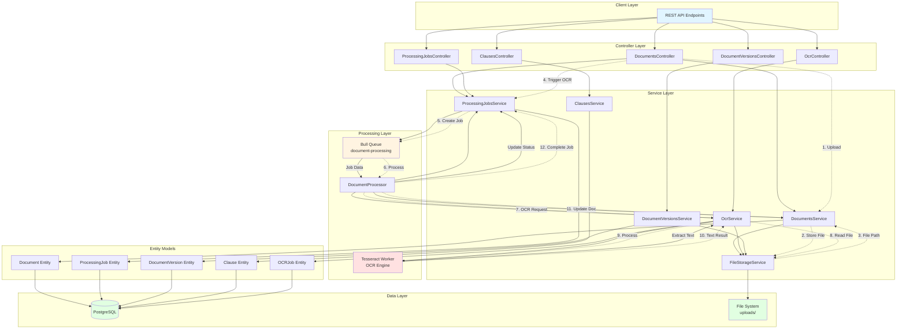

# EA-6: Backend Data Processing Architecture Analysis

**Agent**: EA-6
**Domain**: Backend Data Processing
**Date**: 2025-12-16
**Status**: COMPLETED

## Overview

This document provides a comprehensive analysis of the LexiFlow backend data processing services, covering OCR processing, job management, document versioning, and clause extraction.

## Architecture Diagram



## Processing Pipelines

### 1. OCR Processing Pipeline

**Flow**: Document Upload → Storage → Job Creation → Queue → OCR Processing → Text Extraction → Document Update

**Key Files**:
- `/backend/src/ocr/ocr.service.ts` (lines 50-96)
- `/backend/src/processing-jobs/processors/document-processor.ts` (lines 19-85)
- `/backend/src/documents/documents.controller.ts` (lines 125-148)

**Steps**:
1. Client uploads document via `POST /api/v1/documents`
2. DocumentsService stores file using FileStorageService
3. Client triggers OCR via `POST /api/v1/documents/:id/ocr`
4. ProcessingJobsService creates job record in database
5. Job added to Bull queue `document-processing`
6. DocumentProcessor handles job asynchronously
7. OcrService reads file buffer and processes with Tesseract
8. Extracted text written back to Document entity
9. Job marked as completed with results

**Data Transformations**:
- File Buffer → Tesseract OCR → Text String
- Text → Word Count (split by whitespace)
- Text → Confidence Score (0-100)
- Processing Time (milliseconds)

### 2. Document Versioning Pipeline

**Flow**: Create Version → Store File → Calculate Checksum → Save Metadata

**Key Files**:
- `/backend/src/document-versions/document-versions.service.ts` (lines 26-70)
- `/backend/src/file-storage/file-storage.service.ts` (lines 30-76)

**Steps**:
1. Get latest version number for document
2. Increment version number
3. Store file in organized path: `/uploads/{caseId}/{documentId}/{version}/`
4. Calculate SHA-256 checksum
5. Save version record with metadata

**Data Transformations**:
- File Buffer → SHA-256 Hash (checksum)
- Filename → Sanitized Filename (replace special chars)
- File Stats → Size, MIME type, timestamps

### 3. Job Processing Pipeline

**Flow**: Job Creation → Queue → Processing → Status Updates → Completion

**Key Files**:
- `/backend/src/processing-jobs/processing-jobs.service.ts` (lines 23-55, 93-125)
- `/backend/src/processing-jobs/processors/document-processor.ts`

**Job Types**:
- `OCR` - Text extraction from images/PDFs
- `METADATA_EXTRACTION` - Extract document metadata (stub)
- `REDACTION` - Redact sensitive information (stub)
- `DOCUMENT_CONVERSION` - Convert between formats
- `MERGE` - Merge multiple documents
- `SPLIT` - Split document into parts

**Status Flow**:
```
PENDING → PROCESSING → COMPLETED
              ↓
           FAILED
              ↓
          CANCELLED
```

### 4. Clause Management

**Flow**: CRUD operations with usage tracking and search capabilities

**Key Files**:
- `/backend/src/clauses/clauses.service.ts`

**Features**:
- Create, read, update, delete clauses
- Search by content, title, description
- Filter by category, tags, active status
- Usage tracking (increment on use)
- Duplicate clauses
- Most-used clauses ranking

## Duplicative Code Patterns

### 1. Error Handling Pattern
**Locations**:
- `/backend/src/ocr/ocr.service.ts:92-94`
- `/backend/src/processing-jobs/processing-jobs.service.ts:51-54`
- `/backend/src/document-versions/document-versions.service.ts:66-69`
- `/backend/src/clauses/clauses.service.ts:38-41`
- `/backend/src/documents/documents.service.ts:60-63`

**Pattern**:
```typescript
} catch (error) {
  this.logger.error('Failed to [operation]', error);
  throw error;
}
```

**Impact**: Repeated 20+ times across services. Could be abstracted into a base service class.

### 2. Logger Initialization
**Locations**:
- `/backend/src/ocr/ocr.service.ts:8`
- `/backend/src/processing-jobs/processing-jobs.service.ts:11`
- `/backend/src/document-versions/document-versions.service.ts:15`
- `/backend/src/clauses/clauses.service.ts:14`
- `/backend/src/documents/documents.service.ts:17`
- `/backend/src/file-storage/file-storage.service.ts:10`

**Pattern**:
```typescript
private readonly logger = new Logger(ServiceName.name);
```

**Impact**: Repeated in every service. Could use a base service class.

### 3. FindOne with NotFoundException
**Locations**:
- `/backend/src/processing-jobs/processing-jobs.service.ts:80-88`
- `/backend/src/document-versions/document-versions.service.ts:85-97`
- `/backend/src/clauses/clauses.service.ts:83-91`
- `/backend/src/documents/documents.service.ts:154-162`

**Pattern**:
```typescript
async findOne(id: string): Promise<Entity> {
  const entity = await this.repository.findOne({ where: { id } });
  if (!entity) {
    throw new NotFoundException(`Entity with ID ${id} not found`);
  }
  return entity;
}
```

**Impact**: Repeated 15+ times. Could be a base repository method.

### 4. File Path Resolution
**Locations**:
- `/backend/src/file-storage/file-storage.service.ts:83-85`
- `/backend/src/file-storage/file-storage.service.ts:104-106`
- `/backend/src/file-storage/file-storage.service.ts:135-137`
- `/backend/src/file-storage/file-storage.service.ts:181-183`

**Pattern**:
```typescript
const absolutePath = path.isAbsolute(filePath)
  ? filePath
  : path.join(this.uploadDir, filePath);
```

**Impact**: Repeated 4 times in same service. Should be a private helper method.

### 5. Query Builder Filtering Pattern
**Locations**:
- `/backend/src/clauses/clauses.service.ts:47-77`
- `/backend/src/documents/documents.service.ts:69-149`
- `/backend/src/processing-jobs/processing-jobs.service.ts:130-152`

**Pattern**:
```typescript
const query = this.repository.createQueryBuilder('entity');
if (filter1) {
  query.andWhere('entity.field = :filter1', { filter1 });
}
if (filter2) {
  query.andWhere('entity.field = :filter2', { filter2 });
}
// ... more filters
```

**Impact**: Complex filtering logic repeated. Could use a query builder helper.

### 6. Job Status Update Logic
**Locations**:
- `/backend/src/processing-jobs/processors/document-processor.ts:27-31`
- `/backend/src/processing-jobs/processors/document-processor.ts:50-54`
- `/backend/src/processing-jobs/processors/document-processor.ts:63-72`
- `/backend/src/processing-jobs/processors/document-processor.ts:94-98`

**Pattern**:
```typescript
await this.processingJobsService.updateJobStatus(
  jobId,
  JobStatus.PROCESSING,
  progress,
);
```

**Impact**: Status updates follow same pattern. Could use a job context wrapper.

### 7. Metadata/JSONB Column Handling
**Locations**:
- `/backend/src/clauses/entities/clause.entity.ts:68`
- `/backend/src/document-versions/entities/document-version.entity.ts:40-41`
- `/backend/src/ocr/entities/ocr-job.entity.ts:35-36`
- `/backend/src/processing-jobs/entities/processing-job.entity.ts:38-42`

**Pattern**:
```typescript
@Column({ type: 'jsonb', nullable: true })
metadata: Record<string, any>;
```

**Impact**: Untyped metadata everywhere. Could use a metadata base class with type safety.

## Open-ended Data Segments

### Critical Issues (No Size Limits)

#### 1. OCR Service - Unbounded File Buffer
**Location**: `/backend/src/ocr/ocr.service.ts:64`
```typescript
const fileBuffer = await this.fileStorageService.getFile(filePath);
```
**Issue**: No file size check before loading entire file into memory
**Risk**: Out-of-memory errors for large files (multi-GB PDFs)
**Recommendation**: Add max file size check (e.g., 100MB limit), stream processing for large files

#### 2. FileStorageService - No File Size Validation
**Location**: `/backend/src/file-storage/file-storage.service.ts:30-76`
```typescript
async storeFile(file: Express.Multer.File, ...): Promise<FileUploadResult> {
  // No size validation before writing
  await writeFile(filePath, file.buffer);
}
```
**Issue**: No maximum file size enforcement
**Risk**: Disk space exhaustion, multi-GB uploads
**Recommendation**: Add configurable max file size (e.g., 500MB), disk space pre-check

#### 3. Unbounded Text Fields in Entities
**Locations**:
- `/backend/src/ocr/entities/ocr-job.entity.ts:32-33` - extractedText
- `/backend/src/document-versions/entities/document-version.entity.ts:43-44` - fullTextContent
- `/backend/src/processing-jobs/entities/processing-job.entity.ts:41-42` - result (JSONB)
- `/backend/src/clauses/entities/clause.entity.ts:29-30` - content

**Issue**: PostgreSQL TEXT fields with no size limits
**Risk**: Multi-GB text fields, query performance degradation
**Recommendation**: Add VARCHAR limits or chunk large content

#### 4. No Pagination Enforcement
**Location**: `/backend/src/clauses/clauses.service.ts:47-78`
```typescript
async findAll(...): Promise<Clause[]> {
  // No LIMIT clause if no pagination params provided
  return await query.getMany();
}
```
**Issue**: Could return thousands of records without pagination
**Risk**: Memory exhaustion, slow API responses
**Recommendation**: Enforce default limit (e.g., 100 records)

#### 5. Unlimited Document Versions
**Location**: `/backend/src/document-versions/document-versions.service.ts:26-70`
**Issue**: No limit on number of versions per document
**Risk**: Unbounded storage growth, thousands of versions
**Recommendation**: Add max versions per document (e.g., 50), archive old versions

### Missing Error Handling

#### 6. No Rate Limiting on Job Creation
**Location**: `/backend/src/processing-jobs/processing-jobs.service.ts:23-55`
**Issue**: No limit on jobs created per user/document
**Risk**: Queue flooding, resource exhaustion
**Recommendation**: Add rate limiting (e.g., 10 jobs/minute per user)

#### 7. No File Type Validation
**Location**: `/backend/src/file-storage/file-storage.service.ts:30-76`
**Issue**: No MIME type whitelist validation
**Risk**: Malicious file uploads (executables, scripts)
**Recommendation**: Validate MIME types against whitelist

#### 8. Missing Disk Space Checks
**Location**: `/backend/src/file-storage/file-storage.service.ts:30-76`
**Issue**: No disk space verification before file writes
**Risk**: Failed writes, partial files, system crashes
**Recommendation**: Check available disk space before operations

#### 9. No Timeout on OCR Processing
**Location**: `/backend/src/ocr/ocr.service.ts:67-69`
```typescript
const { data: { text, confidence } } = await this.worker.recognize(fileBuffer);
```
**Issue**: No timeout on Tesseract processing
**Risk**: Hung workers on corrupted/complex images
**Recommendation**: Add timeout (e.g., 5 minutes per document)

#### 10. Unhandled Bull Queue Failures
**Location**: `/backend/src/processing-jobs/processors/document-processor.ts`
**Issue**: No retry strategy defined for failed jobs
**Risk**: Jobs lost on transient failures
**Recommendation**: Configure Bull retry with exponential backoff

### Resource Leaks

#### 11. OCR Worker Lifecycle
**Location**: `/backend/src/ocr/ocr.service.ts:131-141`
**Issue**: Worker termination only on module destroy, not on idle timeout
**Risk**: Memory leak if worker hangs
**Recommendation**: Add idle timeout, health checks, worker pool

#### 12. No Cleanup for Old Processing Jobs
**Location**: `/backend/src/processing-jobs/processing-jobs.service.ts:299-317`
**Issue**: cleanupOldJobs exists but not called automatically
**Risk**: Database bloat with millions of old job records
**Recommendation**: Add scheduled cleanup (e.g., daily cron for jobs > 90 days)

#### 13. Orphaned Files on Transaction Failures
**Location**: `/backend/src/file-storage/file-storage.service.ts:30-76`
**Issue**: Files written to disk before database transaction commits
**Risk**: Orphaned files if database save fails
**Recommendation**: Implement two-phase commit or cleanup orphans periodically

### Security Issues

#### 14. No Input Sanitization on Filenames
**Location**: `/backend/src/file-storage/file-storage.service.ts:47-50`
```typescript
const safeBaseName = baseName.replace(/[^a-zA-Z0-9-_]/g, '_');
```
**Issue**: Path traversal possible if malicious filename bypasses regex
**Risk**: Files written outside upload directory
**Recommendation**: Use path.normalize, validate against base path

#### 15. No Checksum Verification on File Read
**Location**: `/backend/src/file-storage/file-storage.service.ts:81-97`
**Issue**: Files read without verifying checksum integrity
**Risk**: Processing corrupted data
**Recommendation**: Verify checksum on critical operations (OCR)

#### 16. Metadata Injection Risk
**Locations**:
- `/backend/src/clauses/dto/create-clause.dto.ts:40-43`
- `/backend/src/document-versions/dto/create-version.dto.ts:10-13`

**Issue**: Unvalidated JSONB metadata accepts any structure
**Risk**: Injection attacks, unexpected data shapes
**Recommendation**: Define typed metadata schemas, validate structure

## Data Flow Analysis

### File Upload to OCR Complete Flow

```
1. POST /api/v1/documents (with file)
   ↓
2. DocumentsController.create()
   ↓
3. DocumentsService.create()
   ↓
4. FileStorageService.storeFile()
   ├→ Create directory structure
   ├→ Write file to disk
   ├→ Calculate SHA-256 checksum
   └→ Return file metadata
   ↓
5. Document entity saved to PostgreSQL
   ↓
6. POST /api/v1/documents/:id/ocr
   ↓
7. DocumentsController.triggerOcr()
   ↓
8. ProcessingJobsService.createJob(OCR)
   ├→ Create ProcessingJob entity
   └→ Add to Bull queue
   ↓
9. DocumentProcessor.handleOcrJob()
   ├→ Update job status to PROCESSING
   ├→ DocumentsService.findOne()
   ├→ OcrService.processDocument()
   │  ├→ FileStorageService.getFile()
   │  ├→ Tesseract.recognize()
   │  └→ Calculate word count, confidence
   ├→ DocumentsService.markOcrProcessed()
   └→ Update job status to COMPLETED
   ↓
10. Client polls GET /api/v1/processing-jobs/:id
```

### Version Creation Flow

```
1. POST /api/v1/document-versions (with file)
   ↓
2. DocumentVersionsController.create()
   ↓
3. DocumentVersionsService.createVersion()
   ├→ Get latest version number
   ├→ Increment version
   ├→ FileStorageService.storeFile()
   │  └→ Store in /uploads/{caseId}/{documentId}/{version}/
   └→ Save DocumentVersion entity
```

## Module Dependencies

```
ProcessingJobsModule
├── TypeOrmModule (ProcessingJob entity)
├── BullModule (document-processing queue)
├── OcrModule
│   ├── ConfigModule
│   └── FileStorageModule
└── DocumentsModule (forwardRef)
    ├── TypeOrmModule (Document entity)
    └── FileStorageModule

DocumentVersionsModule
├── TypeOrmModule (DocumentVersion entity)
└── FileStorageModule

ClausesModule
└── TypeOrmModule (Clause entity)

FileStorageModule
└── ConfigModule
```

## Key Technologies

- **NestJS 11**: Framework with dependency injection
- **TypeORM**: ORM for PostgreSQL
- **Bull**: Redis-based job queue (uses Redis)
- **Tesseract.js**: OCR engine (WebAssembly)
- **Multer**: File upload middleware
- **PostgreSQL 14+**: Relational database
- **Redis 6+**: Queue backend (optional, can disable)

## Configuration

**Environment Variables**:
- `OCR_ENABLED`: Enable/disable OCR service (default: false)
- `OCR_LANGUAGES`: Supported languages (default: 'eng')
- `UPLOAD_DIR`: File storage directory (default: './uploads')
- `REDIS_ENABLED`: Enable Redis for Bull queues (default: false)

## Performance Considerations

1. **OCR Processing**: CPU-intensive, runs asynchronously via Bull queue
2. **File Storage**: Synchronous disk I/O, no streaming for large files
3. **Database Queries**: Most queries use indexes (documentId, status, type)
4. **Pagination**: Implemented in DocumentsService, missing in ClausesService
5. **Caching**: No caching layer for frequently accessed data

## Recommendations

### Immediate (P0)
1. Add file size limits (max 500MB)
2. Add MIME type whitelist validation
3. Enforce pagination on all list endpoints
4. Add timeout to OCR processing (5 min)
5. Verify disk space before file writes

### Short-term (P1)
6. Implement base service class to reduce duplicative code
7. Add rate limiting on job creation
8. Configure Bull retry strategy
9. Add scheduled cleanup for old jobs
10. Implement file streaming for large files

### Long-term (P2)
11. Add OCR worker pool with health checks
12. Implement checksum verification on reads
13. Add typed metadata schemas
14. Implement two-phase commit for file/DB consistency
15. Add comprehensive monitoring and metrics

## Conclusion

The backend data processing architecture is well-structured with clear separation of concerns. However, it has significant open-ended data segments that could lead to resource exhaustion and security issues. The duplicative code patterns suggest opportunities for abstraction into base classes. Priority should be given to adding resource limits and improving error handling.
