# EA-7: Backend Integration Services Architecture

**Agent:** EA-7
**Date:** 2025-12-16
**Focus:** Backend Integration Services - Communications, Discovery, Billing, Analytics, WebSockets

## Integration Services Architecture

```mermaid
graph TB
    subgraph "External Services"
        PACER[PACER API<br/>Federal Court Data]
        GoogleCal[Google Calendar API]
        OutlookCal[Outlook Calendar API]
        SendGrid[SendGrid/AWS SES<br/>Email Provider]
        S3[AWS S3<br/>Storage]
        ElasticSearch[Elasticsearch<br/>Search Engine]
        Redis[Redis<br/>Cache & Queues]
    end

    subgraph "Integration Layer"
        ExtAPI[External API Service<br/>Status & Config]
        PacerSvc[PACER Service<br/>Court Data Sync]
        CalSvc[Calendar Integration<br/>Google & Outlook]
        IntSvc[Integrations Service<br/>Generic Integrations]
        WebhookSvc[Webhooks Service<br/>Outbound Webhooks]
    end

    subgraph "Communications Module"
        EmailSvc[Email Service<br/>Template & Bulk]
        MsgGW[Messaging Gateway<br/>WebSocket]
        NotifSvc[Notifications Service<br/>In-app, Email, Push]
        CorrespSvc[Correspondence Service]
        SvcJobsSvc[Service Jobs Service<br/>Legal Service Tracking]
    end

    subgraph "Realtime Module - DUPLICATE IMPLEMENTATIONS"
        RealtimeGW[Realtime Gateway<br/>WebSocket + JWT<br/>197 lines]
        RealtimeSvc[Realtime Service<br/>WebSocket Generic<br/>162 lines<br/>⚠️ DUPLICATE]
    end

    subgraph "Queue Processors - Bull/Redis"
        EmailQueue[Email Queue<br/>5 retries]
        NotifQueue[Notification Queue<br/>3 retries]
        DocQueue[Document Queue<br/>3 retries]
        ReportQueue[Report Queue]
        BackupQueue[Backup Queue<br/>2 retries]
    end

    subgraph "Billing Module"
        BillingSvc[Billing Service<br/>Core]
        InvoicesSvc[Invoices Service<br/>PDF Gen]
        TimeEntrySvc[Time Entries Service]
        ExpensesSvc[Expenses Service]
        BillAnalyticsSvc[Billing Analytics<br/>WIP, AR Aging]
        TrustAcctSvc[Trust Accounts Service]
        FeeAgrmtSvc[Fee Agreements Service]
        RateTablesSvc[Rate Tables Service]
    end

    subgraph "Analytics Module"
        AnalyticsSvc[Analytics Service<br/>Event Tracking]
        DashboardSvc[Dashboard Service]
        CaseAnalyticsSvc[Case Analytics]
        BillAnalytics2[Billing Analytics<br/>⚠️ DUPLICATE]
        DiscAnalyticsSvc[Discovery Analytics]
        JudgeStatsSvc[Judge Stats]
        OutcomePredSvc[Outcome Predictions]
    end

    subgraph "Discovery Module"
        DiscoverySvc[Discovery Service<br/>Core]
        LegalHoldsSvc[Legal Holds Service]
        CustodiansSvc[Custodians Service]
        EvidenceSvc[Evidence Service]
        DepositionsSvc[Depositions Service]
        ProductionsSvc[Productions Service]
        ESISourcesSvc[ESI Sources Service]
        PrivLogSvc[Privilege Log Service]
        DiscReqSvc[Discovery Requests Service]
        CustInterviewsSvc[Custodian Interviews Service]
        ExaminationsSvc[Examinations Service]
    end

    subgraph "Data Layer"
        PostgreSQL[(PostgreSQL<br/>Primary DB)]
    end

    %% External Service Connections
    PacerSvc -->|HTTP/REST| PACER
    CalSvc -->|OAuth2| GoogleCal
    CalSvc -->|OAuth2| OutlookCal
    EmailSvc -.->|Not Implemented| SendGrid
    WebhookSvc -->|HTTP POST| ExtWebhooks[External Webhooks]

    %% Integration Layer Connections
    ExtAPI -.->|Check Status| PACER
    ExtAPI -.->|Check Status| GoogleCal
    ExtAPI -.->|Check Status| OutlookCal
    ExtAPI -.->|Check Status| S3
    ExtAPI -.->|Check Status| ElasticSearch
    ExtAPI -.->|Check Status| Redis

    %% Queue Connections
    EmailSvc --> EmailQueue
    NotifSvc --> NotifQueue
    EmailQueue --> Redis
    NotifQueue --> Redis
    DocQueue --> Redis
    ReportQueue --> Redis
    BackupQueue --> Redis

    %% WebSocket Connections
    MsgGW -.->|Socket.io| Clients[WebSocket Clients]
    RealtimeGW -.->|Socket.io<br/>JWT Auth| Clients
    RealtimeSvc -.->|Socket.io<br/>No Auth| Clients

    %% Database Connections
    BillingSvc --> PostgreSQL
    InvoicesSvc --> PostgreSQL
    TimeEntrySvc --> PostgreSQL
    ExpensesSvc --> PostgreSQL
    TrustAcctSvc --> PostgreSQL
    FeeAgrmtSvc --> PostgreSQL
    RateTablesSvc --> PostgreSQL
    AnalyticsSvc --> PostgreSQL
    DashboardSvc --> PostgreSQL
    DiscoverySvc --> PostgreSQL
    LegalHoldsSvc --> PostgreSQL
    CustodiansSvc --> PostgreSQL
    EvidenceSvc --> PostgreSQL
    DepositionsSvc --> PostgreSQL
    ProductionsSvc --> PostgreSQL
    ESISourcesSvc --> PostgreSQL
    PrivLogSvc --> PostgreSQL
    DiscReqSvc --> PostgreSQL

    %% Cross-module Dependencies
    InvoicesSvc -.->|Uses| EmailSvc
    NotifSvc -.->|Uses| EmailSvc
    WebhookSvc -.->|Triggers on Events| AnalyticsSvc

    classDef external fill:#f9f,stroke:#333,stroke-width:2px
    classDef integration fill:#bbf,stroke:#333,stroke-width:2px
    classDef queue fill:#bfb,stroke:#333,stroke-width:2px
    classDef warning fill:#fbb,stroke:#f00,stroke-width:3px
    classDef websocket fill:#fbf,stroke:#333,stroke-width:2px

    class PACER,GoogleCal,OutlookCal,SendGrid,S3,ElasticSearch,Redis external
    class ExtAPI,PacerSvc,CalSvc,IntSvc,WebhookSvc integration
    class EmailQueue,NotifQueue,DocQueue,ReportQueue,BackupQueue queue
    class RealtimeSvc,BillAnalytics2 warning
    class MsgGW,RealtimeGW,RealtimeSvc websocket
```



## Integration Points Summary

### 1. External API Integrations

| Service | Provider | Protocol | Auth | Rate Limiting | Status |
|---------|----------|----------|------|---------------|--------|
| PACER | US Courts | HTTP/REST | Basic Auth | ❌ None | Mock Implementation |
| Google Calendar | Google | OAuth2/REST | OAuth2 | ❌ None | Real Implementation |
| Outlook Calendar | Microsoft | OAuth2/REST | OAuth2 | ❌ None | Real Implementation |
| Email | SendGrid/SES/Mailgun | SMTP/API | API Key | ❌ None | Stub Only |
| S3 | AWS | REST | IAM | ❌ None | Config Only |
| Elasticsearch | Elastic | REST | Basic Auth | ❌ None | Config Only |
| Redis | Redis | TCP | None | N/A | Configured |

### 2. WebSocket Gateways

| Gateway | Namespace | Auth | Connection Limit | Rate Limit | Purpose |
|---------|-----------|------|------------------|------------|---------|
| RealtimeGateway | /events | ✅ JWT | ❌ Unlimited | ❌ None | General Events |
| RealtimeService | / (default) | ❌ None | ❌ Unlimited | ❌ None | Generic Realtime |
| MessagingGateway | /messaging | ⚠️ Query Param | ❌ Unlimited | ❌ None | Messaging |

### 3. Queue Processors (Bull/Redis)

| Queue | Max Retries | Backoff | Job Retention | Purpose |
|-------|-------------|---------|---------------|---------|
| Email | 5 | Exponential (1s) | Default | Email delivery |
| Notifications | 3 | None | Default | Push/SMS/In-app |
| Document Processing | 3 | Exponential (2s) | 100 complete, 50 failed | OCR, extraction |
| Reports | Default | None | Default | Report generation |
| Backup | 2 | None | Default | Data backup |

### 4. Webhook Service

- **Delivery Method:** HTTP POST with axios
- **Retry Policy:** 3 attempts with delays [1min, 5min, 15min]
- **Security:** HMAC-SHA256 signatures
- **Cron:** Retry failed deliveries every 5 minutes
- **⚠️ Issue:** In-memory storage (not persistent)

## Duplicative Code Patterns

### 1. Duplicate WebSocket Implementations
**Location:** `/backend/src/realtime/`

**Files:**
- `realtime.gateway.ts:1-197` - Full-featured WebSocket gateway with JWT auth
- `realtime.service.ts:1-162` - Generic WebSocket service with overlapping functionality

**Duplication Details:**
```typescript
// Both implement:
- WebSocketGateway decorator
- OnGatewayConnection/OnGatewayDisconnect
- Room management (join/leave)
- Message broadcasting
- User tracking via Maps

// Differences:
RealtimeGateway:
  - JWT authentication
  - Namespace: /events
  - Event types enum (WSEvent)
  - Structured broadcast methods

RealtimeService:
  - No authentication
  - Default namespace
  - Generic room management
  - Also decorated as @Injectable AND @WebSocketGateway
```

**Impact:** Memory overhead, confusion, potential race conditions

**Recommendation:** Consolidate into single gateway with optional auth

### 2. Duplicate Billing Analytics
**Locations:**
- `/backend/src/billing/analytics/billing-analytics.service.ts` - 380 lines
- `/backend/src/analytics/billing-analytics/billing-analytics.service.ts` - Similar functionality

**Overlap:**
- WIP (Work in Progress) calculations
- AR Aging reports
- Realization rates
- Operating summaries

**Recommendation:** Merge into billing module, have analytics module import it

### 3. Repeated Query/Filter Patterns
**Locations:** Multiple services across all modules

**Pattern:**
```typescript
// Repeated in 50+ files:
const query = this.repository.createQueryBuilder('entity')
  .where('entity.deletedAt IS NULL')
  .andWhere('entity.caseId = :caseId', { caseId })
  .skip((page - 1) * limit)
  .take(limit)
  .orderBy(`entity.${sortBy}`, sortOrder);
```

**Files with pattern:**
- `invoices.service.ts:71-112`
- `time-entries.service.ts:45-89`
- `expenses.service.ts:38-76`
- `discovery-requests.service.ts:52-94`
- `custodians.service.ts:41-78`
- `evidence.service.ts:36-71`
- ...and 40+ more

**Recommendation:** Extract to BaseQueryBuilder service

### 4. Email Sending Logic Duplication
**Locations:**
- `communications/email/email.service.ts:32-91` - Template email logic
- `queues/processors/email-processor.service.ts:21-33` - Queue processing

**Issue:** Email sending logic split between service and processor

**Recommendation:** Consolidate email sending in EmailService, queue only dispatches

## Open-ended Data Segments

### CRITICAL Issues

#### 1. Unlimited WebSocket Connections
**Files:**
- `realtime/realtime.gateway.ts:64-99`
- `realtime/realtime.service.ts:33-53`
- `communications/messaging/messaging.gateway.ts:43-73`

**Issue:** No maximum connection limit per user or globally

```typescript
// realtime.gateway.ts:79
this.connectedClients.set(client.id, {
  userId,
  socketId: client.id,
  connectedAt: new Date(),
});
// ❌ No check for max connections
```

**Impact:** Memory exhaustion, DoS vulnerability

**Recommendation:** Add connection limits (e.g., 5 per user, 10,000 global)

#### 2. Unbounded WebSocket Room Subscriptions
**Files:**
- `realtime/realtime.gateway.ts:113-121`
- `realtime/realtime.service.ts:55-87`

**Issue:** Users can join unlimited rooms

```typescript
// realtime.gateway.ts:118
client.join(`case:${data.caseId}`);
// ❌ No limit on rooms per client
```

**Impact:** Memory bloat, potential abuse

**Recommendation:** Limit to 100 rooms per connection

#### 3. No Rate Limiting on WebSocket Events
**Files:**
- `communications/messaging/messaging.gateway.ts:79-99`
- `realtime/realtime.service.ts:114-129`

**Issue:** Clients can send unlimited messages/events

```typescript
// messaging.gateway.ts:79
@SubscribeMessage('message:send')
handleMessageSend(...) {
  // ❌ No rate limiting
  this.server.to(`conversation:${data.conversationId}`).emit('message:new', ...);
}
```

**Impact:** Spam, server overload

**Recommendation:** Rate limit to 10 messages/sec per user

#### 4. Bulk Email Without Batch Limits
**Files:**
- `communications/email/email.service.ts:221-252`

**Issue:** Bulk email accepts unlimited recipients

```typescript
// email.service.ts:221
async sendBulkEmails(
  recipients: Array<{ email: string; context: Record<string, any> }>,
  // ❌ No limit on recipients.length
```

**Impact:** Email provider rate limit violations, memory issues

**Recommendation:** Limit to 1000 recipients per call, use queue for larger batches

#### 5. Calendar API No Retry/Backoff
**Files:**
- `common/services/calendar-integration.service.ts:103-127`

**Issue:** External API calls lack retry logic

```typescript
// calendar-integration.service.ts:113
const response = await calendar.events.list({
  maxResults: options.maxResults || 100,
  // ❌ No retry on failure, no exponential backoff
});
```

**Impact:** Failures on temporary network issues

**Recommendation:** Add retry with exponential backoff (3 attempts)

#### 6. Unbounded PACER Search Results
**Files:**
- `integrations/pacer/pacer.service.ts:20-71`

**Issue:** No pagination or result limit

```typescript
// pacer.service.ts:32 (mock, but architecture shows issue)
return [
  // Returns all results in one array
  // ❌ No pagination in real implementation
];
```

**Impact:** Memory issues with large result sets

**Recommendation:** Add pagination (max 100 per page)

### MODERATE Issues

#### 7. Memory-based Rate Limiting
**Files:**
- `common/interceptors/rate-limiter.interceptor.ts:20-115`

**Issue:** Rate limiting uses in-memory Map

```typescript
// rate-limiter.interceptor.ts:20
private requestCounts: Map<string, RequestCount[]> = new Map();
```

**Impact:** Not suitable for multi-instance deployments

**Recommendation:** Use Redis for distributed rate limiting

#### 8. In-memory Webhook Storage
**Files:**
- `webhooks/webhooks.service.ts:24-25`

**Issue:** Webhooks and deliveries stored in memory

```typescript
// webhooks.service.ts:24-25
private readonly webhooks = new Map<string, Webhook>();
private readonly deliveries = new Map<string, WebhookDelivery>();
```

**Impact:** Data loss on restart, not scalable

**Recommendation:** Persist to database

#### 9. Unbounded Query Results in Analytics
**Files:**
- `analytics/analytics.service.ts:74-91`
- `billing/analytics/billing-analytics.service.ts:26-179`

**Issue:** Some analytics queries have no LIMIT

```typescript
// analytics.service.ts:75
const events = await this.analyticsEventRepository.find({
  order: { timestamp: 'DESC' },
  take: 1000, // ⚠️ Hardcoded, but at least exists
});

// billing-analytics.service.ts:51
const unbilledTimeEntries = await timeQuery.getMany();
// ❌ No limit - could return millions of rows
```

**Impact:** Slow queries, memory issues

**Recommendation:** Always use pagination (default limit: 1000)

#### 10. No Timeout on External HTTP Calls
**Files:**
- `webhooks/webhooks.service.ts:160-170`
- `integrations/pacer/pacer.service.ts:20-71`

**Issue:** Most axios calls have timeout, but PACER doesn't

```typescript
// webhooks.service.ts:169 - Good
const response = await axios.post(webhook.url, payload, {
  timeout: 10000, // ✅ Has timeout
});

// pacer.service.ts:26 - Missing
// const response = await axios.post(...)
// ❌ No timeout configured
```

**Recommendation:** Set default 30s timeout for all external calls

### MINOR Issues

#### 11. Invoice PDF Generation Blocks Request
**Files:**
- `billing/invoices/invoices.service.ts:195-211`

**Issue:** PDF generation is synchronous

```typescript
// invoices.service.ts:203
await new Promise(resolve => setTimeout(resolve, 500));
// Simulates processing time - should be async job
```

**Impact:** Slow API responses

**Recommendation:** Move to document processing queue

#### 12. Missing Pagination on Several Endpoints
**Files:**
- `discovery/discovery.service.ts:30-32`
- `communications/notifications/notifications.service.ts:32-44`

**Issue:** Some findAll() methods return all records

```typescript
// discovery.service.ts:30
async findAllRequests(): Promise<any[]> {
  return this.discoveryRequestRepository.find();
  // ❌ No pagination
}
```

**Impact:** Large datasets cause slowness

**Recommendation:** Add pagination to all list endpoints

## Security Concerns

### Authentication Issues

1. **MessagingGateway Weak Auth** (`messaging.gateway.ts:229`)
   - Uses query parameter for userId instead of JWT
   - Trivial to impersonate users

2. **RealtimeService No Auth** (`realtime.service.ts:20-24`)
   - @WebSocketGateway with no authentication
   - Anyone can connect and join rooms

3. **Credentials in Plain Env Vars** (`external-api.service.ts:31-80`)
   - Checks for credentials in environment variables
   - No encryption or secrets management

### Data Exposure

4. **Webhook Secrets in Memory** (`webhooks.service.ts:24`)
   - Webhook secrets stored in Map (not encrypted)

5. **No CORS Configuration** (`realtime.service.ts:20-23`)
   - CORS set to '*' (allow all origins)

## Performance Bottlenecks

1. **Sequential Bulk Operations**
   - `email.service.ts:232-249` - Emails sent one at a time
   - `notifications.service.ts:137-147` - Notifications sent serially

2. **N+1 Query Pattern**
   - `billing-analytics.service.ts:88-114` - Multiple queries in loop

3. **Missing Indexes**
   - Need analysis of database entities for missing indexes

## Recommendations Summary

### Immediate Actions (Critical)

1. Add WebSocket connection limits (per user + global)
2. Add rate limiting to WebSocket events
3. Add batch size limits to bulk operations
4. Move webhook storage to database
5. Implement proper WebSocket authentication

### Short-term (High Priority)

1. Consolidate duplicate WebSocket implementations
2. Merge billing analytics services
3. Add retry logic to external API calls
4. Implement distributed rate limiting with Redis
5. Add pagination to all list endpoints

### Medium-term (Moderate Priority)

1. Extract common query patterns to base service
2. Move PDF generation to background queue
3. Add database indexes based on query patterns
4. Implement secrets management (Vault/AWS Secrets Manager)
5. Configure proper CORS policies

### Long-term (Low Priority)

1. Implement circuit breakers for external services
2. Add comprehensive monitoring/metrics
3. Implement request tracing (OpenTelemetry)
4. Add API versioning
5. Implement GraphQL subscriptions for realtime

---

**Analysis Complete:** 2025-12-16
**Files Analyzed:** 50+ integration service files
**Issues Found:** 12 Critical/Moderate open-ended segments, 2 major duplications
**Integration Points:** 7 external services, 3 WebSocket gateways, 5 queue processors
