# Enhanced Data Flow Diagrams - LexiFlow Premium
## Comprehensive Architecture Analysis with Isolated Duplications & Open-Ended Segments

**Generated:** 2025-12-16
**Agents:** 8 Enterprise Architects + 1 Coordinator
**Analysis Scope:** 300+ files, 50,000+ LOC

---

## 1. System-Wide Architecture with Risk Annotations

---

## 2. Frontend Data Layer Flow with Duplications Isolated

```mermaid
graph TD
    subgraph "Component Layer"
        COMP["React Component<br/>useQuery/useMutation hooks"]
    end

    subgraph "Query Layer"
        QC["QueryClient<br/>Lines 67-71"]
        QC_CACHE["cache Map<br/>MAX=100 ✓"]
        QC_LIST["listeners Map<br/>🔴 UNBOUNDED"]
        QC_GLOBAL["globalListeners Set<br/>⚠️ UNBOUNDED"]
        QC_INFLIGHT["inflight Map<br/>⚠️ Needs cleanup"]
    end

    subgraph "DataService Facade - dataService.ts"
        DS_ROUTE{"useBackendApi?<br/>Lines 89-270"}

        subgraph "API Path"
            API_SVC["apiServices<br/>14 services"]
            API_EXT["apiServicesExtended<br/>11 services<br/>🔴 DUPLICATE BARREL"]
            API_DISC["apiServicesDiscovery<br/>7 services<br/>🔴 DUPLICATE BARREL"]
            API_COMP["apiServicesCompliance<br/>6 services<br/>🔴 DUPLICATE BARREL"]
            API_ADD["apiServicesAdditional<br/>5 services<br/>🔴 DUPLICATE BARREL"]
            API_FIN["apiServicesFinal<br/>13 services<br/>🔴 DUPLICATE BARREL"]
        end

        subgraph "IndexedDB Path"
            INT_CASE["IntegratedCaseRepository"]
            INT_DOCK["IntegratedDocketRepository"]
            INT_DOC["IntegratedDocumentRepository"]
            INT_EVID["IntegratedEvidenceRepository"]

            subgraph "🔴 Anonymous Repos (23x)"
                ANON1["trustAccounts:108"]
                ANON2["billingAnalytics:109"]
                ANON3["reports:110"]
                ANON4["processingJobs:111"]
                ANON_MORE["...19 more<br/>Lines 112-268"]
            end
        end

        subgraph "🔴 Direct DB Access (50+)"
            DIRECT1["strategy:150-179"]
            DIRECT2["transactions:182-192"]
            DIRECT3["messenger:277-296"]
            DIRECT4["calendar:297-312"]
            DIRECT5["notifications:313-335"]
            DIRECT6["collaboration:336-387"]
            DIRECT7["warRoom:389-425"]
            DIRECT8["dashboard:427-440"]
        end
    end

    subgraph "Repository Layer"
        REPO_BASE["Repository.ts<br/>Lines 44-224"]
        REPO_LRU["LRUCache<br/>Lines 7-41<br/>🔴 DUPLICATE of QueryClient"]
        REPO_LIST["listeners Set<br/>Line 47<br/>⚠️ UNBOUNDED"]
        REPO_BIND["Method Binding<br/>Lines 54-63<br/>🔴 DUPLICATE pattern"]
    end

    subgraph "MicroORM Layer"
        ORM["MicroORM.ts<br/>Lines 7-34<br/>✓ Clean adapter"]
    end

    subgraph "Database Layer"
        DB["DatabaseManager<br/>Lines 163-464"]
        DB_BUFFER["writeBuffer<br/>Line 173<br/>🔴 UNBOUNDED"]
        DB_INDEX["titleIndex<br/>Line 170<br/>BTree"]
        DB_GETALL["getAll()<br/>Lines 284-296<br/>🔴 Returns ALL records"]
    end

    subgraph "Storage"
        IDB[("IndexedDB<br/>96 stores")]
        LS[("localStorage")]
    end

    %% Flow
    COMP -->|"1. fetch(key, fn)"| QC
    QC --> QC_CACHE
    QC --> QC_LIST
    QC --> QC_GLOBAL
    QC --> QC_INFLIGHT
    QC -->|"2. Call DataService"| DS_ROUTE

    DS_ROUTE -->|"Backend=true"| API_SVC
    DS_ROUTE -->|"Backend=false"| INT_CASE

    API_SVC --> API_EXT --> API_DISC --> API_COMP --> API_ADD --> API_FIN

    INT_CASE --> REPO_BASE
    INT_DOCK --> REPO_BASE
    INT_DOC --> REPO_BASE
    INT_EVID --> REPO_BASE
    ANON1 --> REPO_BASE
    ANON2 --> REPO_BASE

    DIRECT1 -->|"BYPASS"| DB
    DIRECT2 -->|"BYPASS"| DB
    DIRECT3 -->|"BYPASS"| DB
    DIRECT4 -->|"BYPASS"| DB

    REPO_BASE --> REPO_LRU
    REPO_BASE --> REPO_LIST
    REPO_BASE --> REPO_BIND
    REPO_BASE -->|"3. ORM call"| ORM

    ORM -->|"4. DB operation"| DB
    DB --> DB_BUFFER
    DB --> DB_INDEX
    DB --> DB_GETALL

    DB -->|"5. Persist"| IDB
    DB -->|"Fallback"| LS

    %% Styling
    classDef critical fill:#ffcccc,stroke:#cc0000,stroke-width:2px
    classDef duplicate fill:#ffb3ff,stroke:#cc00cc,stroke-width:2px
    classDef warning fill:#ffffcc,stroke:#cccc00

    class QC_LIST,QC_GLOBAL,DB_BUFFER,DB_GETALL,REPO_LIST critical
    class API_EXT,API_DISC,API_COMP,API_ADD,API_FIN,REPO_LRU,ANON1,ANON2,ANON3,ANON4,ANON_MORE duplicate
    class DIRECT1,DIRECT2,DIRECT3,DIRECT4,DIRECT5,DIRECT6,DIRECT7,DIRECT8 critical
```

---

## 3. State Management Memory Flow with Leak Points

```mermaid
graph TD
    subgraph "Memory Lifecycle"
        START["Application Start"]
        H1["Hour 1"]
        D1["Day 1"]
        W1["Week 1"]
        M1["Month 1"]
    end

    subgraph "QueryClient Memory - queryClient.ts"
        QC_CACHE["cache Map<br/>100 items ✓ BOUNDED"]
        QC_LIST["listeners Map<br/>🔴 Grows with queries<br/>No GC for empty Sets"]
        QC_GLOBAL["globalListeners Set<br/>⚠️ Grows with hooks"]
        QC_INFLIGHT["inflight Map<br/>⚠️ Should be small"]
        QC_ABORT["abortControllers Map<br/>✓ Cleaned on settle"]
    end

    subgraph "SyncEngine Memory - syncEngine.ts"
        SE_QUEUE["mutationQueue<br/>localStorage<br/>✓ Persisted"]
        SE_CACHE["processedCache<br/>LinearHash<br/>🔴 NEVER CLEANED<br/>Line 17"]
    end

    subgraph "Repository Memory - Repository.ts"
        REPO_CACHE["LRUCache<br/>100 items × 28 repos<br/>= 2,800 items max"]
        REPO_LIST["listeners per repo<br/>28 Sets<br/>⚠️ UNBOUNDED"]
    end

    subgraph "Context Memory"
        WIN_ARR["WindowContext.windows<br/>WindowInstance[]<br/>⚠️ No max limit"]
        TOAST_Q["ToastContext.queueRef<br/>Toast[]<br/>⚠️ Grows on burst"]
        TOAST_TO["setTimeout timers<br/>🔴 Not tracked"]
    end

    subgraph "Database Memory - db.ts"
        DB_BUF["writeBuffer<br/>Array<br/>🔴 UNBOUNDED"]
        DB_IDX["titleIndex BTree<br/>⚠️ Grows with cases"]
    end

    subgraph "Memory Growth Over Time"
        MEM_H1["Hour 1:<br/>~50 MB baseline"]
        MEM_D1["Day 1:<br/>~100 MB<br/>+1K processedCache"]
        MEM_W1["Week 1:<br/>~200 MB<br/>+8K processedCache"]
        MEM_M1["Month 1:<br/>~500+ MB<br/>+40K processedCache<br/>🔴 CRITICAL"]
    end

    START --> H1 --> D1 --> W1 --> M1

    H1 --> MEM_H1
    D1 --> MEM_D1
    W1 --> MEM_W1
    M1 --> MEM_M1

    SE_CACHE --> MEM_D1
    SE_CACHE --> MEM_W1
    SE_CACHE --> MEM_M1

    QC_LIST --> MEM_W1
    REPO_LIST --> MEM_W1
    WIN_ARR --> MEM_D1
    TOAST_Q --> MEM_D1
    DB_BUF --> MEM_D1

    %% Styling
    classDef safe fill:#ccffcc,stroke:#00cc00
    classDef warning fill:#ffffcc,stroke:#cccc00
    classDef critical fill:#ffcccc,stroke:#cc0000,stroke-width:2px

    class QC_CACHE,QC_ABORT,SE_QUEUE,REPO_CACHE safe
    class QC_GLOBAL,QC_INFLIGHT,REPO_LIST,WIN_ARR,TOAST_Q,DB_IDX warning
    class QC_LIST,SE_CACHE,TOAST_TO,DB_BUF,MEM_M1 critical
```

---

## 4. Backend Security & Duplication Flow

```mermaid
graph TD
    subgraph "Request Entry"
        REQ["HTTP Request"]
    end

    subgraph "Authentication Layer"
        subgraph "🔴 Duplicate Guards"
            G1["auth/guards/jwt-auth.guard.ts<br/>Extends AuthGuard('jwt')"]
            G2["common/guards/jwt-auth.guard.ts<br/>Custom CanActivate<br/>🔴 DUPLICATE"]
            G3["auth/guards/permissions.guard.ts<br/>Uses PERMISSIONS_KEY"]
            G4["common/guards/permissions.guard.ts<br/>Uses 'permissions' string<br/>🔴 DUPLICATE"]
        end

        AUTH_SVC["AuthService<br/>auth.service.ts"]
        AUTH_MEM1["refreshTokens Map<br/>Line 19<br/>🔴 IN-MEMORY"]
        AUTH_MEM2["resetTokens Map<br/>Line 21<br/>🔴 IN-MEMORY"]
        AUTH_MEM3["mfaTokens Map<br/>Line 24<br/>🔴 IN-MEMORY"]
        MFA["verifyTotpCode()<br/>Lines 360-376<br/>🔴 ALWAYS FALSE"]
    end

    subgraph "User Management"
        USERS_SVC["UsersService<br/>users.service.ts"]
        USERS_MEM["users Map<br/>Line 17<br/>🔴 IN-MEMORY<br/>Data loss on restart"]
        USER_ENTITY["User Entity<br/>✓ Defined but UNUSED"]
    end

    subgraph "Controller Layer"
        CTRL["40+ Controllers"]
    end

    subgraph "Service Layer - SQL Injection Risk"
        SVC_CASE["CasesService:95<br/>🔴 orderBy injection"]
        SVC_DOC["DocumentsService:133<br/>🔴 orderBy injection"]
        SVC_DISC["Discovery Services (8)<br/>🔴 orderBy injection"]
        SVC_BILL["Billing Services<br/>🔴 orderBy injection"]

        SQL_PATTERN["Pattern:<br/>queryBuilder.orderBy(<br/>`table.${sortBy}`,<br/>sortOrder)"]
    end

    subgraph "🔴 Duplicated Patterns"
        DUP1["FindOne+NotFound<br/>82 occurrences<br/>~820 lines"]
        DUP2["Pagination Logic<br/>59 services<br/>~590 lines"]
        DUP3["Logger Init<br/>120+ services<br/>~120 lines"]
        DUP4["Error Try-Catch<br/>20+ services<br/>~80 lines"]
    end

    subgraph "Data Layer"
        TORM["TypeORM Repository"]
        PG[("PostgreSQL")]
    end

    REQ --> G1
    REQ --> G2
    G1 --> AUTH_SVC
    G2 --> AUTH_SVC
    AUTH_SVC --> AUTH_MEM1
    AUTH_SVC --> AUTH_MEM2
    AUTH_SVC --> AUTH_MEM3
    AUTH_SVC --> MFA
    AUTH_SVC --> USERS_SVC
    USERS_SVC --> USERS_MEM
    USERS_SVC -.->|"NOT USING"| USER_ENTITY

    G1 --> CTRL
    CTRL --> SVC_CASE
    CTRL --> SVC_DOC
    CTRL --> SVC_DISC
    CTRL --> SVC_BILL

    SVC_CASE --> SQL_PATTERN
    SVC_DOC --> SQL_PATTERN
    SVC_DISC --> SQL_PATTERN
    SVC_BILL --> SQL_PATTERN

    SVC_CASE --> DUP1
    SVC_DOC --> DUP1
    SVC_CASE --> DUP2
    SVC_DOC --> DUP2

    SVC_CASE --> TORM
    TORM --> PG

    %% Styling
    classDef critical fill:#ffcccc,stroke:#cc0000,stroke-width:2px
    classDef duplicate fill:#ffb3ff,stroke:#cc00cc,stroke-width:2px
    classDef warning fill:#ffffcc,stroke:#cccc00

    class G2,G4,AUTH_MEM1,AUTH_MEM2,AUTH_MEM3,MFA,USERS_MEM critical
    class DUP1,DUP2,DUP3,DUP4,SQL_PATTERN duplicate
    class SVC_CASE,SVC_DOC,SVC_DISC,SVC_BILL warning
```

---

## 5. WebSocket Duplicate Architecture

```mermaid
graph TD
    subgraph "Client Connections"
        CLIENT["WebSocket Clients"]
    end

    subgraph "🔴 DUPLICATE: Realtime Gateway - realtime.gateway.ts"
        RG_GW["@WebSocketGateway<br/>namespace: '/events'<br/>Lines 48-54"]
        RG_AUTH["JWT Authentication<br/>Lines 64-100<br/>✓ SECURE"]
        RG_CLIENTS["connectedClients Map<br/>Line 60<br/>⚠️ No limit"]
        RG_ROOMS["Case rooms<br/>case:${caseId}<br/>user:${userId}"]
        RG_BROAD["broadcastToAll()<br/>broadcastToUser()<br/>broadcastToCase()"]
    end

    subgraph "🔴 DUPLICATE: Realtime Service - realtime.service.ts"
        RS_GW["@WebSocketGateway<br/>No namespace<br/>Lines 20-24"]
        RS_AUTH["NO Authentication<br/>🔴 CRITICAL"]
        RS_ROOMS["rooms Map<br/>Line 30<br/>⚠️ No limit"]
        RS_USERS["socketToUser Map<br/>Line 31"]
        RS_BROAD["broadcastToRoom()<br/>broadcastToAll()"]
    end

    subgraph "🔴 VULNERABLE: Messaging Gateway - messaging.gateway.ts"
        MG_GW["@WebSocketGateway<br/>CORS: '*'<br/>🔴 Permissive"]
        MG_AUTH["extractUserIdFromSocket()<br/>Line 229<br/>🔴 Query param userId"]
        MG_USERS["userSocketMap Map<br/>socketUserMap Map"]
    end

    subgraph "Issues"
        ISSUE1["🔴 2 Gateway Decorators<br/>Port collision risk"]
        ISSUE2["🔴 No Connection Limits<br/>DoS vulnerability"]
        ISSUE3["🔴 Inconsistent Auth<br/>JWT vs Query param"]
        ISSUE4["🔴 Memory overhead<br/>359+ duplicate lines"]
        ISSUE5["🔴 Race conditions<br/>Dual data stores"]
    end

    CLIENT --> RG_GW
    CLIENT --> RS_GW
    CLIENT --> MG_GW

    RG_GW --> RG_AUTH --> RG_CLIENTS --> RG_ROOMS --> RG_BROAD
    RS_GW --> RS_AUTH --> RS_ROOMS --> RS_USERS --> RS_BROAD
    MG_GW --> MG_AUTH --> MG_USERS

    RG_GW -.-> ISSUE1
    RS_GW -.-> ISSUE1
    RG_CLIENTS -.-> ISSUE2
    RS_ROOMS -.-> ISSUE2
    RG_AUTH -.-> ISSUE3
    MG_AUTH -.-> ISSUE3
    RG_GW -.-> ISSUE4
    RS_GW -.-> ISSUE4
    RG_CLIENTS -.-> ISSUE5
    RS_ROOMS -.-> ISSUE5

    %% Styling
    classDef critical fill:#ffcccc,stroke:#cc0000,stroke-width:2px
    classDef warning fill:#ffffcc,stroke:#cccc00
    classDef duplicate fill:#ffb3ff,stroke:#cc00cc,stroke-width:2px

    class RS_AUTH,MG_AUTH,ISSUE1,ISSUE2,ISSUE3,ISSUE4,ISSUE5 critical
    class RS_GW,RS_ROOMS,RS_USERS,RS_BROAD duplicate
    class RG_CLIENTS,MG_USERS warning
```

---

## 6. Integration Event Flow with Gaps

```mermaid
graph LR
    subgraph "Event Publishers"
        PUB_CASE["CaseRepository<br/>CASE_CREATED"]
        PUB_DOCK["DocketRepository<br/>DOCKET_INGESTED"]
        PUB_TASK["TaskRepository:31<br/>TASK_COMPLETED"]
        PUB_DOC["DocumentRepository<br/>DOCUMENT_UPLOADED"]
        PUB_BILL["BillingRepository:142<br/>INVOICE_STATUS_CHANGED"]
        PUB_HR["HRRepository:48<br/>STAFF_HIRED"]
        PUB_COMM["CommunicationDomain:33<br/>SERVICE_COMPLETED"]
        PUB_CRM["CRMDomain<br/>LEAD_STAGE_CHANGED"]

        subgraph "🔴 Missing Publishers"
            MISS1["EvidenceRepository<br/>❌ EVIDENCE_STATUS_UPDATED"]
            MISS2["CitationRepository<br/>❌ CITATION_SAVED"]
            MISS3["ComplianceDomain<br/>❌ WALL_ERECTED"]
            MISS4["DataConnector<br/>❌ DATA_SOURCE_CONNECTED"]
        end
    end

    subgraph "IntegrationOrchestrator"
        ORCH["integrationOrchestrator.ts<br/>publish() switch"]
    end

    subgraph "Event Handlers"
        H1["Opp #1: CRM→Compliance<br/>Lines 32-48<br/>✅ runConflictCheck"]
        H2["Opp #2: Docket→Calendar<br/>Lines 52-85<br/>✅ Create deadlines<br/>⚠️ Store name inconsistent"]
        H3["Opp #3: Task→Billing<br/>Lines 89-107<br/>⚠️ Loose criteria"]
        H4["Opp #4: Doc→Evidence<br/>Lines 111-142<br/>✅ Create evidence"]
        H5["Opp #5: Billing→Workflow<br/>Lines 146-168<br/>⚠️ Playbook dependency"]
        H6["Opp #6: Evidence→Audit<br/>Lines 172-186<br/>🔴 NO PUBLISHER"]
        H7["Opp #7: Research→Pleadings<br/>Lines 190-193<br/>🔴 STUB ONLY"]
        H8["Opp #8: Compliance→Security<br/>Lines 197-210<br/>🔴 NO PUBLISHER"]
        H9["Opp #9: HR→Admin<br/>Lines 214-229<br/>⚠️ Weak method check"]
        H10["Opp #10: Service→Docket<br/>Lines 233-250<br/>✅ Auto-file proof"]
        H11["Opp #11: Data→Infra<br/>Lines 254-268<br/>🔴 NO PUBLISHER"]
    end

    subgraph "Side Effects"
        SE_DB["db.put()<br/>Direct DB access<br/>⚠️ Bypasses cache"]
        SE_DS["DataService calls<br/>✓ Proper pattern"]
        SE_CHAIN["ChainService<br/>Immutable ledger"]
    end

    PUB_CRM --> ORCH --> H1
    PUB_DOCK --> ORCH --> H2
    PUB_TASK --> ORCH --> H3
    PUB_DOC --> ORCH --> H4
    PUB_BILL --> ORCH --> H5
    PUB_HR --> ORCH --> H9
    PUB_COMM --> ORCH --> H10

    MISS1 -.->|"❌ Never triggers"| H6
    MISS2 -.->|"❌ Never triggers"| H7
    MISS3 -.->|"❌ Never triggers"| H8
    MISS4 -.->|"❌ Never triggers"| H11

    H1 --> SE_DS
    H2 --> SE_DB
    H4 --> SE_DS
    H5 --> SE_CHAIN
    H6 --> SE_CHAIN
    H10 --> SE_DS

    %% Styling
    classDef complete fill:#ccffcc,stroke:#00cc00
    classDef partial fill:#ffffcc,stroke:#cccc00
    classDef broken fill:#ffcccc,stroke:#cc0000,stroke-width:2px
    classDef missing fill:#ffb3ff,stroke:#cc00cc,stroke-width:2px

    class H1,H4,H10 complete
    class H2,H3,H5,H9 partial
    class H6,H7,H8,H11 broken
    class MISS1,MISS2,MISS3,MISS4 missing
```

---

## 7. Type System Mismatch Flow

```mermaid
graph TB
    subgraph "Frontend Types"
        FE_BASE["BaseEntity<br/>primitives.ts:36-45"]
        FE_DATE["createdAt: string (ISO)<br/>updatedAt: string (ISO)<br/>deletedAt: string (ISO)"]
        FE_ID["id: CaseId | UserId | ...<br/>(Branded types)"]
        FE_CASE["Case.type: MatterType<br/>6 values:<br/>Litigation, M&A, IP,<br/>Real Estate, General, Appeal"]
        FE_STATUS["CaseStatus<br/>11 values inc. legacy:<br/>Pre-Filing, Appeal, Transferred"]
        FE_DOC["DocumentStatus<br/>❌ UNDEFINED"]
        FE_COMM["CommunicationStatus<br/>'Draft' (PascalCase)"]
        FE_PAGI["PaginatedResponse<br/>field: 'data'"]
    end

    subgraph "API Boundary"
        API["JSON Serialization<br/>🔴 Type Safety Lost"]
    end

    subgraph "Backend Types"
        BE_BASE["BaseEntity<br/>base.entity.ts:10-34"]
        BE_DATE["createdAt: Date<br/>updatedAt: Date<br/>deletedAt: Date"]
        BE_ID["id: string<br/>(Plain string)"]
        BE_CASE["Case.type: CaseType<br/>11 values:<br/>CIVIL, CRIMINAL, FAMILY,<br/>BANKRUPTCY, IMMIGRATION,<br/>CORPORATE, LABOR, ENVIRONMENTAL,<br/>TAX, INTELLECTUAL_PROPERTY,<br/>REAL_ESTATE"]
        BE_STATUS["CaseStatus<br/>8 values:<br/>OPEN, ACTIVE, DISCOVERY,<br/>TRIAL, SETTLED, CLOSED,<br/>ARCHIVED, ON_HOLD"]
        BE_DOC["DocumentStatus<br/>5 values:<br/>draft, under_review,<br/>approved, filed, archived"]
        BE_COMM["CommunicationStatus<br/>'draft' (lowercase)"]
        BE_PAGI1["PaginatedResponseDto<br/>api-response.dto.ts:43<br/>field: 'items'"]
        BE_PAGI2["PaginatedResponseDto<br/>paginated-response.dto.ts:5<br/>field: 'data'<br/>🔴 DUPLICATE"]
    end

    subgraph "Mismatches"
        MIS1["🔴 Date Type<br/>string ≠ Date"]
        MIS2["🔴 Case Taxonomy<br/>MatterType ≠ CaseType<br/>No mapping exists"]
        MIS3["🔴 Missing Enum<br/>DocumentStatus undefined"]
        MIS4["🔴 Case Sensitivity<br/>'Draft' ≠ 'draft'"]
        MIS5["🔴 Pagination Field<br/>'data' vs 'items'"]
        MIS6["⚠️ Brand Erosion<br/>CaseId → string"]
    end

    FE_BASE --> FE_DATE
    FE_BASE --> FE_ID
    BE_BASE --> BE_DATE
    BE_BASE --> BE_ID

    FE_DATE --> API --> BE_DATE
    FE_ID --> API --> BE_ID
    FE_CASE --> API --> BE_CASE
    FE_STATUS --> API --> BE_STATUS
    FE_DOC --> API --> BE_DOC
    FE_COMM --> API --> BE_COMM
    FE_PAGI --> API --> BE_PAGI1
    FE_PAGI --> API --> BE_PAGI2

    FE_DATE -.-> MIS1
    BE_DATE -.-> MIS1
    FE_CASE -.-> MIS2
    BE_CASE -.-> MIS2
    FE_DOC -.-> MIS3
    FE_COMM -.-> MIS4
    BE_COMM -.-> MIS4
    FE_PAGI -.-> MIS5
    BE_PAGI1 -.-> MIS5
    FE_ID -.-> MIS6
    BE_ID -.-> MIS6

    %% Styling
    classDef critical fill:#ffcccc,stroke:#cc0000,stroke-width:2px
    classDef duplicate fill:#ffb3ff,stroke:#cc00cc,stroke-width:2px
    classDef warning fill:#ffffcc,stroke:#cccc00

    class MIS1,MIS2,MIS3,MIS4,MIS5 critical
    class BE_PAGI2 duplicate
    class MIS6 warning
```

---

## 8. Backend Processing Pipeline with Resource Gaps

```mermaid
graph TD
    subgraph "File Upload"
        UPLOAD["POST /documents<br/>DocumentsController"]
        MULTER["Multer Middleware<br/>✓ File size check<br/>50MB default"]
    end

    subgraph "File Storage - file-storage.service.ts"
        FS_STORE["storeFile()<br/>Lines 30-76"]
        FS_CHECK["🔴 No disk space check"]
        FS_SIZE["🔴 No file size validation<br/>after upload"]
        FS_PATH["Path sanitization<br/>⚠️ Partial protection"]
        FS_WRITE["writeFile()<br/>Direct disk write"]
        FS_GET["getFile()<br/>Lines 81-97<br/>🔴 Loads ENTIRE file"]
    end

    subgraph "Processing Jobs - processing-jobs.service.ts"
        PJ_CREATE["createJob()<br/>Lines 23-55"]
        PJ_STATUS["updateJobStatus()<br/>Lines 93-125"]
        PJ_RESULT["job.result<br/>Line 109<br/>🔴 Unbounded JSONB"]
        PJ_ERROR["job.error<br/>Line 113<br/>🔴 Unbounded TEXT"]
        PJ_CLEAN["cleanupOldJobs()<br/>Lines 299-317<br/>⚠️ NOT SCHEDULED"]
    end

    subgraph "Bull Queues - queues.module.ts"
        QUEUE_DOC["DOCUMENT_PROCESSING<br/>removeOnComplete: 100<br/>removeOnFail: 50"]
        QUEUE_EMAIL["EMAIL<br/>attempts: 5"]
        QUEUE_NOTIFY["NOTIFICATIONS<br/>attempts: 3"]
        QUEUE_REPORT["REPORTS<br/>⚠️ No cleanup config"]
        QUEUE_BACKUP["BACKUP<br/>attempts: 2<br/>⚠️ Low retry"]

        QUEUE_DLQ["🔴 NO Dead Letter Queue"]
        QUEUE_TO["🔴 NO Job Timeout"]
    end

    subgraph "Document Processor - document-processor.ts"
        PROC_OCR["@Process(OCR)<br/>Lines 19-85"]
        PROC_META["@Process(METADATA)<br/>❌ Not implemented"]
        PROC_REDACT["@Process(REDACTION)<br/>❌ Not implemented"]
    end

    subgraph "OCR Service - ocr.service.ts"
        OCR_LOAD["getFile()<br/>Line 64<br/>🔴 Full file buffer"]
        OCR_PROC["worker.recognize()<br/>Line 69<br/>🔴 No timeout"]
        OCR_WORK["Tesseract Worker<br/>⚠️ No health check"]
    end

    subgraph "Document Versions - document-versions.service.ts"
        DV_CREATE["createVersion()<br/>Lines 26-70"]
        DV_LIMIT["🔴 No version limit<br/>per document"]
        DV_DEDUP["🔴 No content dedup<br/>Same file copied"]
    end

    subgraph "Database Entities"
        ENT_DOC["Document Entity<br/>fullTextContent: TEXT<br/>🔴 Unbounded"]
        ENT_VER["DocumentVersion Entity<br/>fullTextContent: TEXT<br/>🔴 Duplicated per ver"]
        ENT_JOB["ProcessingJob Entity<br/>result: JSONB<br/>error: TEXT<br/>🔴 Unbounded"]
    end

    UPLOAD --> MULTER --> FS_STORE
    FS_STORE --> FS_CHECK
    FS_STORE --> FS_SIZE
    FS_STORE --> FS_PATH
    FS_PATH --> FS_WRITE
    FS_WRITE --> PJ_CREATE

    PJ_CREATE --> QUEUE_DOC
    QUEUE_DOC --> QUEUE_DLQ
    QUEUE_DOC --> QUEUE_TO
    QUEUE_DOC --> PROC_OCR

    PROC_OCR --> FS_GET
    FS_GET --> OCR_LOAD
    OCR_LOAD --> OCR_PROC
    OCR_PROC --> OCR_WORK

    OCR_WORK --> PJ_STATUS
    PJ_STATUS --> PJ_RESULT
    PJ_STATUS --> PJ_ERROR

    PJ_CREATE --> ENT_JOB
    FS_STORE --> DV_CREATE
    DV_CREATE --> DV_LIMIT
    DV_CREATE --> DV_DEDUP
    DV_CREATE --> ENT_VER

    OCR_WORK --> ENT_DOC

    %% Styling
    classDef critical fill:#ffcccc,stroke:#cc0000,stroke-width:2px
    classDef warning fill:#ffffcc,stroke:#cccc00
    classDef notimpl fill:#cccccc,stroke:#666666

    class FS_CHECK,FS_SIZE,FS_GET,OCR_LOAD,OCR_PROC,PJ_RESULT,PJ_ERROR,DV_LIMIT,DV_DEDUP,QUEUE_DLQ,QUEUE_TO,ENT_DOC,ENT_VER,ENT_JOB critical
    class FS_PATH,OCR_WORK,PJ_CLEAN,QUEUE_REPORT,QUEUE_BACKUP warning
    class PROC_META,PROC_REDACT notimpl
```

---

## 9. Remediation Priority Flow

---

## Summary Statistics

| Metric | Count | Files | Priority |
|--------|-------|-------|----------|
| **Critical Security Issues** | 3 | 15+ | P0 (48h) |
| **Critical Memory Leaks** | 6 | 8 | P0 (1 week) |
| **Duplicate Code Patterns** | 18 | 200+ | P1 (2 weeks) |
| **Open-ended Data Segments** | 28 | 30+ | P1 (2 weeks) |
| **Type Mismatches** | 12 | 20+ | P1 (1 week) |
| **Incomplete Integrations** | 4 | 4 | P1 (1 week) |
| **Component Duplications** | 6 | 15+ | P2 (1 month) |
| **Total Estimated Effort** | - | - | 120+ hours |

---

**Analysis Complete:** 2025-12-16
**Agents:** EA-1 through EA-8 + Coordinator
**Recommendation:** Address P0 security issues immediately, followed by memory leaks, then architecture consolidation.
