# LexiFlow Premium - IndexedDB Schema

**Generated:** 2025-12-16
**Architect:** EA-8
**Object Stores:** 96 stores
**Database Version:** 27
**Mode:** Dual-stack (IndexedDB + LocalStorage fallback)

---

## Overview

LexiFlow Premium uses IndexedDB as the primary client-side data store for offline-first functionality. The database includes 96 object stores aligned with backend PostgreSQL tables, plus additional frontend-only stores for UI state and caching.

### Database Configuration

- **Database Name:** `LexiFlowDB`
- **Current Version:** 27
- **Fallback:** LocalStorage (when IndexedDB unavailable)
- **Key Path:** `id` (all stores)
- **Indexes:** `caseId`, `status`, compound indexes

---

## Store Categories

### 1. Core Entities (Backend-Aligned)

Stores that mirror PostgreSQL tables for offline synchronization.

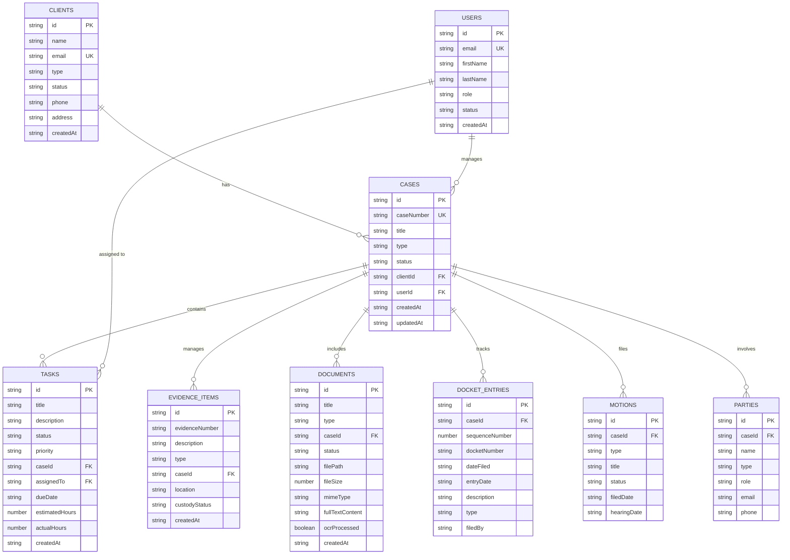

### Store List: Core Entities

| Store Name | Backend Table | Key Indexes | Description |
|------------|---------------|-------------|-------------|
| `cases` | cases | caseId, status, client | Case management records |
| `tasks` | tasks | caseId, status, caseId_status | Task tracking |
| `evidence_items` | evidence_items | caseId, status | Evidence management |
| `documents` | documents | caseId, status | Document repository |
| `docket_entries` | docket_entries | caseId, status | Court docket tracking |
| `motions` | motions | caseId, status | Motion management |
| `clients` | clients | status | Client information |
| `users` | users | status | User accounts |
| `parties` | parties | caseId | Case parties |

---

## 2. HR & Staff Management

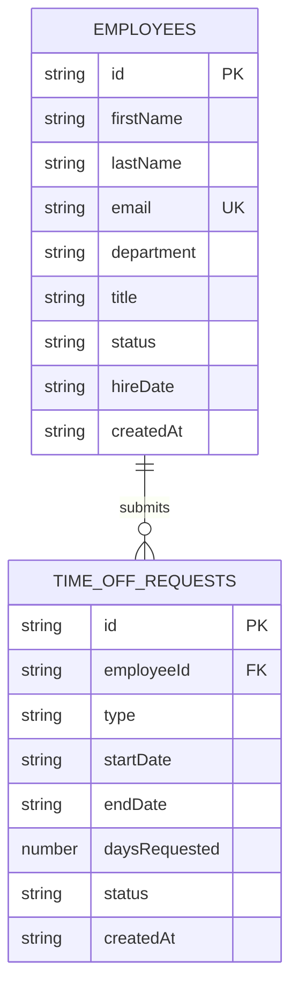

| Store Name | Backend Table | Description |
|------------|---------------|-------------|
| `employees` | employees | Staff directory |
| `time_off_requests` | time_off_requests | Time-off management |

---

## 3. Billing & Financial

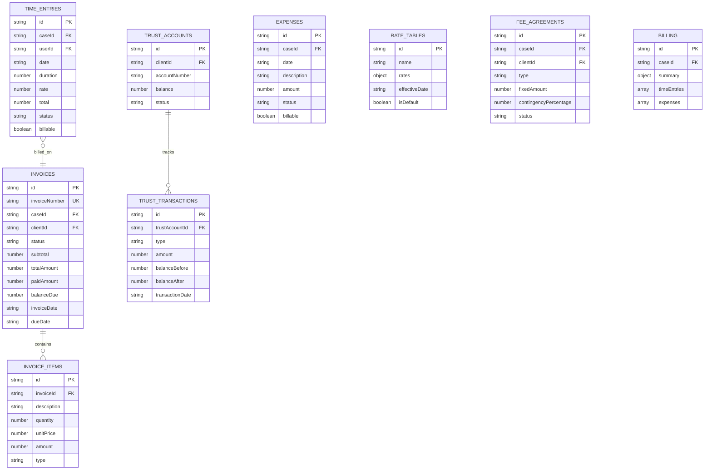

| Store Name | Backend Table | Description |
|------------|---------------|-------------|
| `invoices` | invoices | Invoice records |
| `invoice_items` | invoice_items | Line items |
| `time_entries` | time_entries | Time tracking |
| `expenses` | expenses | Expense tracking |
| `rate_tables` | rate_tables | Billing rates |
| `trust_accounts` | trust_accounts | Trust accounting |
| `trust_transactions` | trust_transactions | Trust transactions |
| `fee_agreements` | fee_agreements | Fee arrangements |
| `billing` | - | Frontend aggregated view |

---

## 4. Discovery & E-Discovery

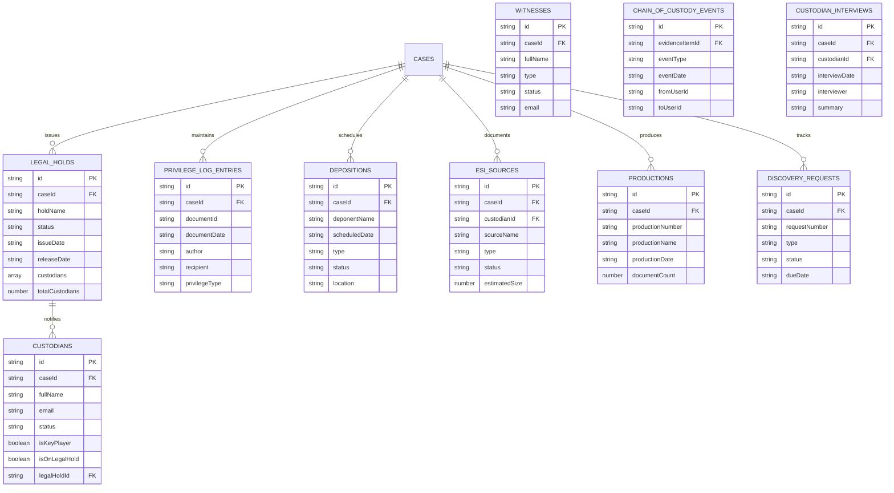

| Store Name | Backend Table | Description |
|------------|---------------|-------------|
| `legal_holds` | legal_holds | Legal hold notices |
| `privilege_log_entries` | privilege_log_entries | Privilege log |
| `depositions` | depositions | Deposition scheduling |
| `esi_sources` | esi_sources | ESI source tracking |
| `productions` | productions | Production sets |
| `custodian_interviews` | custodian_interviews | Custodian interviews |
| `discovery_requests` | discovery_requests | Discovery requests |
| `witnesses` | witnesses | Witness management |
| `chain_of_custody_events` | chain_of_custody_events | Evidence chain of custody |

### Legacy Discovery Stores (Frontend-Only)

| Store Name | Description | Status |
|------------|-------------|--------|
| `conferral_sessions` | Meet-and-confer sessions | Legacy |
| `joint_plans` | Joint discovery plans | Legacy |
| `stipulation_requests` | Stipulation tracking | Legacy |
| `discovery_examinations` | Examination records | Legacy |
| `discovery_vendors` | Vendor management | Legacy |
| `discovery_transcripts` | Transcript repository | Legacy |
| `discovery_sanctions` | Sanctions tracking | Legacy |

---

## 5. Litigation & Trial

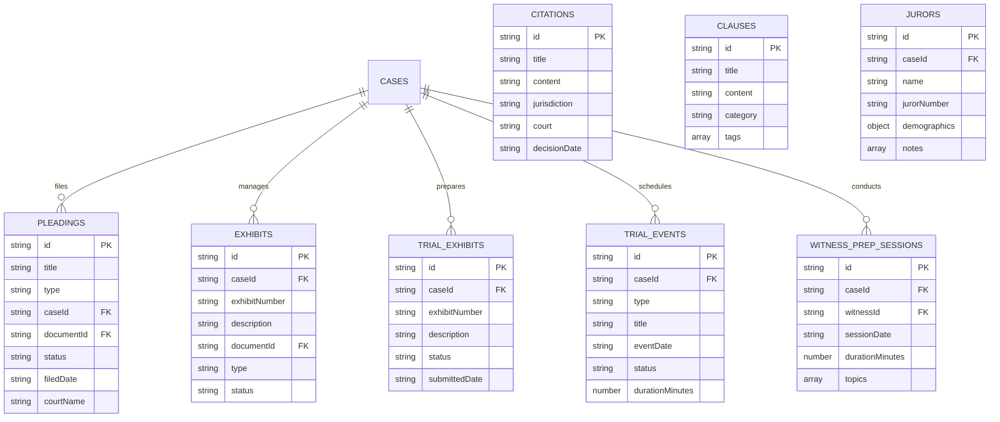

| Store Name | Backend Table | Description |
|------------|---------------|-------------|
| `pleadings` | pleadings | Pleading documents |
| `exhibits` | exhibits | Trial exhibits |
| `trial_exhibits` | trial_exhibits | Trial exhibit tracking |
| `trial_events` | trial_events | Trial calendar |
| `witness_prep_sessions` | witness_prep_sessions | Witness preparation |
| `citations` | citations | Case citations |
| `clauses` | clauses | Contract clauses |
| `jurors` | - | Jury management (frontend-only) |

---

## 6. Compliance & Security

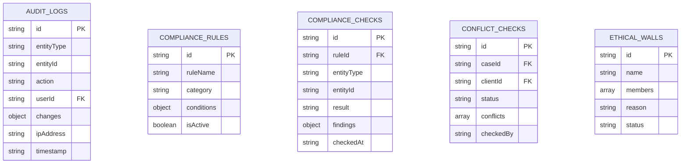

| Store Name | Backend Table | Description |
|------------|---------------|-------------|
| `audit_logs` | audit_logs | Audit trail |
| `compliance_rules` | compliance_rules | Compliance rules |
| `compliance_checks` | compliance_checks | Compliance verification |
| `conflict_checks` | conflict_checks | Conflict checking |
| `ethical_walls` | ethical_walls | Information barriers |

---

## 7. Organization & Projects

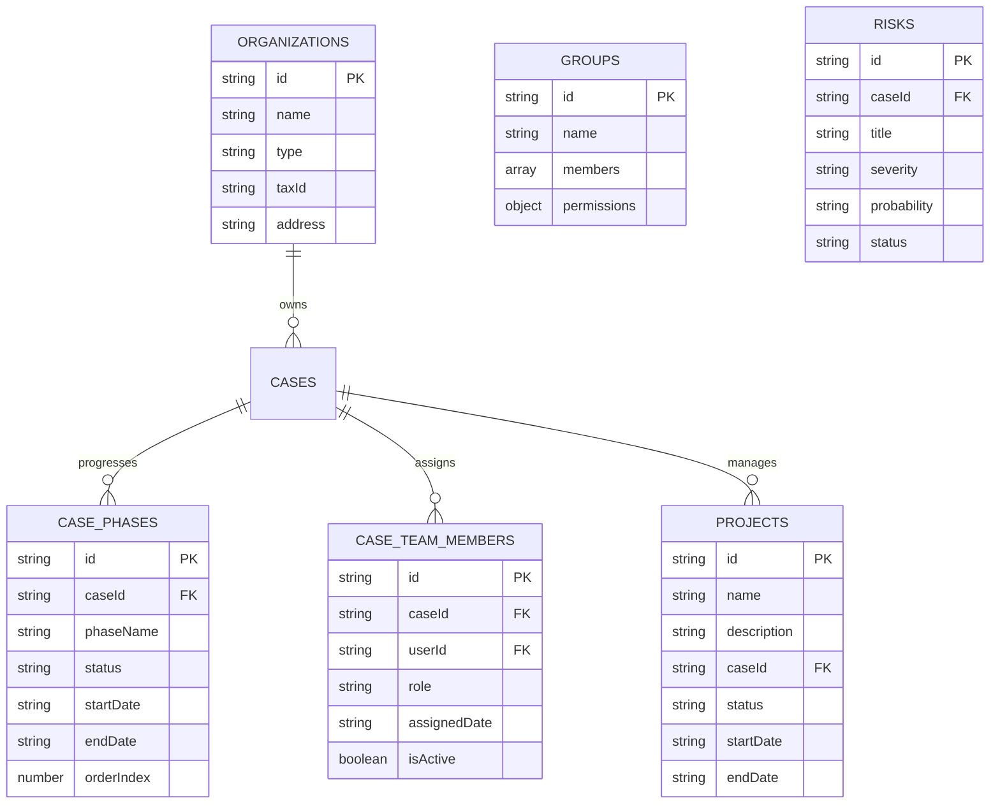

| Store Name | Backend Table | Description |
|------------|---------------|-------------|
| `organizations` | organizations | Organizational entities |
| `groups` | - | User groups (frontend-only) |
| `projects` | projects | Project management |
| `risks` | risks | Risk tracking |
| `case_phases` | case_phases | Case phase management |
| `case_team_members` | case_team_members | Team assignments |

---

## 8. Document Processing

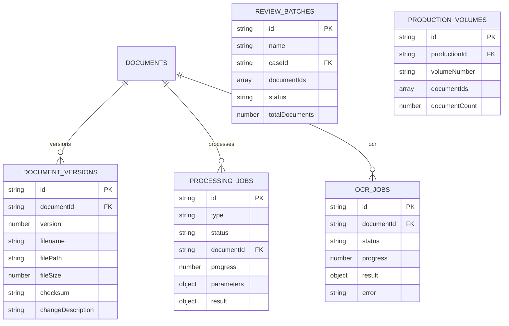

| Store Name | Backend Table | Description |
|------------|---------------|-------------|
| `document_versions` | document_versions | Version history |
| `processing_jobs` | processing_jobs | Document processing queue |
| `ocr_jobs` | ocr_jobs | OCR processing |
| `review_batches` | - | Document review batches (frontend-only) |
| `production_volumes` | - | Production volumes (frontend-only) |

---

## 9. Knowledge & Templates

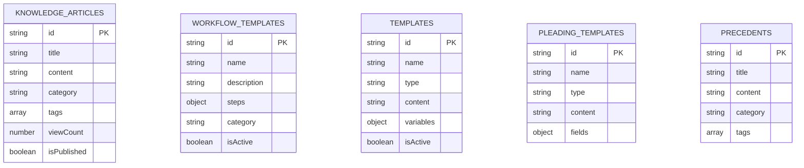

| Store Name | Backend Table | Description |
|------------|---------------|-------------|
| `knowledge_articles` | knowledge_articles | Knowledge base |
| `workflow_templates` | workflow_templates | Workflow definitions |
| `templates` | templates | Communication templates |
| `pleading_templates` | - | Pleading templates (frontend-only) |
| `precedents` | - | Legal precedents (frontend-only) |

---

## 10. Communications

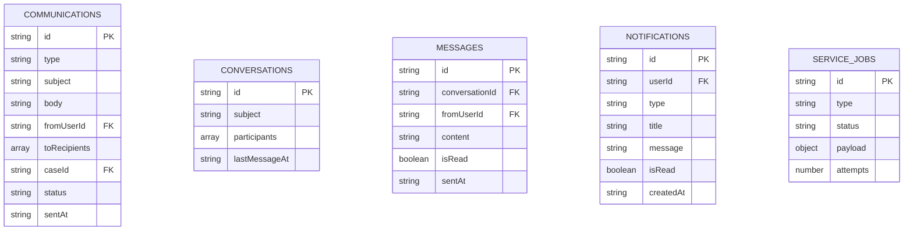

| Store Name | Backend Table | Description |
|------------|---------------|-------------|
| `communications` | communications | Email/SMS tracking |
| `conversations` | conversations | Message threads |
| `messages` | messages | Chat messages |
| `notifications` | notifications | User notifications |
| `service_jobs` | - | Service queue (frontend-only) |

---

## 11. Authentication & Sessions

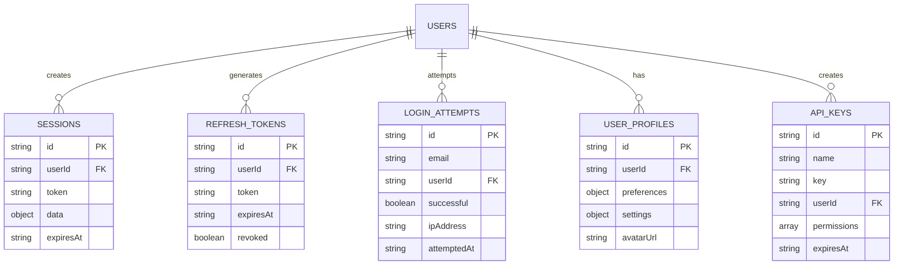

| Store Name | Backend Table | Description |
|------------|---------------|-------------|
| `sessions` | sessions | User sessions |
| `refresh_tokens` | refresh_tokens | JWT refresh tokens |
| `login_attempts` | login_attempts | Login audit trail |
| `user_profiles` | user_profiles | Extended user data |
| `api_keys` | api_keys | API authentication |

---

## 12. Integrations & Analytics

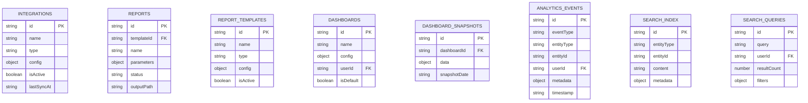

| Store Name | Backend Table | Description |
|------------|---------------|-------------|
| `integrations` | integrations | Third-party integrations |
| `reports` | reports | Report instances |
| `report_templates` | report_templates | Report definitions |
| `dashboards` | dashboards | Dashboard configs |
| `dashboard_snapshots` | dashboard_snapshots | Dashboard data snapshots |
| `analytics_events` | analytics_events | Analytics tracking |
| `search_index` | search_index | Full-text search index |
| `search_queries` | search_queries | Search history |

---

## 13. Calendar & Scheduling

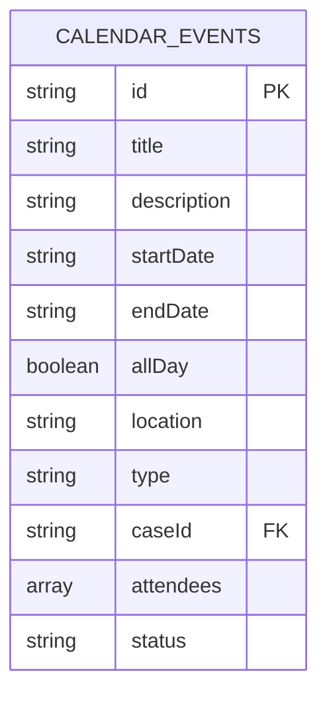

| Store Name | Backend Table | Description |
|------------|---------------|-------------|
| `calendar_events` | calendar_events | Calendar integration |

---

## 14. War Room & Strategy

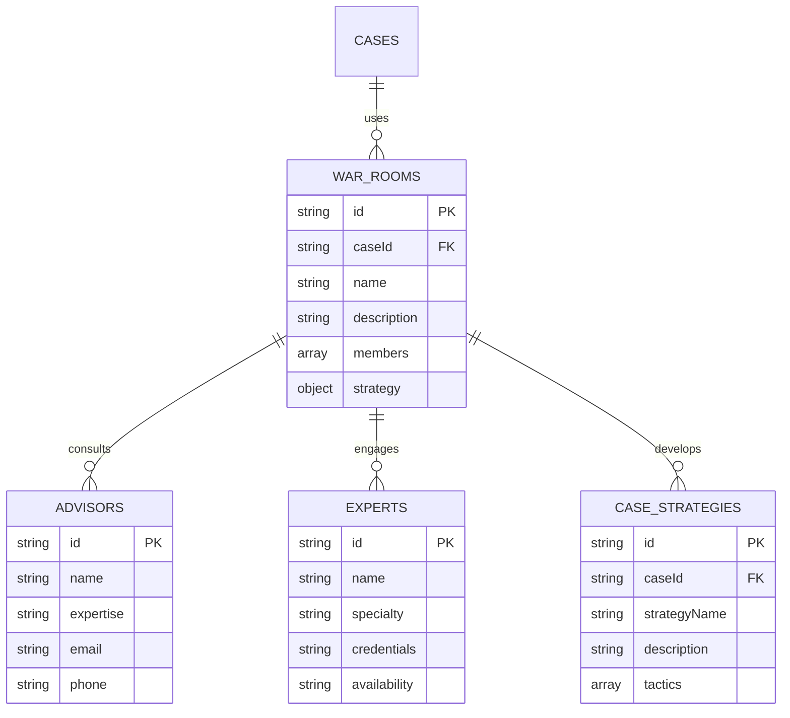

| Store Name | Backend Table | Description |
|------------|---------------|-------------|
| `war_rooms` | war_rooms | Strategic planning |
| `advisors` | advisors | Advisory board |
| `experts` | experts | Expert consultants |
| `case_strategies` | case_strategies | Strategy tracking |

---

## 15. Frontend-Only Stores

Stores that exist only in the frontend for UI state and client-side features.

| Store Name | Purpose | Data Type |
|------------|---------|-----------|
| `firm_processes` | Firm workflow processes | Process definitions |
| `judge_profiles` | Judge information | Judge data |
| `opposing_counsel` | Opposing counsel directory | Contact info |
| `opposition` | Opposition tracking | Strategy notes |
| `policies` | Firm policies | Policy documents |
| `map_nodes` | Mind map / org chart | Graph data |
| `qa_items` | QA/QC tracking | Quality items |
| `rules` | Business rules | Rule definitions |
| `brief_analysis` | Brief analysis notes | Analysis data |
| `legal_entities` | Legal entity tracking | Entity data |
| `entity_relationships` | Entity relationship mapping | Graph data |
| `counsel_profiles` | Attorney profiles | Profile data |
| `judge_motion_stats` | Judge motion statistics | Analytics data |
| `outcome_predictions` | Case outcome predictions | ML predictions |
| `okrs` | OKR tracking | Goals/objectives |
| `malware_signatures` | Security signatures | Security data |
| `cle_tracking` | CLE credit tracking | Education records |
| `vendor_contracts` | Vendor contract management | Contract data |
| `rfps` | RFP tracking | Proposal data |
| `maintenance_tickets` | Facility maintenance | Ticket data |
| `facilities` | Facility management | Facility info |
| `vendor_directory` | Vendor directory | Vendor contacts |
| `reporters` | Court reporter directory | Contact info |
| `jurisdictions` | Jurisdiction data | Legal jurisdictions |
| `leads` | CRM leads | Sales leads |
| `crm_analytics` | CRM analytics | Analytics data |
| `realization_stats` | Revenue realization | Financial metrics |
| `operating_summary` | Operating metrics | Dashboard data |
| `discovery_funnel_stats` | Discovery funnel metrics | Analytics |
| `custodian_main` | Custodian analytics | Metrics |
| `sla_configs` | SLA configurations | Service levels |
| `retention_policies` | Data retention policies | Retention rules |
| `transactions` | Ledger transactions | Financial records |

---

## Index Structure

### Standard Indexes (All Stores)

1. **Primary Index:** `id` (keyPath)
2. **Case Association:** `caseId` (non-unique)
3. **Status Filtering:** `status` (non-unique)

### Special Indexes

| Store | Index Name | Keys | Purpose |
|-------|-----------|------|---------|
| tasks | caseId_status | [caseId, status] | Compound filtering |
| cases | client | client | Client filtering |

### Index Creation Example

```typescript
// From db.ts
store.createIndex('caseId', 'caseId', { unique: false });
store.createIndex('status', 'status', { unique: false });
store.createIndex('caseId_status', ['caseId', 'status'], { unique: false });
```

---

## Data Structures

### B-Tree Index

LexiFlow implements a client-side B-Tree for fast case title lookups:

```typescript
private titleIndex: BTree<string, string> = new BTree(5);

// Building index
cases.forEach(c => this.titleIndex.insert(c.title.toLowerCase(), c.id));

// Searching
const id = this.titleIndex.search(title.toLowerCase());
```

**Performance:**
- Order: 5
- Search Complexity: O(log n)
- Insert Complexity: O(log n)

---

## Storage Modes

### IndexedDB Mode (Primary)

```typescript
mode: 'IndexedDB'
dbName: 'LexiFlowDB'
dbVersion: 27
```

**Features:**
- Async API
- Large storage (100s of MB)
- Structured data with indexes
- Transaction support

### LocalStorage Mode (Fallback)

```typescript
mode: 'LocalStorage'
```

**Features:**
- Synchronous API
- 5-10 MB limit
- Key-value pairs
- No transaction support

**Auto-Detection:**
```typescript
constructor() {
  try {
    if (!window.indexedDB) this.mode = 'LocalStorage';
  } catch (e) {
    this.mode = 'LocalStorage';
  }
}
```

---

## Transaction Coalescing

LexiFlow implements write buffer coalescing to optimize IndexedDB performance:

```typescript
private writeBuffer: Array<{
  store: string,
  item: any,
  type: 'put' | 'delete',
  resolve: Function,
  reject: Function
}> = [];

private readonly MAX_BUFFER_SIZE = 1000;
private readonly FORCE_FLUSH_THRESHOLD = 500;
private flushTimer: number | null = null;
```

### Flush Strategy

1. **Time-based:** Flush every 16ms (1 animation frame)
2. **Size-based:** Force flush at 500 operations
3. **Safety:** Hard limit at 1000 operations

### Performance Benefits

- Reduces transaction overhead
- Batches writes to same store
- Improves UI responsiveness
- Prevents IndexedDB blocking

---

## File Storage

In addition to object stores, LexiFlow uses a special `files` store for blob storage:

```typescript
// File store (not in STORES constant)
db.createObjectStore('files'); // No keyPath, manual key management

// Usage
await db.putFile(documentId, fileBlob);
const blob = await db.getFile(documentId);
```

**Limitations:**
- LocalStorage mode: Files not supported
- Browser quota applies
- No automatic cleanup

---

## Synchronization Strategy

### Offline-First Architecture

1. **Write Operations:**
   - Write to IndexedDB immediately
   - Queue for backend sync in SyncEngine
   - Return optimistic result to UI

2. **Read Operations:**
   - Read from IndexedDB cache first
   - Fall back to backend API if `VITE_USE_BACKEND_API=true`
   - Update cache with backend data

3. **Sync Process:**
   - Background sync via SyncEngine
   - Exponential backoff on failure
   - Conflict resolution via timestamp

### Backend Alignment

| IndexedDB Store | PostgreSQL Table | Sync Status |
|----------------|------------------|-------------|
| cases | cases | ✓ Aligned |
| tasks | tasks | ✓ Aligned |
| documents | documents | ✓ Aligned |
| clients | clients | ✓ Aligned |
| users | users | ✓ Aligned |
| time_entries | time_entries | ✓ Aligned |
| invoices | invoices | ✓ Aligned |
| legal_holds | legal_holds | ✓ Aligned |
| *Frontend-only stores* | - | ✗ No sync |

---

## Migration Strategy

### Version Management

```typescript
dbVersion = 27; // Current version

request.onupgradeneeded = (event) => {
  const db = event.target.result;

  // Create missing stores
  Object.values(STORES).forEach(storeName => {
    if (!db.objectStoreNames.contains(storeName)) {
      const store = db.createObjectStore(storeName, { keyPath: 'id' });
      // Add indexes
    }
  });
};
```

### Version History

- **v27:** Added 20+ backend-aligned stores
- **v26:** Previous version
- **Earlier:** Incremental store additions

---

## Performance Monitoring

### Buffer Statistics

```typescript
db.getBufferStats() => {
  bufferSize: number,
  maxBufferSize: 1000,
  forceFlushThreshold: 500,
  hasPendingFlush: boolean
}
```

### Query Performance

- **Indexed Queries:** O(log n)
- **Full Scans:** O(n)
- **B-Tree Search:** O(log n)

---

## Storage Quota Management

### Browser Limits

| Browser | Storage Limit |
|---------|---------------|
| Chrome | ~60% available disk |
| Firefox | ~10GB |
| Safari | ~1GB (prompts for more) |
| Edge | ~60% available disk |

### Quota Handling

**Current:** No quota management implemented

**Recommended:**
1. Monitor storage usage
2. Implement data pruning
3. Archive old records
4. Warn users at 80% capacity

---

## Database Operations API

### Core Methods

```typescript
// Initialization
await db.init();

// CRUD Operations
await db.put(storeName, item);
await db.get(storeName, id);
await db.getAll(storeName);
await db.delete(storeName, id);

// Bulk Operations
await db.bulkPut(storeName, items);

// Indexed Queries
await db.getByIndex(storeName, 'caseId', caseId);
await db.getByIndex(storeName, 'caseId_status', [caseId, status]);

// Counts
await db.count(storeName);

// File Operations
await db.putFile(id, file);
await db.getFile(id);

// B-Tree Search
await db.findCaseByTitle(title);

// Mode Management
db.getMode(); // 'IndexedDB' | 'LocalStorage'
await db.switchMode(newMode);
```

---

## Best Practices

### 1. Always Use DataService

```typescript
// ✓ Correct
import { DataService } from '../services/dataService';
const cases = await DataService.cases.getAll();

// ✗ Wrong - bypasses Repository layer
import { db } from '../services/db';
await db.getAll('cases');
```

### 2. Handle Offline Scenarios

```typescript
try {
  const cases = await DataService.cases.getAll();
} catch (error) {
  // Fallback to cached data or show offline message
}
```

### 3. Optimize Large Queries

```typescript
// Use indexes when possible
const tasks = await db.getByIndex('tasks', 'caseId', caseId);

// Avoid full scans
const allTasks = await db.getAll('tasks'); // Slow for large datasets
```

### 4. Clean Up Old Data

```typescript
// Implement periodic cleanup
const oldDate = new Date();
oldDate.setFullYear(oldDate.getFullYear() - 1);

const oldLogs = logs.filter(log => new Date(log.createdAt) < oldDate);
for (const log of oldLogs) {
  await db.delete('audit_logs', log.id);
}
```

---

## Security Considerations

### Data Privacy

- **No Encryption:** IndexedDB data is not encrypted by default
- **Browser Security:** Relies on browser's same-origin policy
- **Sensitive Data:** Avoid storing passwords, tokens in plain text

### Recommendations

1. Use browser's built-in encryption (where available)
2. Clear cache on logout
3. Implement data sanitization
4. Validate data on read operations

---

## Debugging Tools

### Chrome DevTools

1. Open DevTools → Application → IndexedDB
2. Expand `LexiFlowDB`
3. View object stores and data
4. Run ad-hoc queries

### Programmatic Access

```typescript
// In browser console
const db = window.indexedDB.open('LexiFlowDB', 27);
db.onsuccess = (e) => {
  const database = e.target.result;
  console.log('Stores:', database.objectStoreNames);
};
```

---

## Error Handling

### Common Errors

| Error | Cause | Solution |
|-------|-------|----------|
| QuotaExceededError | Storage full | Clean up old data |
| VersionError | Version mismatch | Reload page |
| AbortError | Transaction aborted | Retry operation |
| ConstraintError | Duplicate key | Check uniqueness |

### Error Recovery

```typescript
request.onerror = (event) => {
  console.error("IDB Error:", event.target.error);
  this.mode = 'LocalStorage'; // Fallback
  resolve();
};
```

---

## Future Enhancements

### Planned Features

1. **Compression:** Compress large text fields
2. **Encryption:** Client-side encryption for sensitive data
3. **Quota Management:** Automatic cleanup and archival
4. **Sharding:** Split large stores across multiple databases
5. **Service Worker Sync:** Background sync improvements
6. **Conflict Resolution:** Advanced merge strategies

---

## End of IndexedDB Schema Documentation
