# LexiFlow Premium - Master Architecture Analysis

**Coordinator:** EA-Coordinator
**Date:** 2025-12-16
**Status:** COMPLETE

**Agent Contributors:**
- EA-2: Frontend State Management
- EA-3: Frontend Integration & Events
- EA-6: Backend Data Processing
- EA-7: Backend Integration Services
- Coordinator: Independent Analysis

---

## Executive Summary

LexiFlow Premium is an enterprise legal OS with a dual-stack architecture:
- **Frontend**: React 18 + Vite, offline-first with IndexedDB persistence
- **Backend**: NestJS 11 + PostgreSQL with 40+ microservice modules

### Overall Assessment

**Grade: B**

**Strengths:**
- ✅ Well-architected event-driven integration system
- ✅ Comprehensive offline-first architecture with SyncEngine
- ✅ Clean separation of concerns (Repository → DataService → UI)
- ✅ 180+ REST endpoints with Swagger documentation
- ✅ Dual-stack capability (IndexedDB + Backend API)

**Critical Issues:**
- ❌ 27+ unbounded data structures creating memory leak risks
- ❌ 15+ duplicative code patterns across 200+ files
- ❌ 4/11 integration opportunities incomplete (missing event publishers)
- ❌ Fragmented API services split across 6 barrel files
- ❌ No connection/rate limits on WebSocket services
- ❌ Multiple security vulnerabilities (weak auth, no input validation)

---

## System-Wide Architecture Diagram

```mermaid
graph TB
    subgraph "Client Layer - React Frontend"
        UI[React Components<br/>34 Domain Directories]
        Routes[React Router<br/>Lazy Loading]
    end

    subgraph "Frontend State Management"
        QC[QueryClient<br/>Cache: 100 LRU<br/>⚠️ Listeners: UNBOUNDED]
        SE[SyncEngine<br/>Queue: localStorage<br/>⚠️ ProcessedCache: UNBOUNDED]
        Ctx[5 Context Providers<br/>Theme, Window, Toast, etc.<br/>⚠️ Some UNBOUNDED]
    end

    subgraph "Frontend Data Layer"
        DS[DataService Facade<br/>30+ Domains]

        subgraph "Dual Stack"
            Repos[28 Repository Classes<br/>100 LRU Cache<br/>⚠️ Listeners: UNBOUNDED]
            APIs[6 API Service Files<br/>🔴 FRAGMENTED<br/>apiServices + 5 extensions]
        end

        MO[MicroORM<br/>IndexedDB Abstraction]
        IO[IntegrationOrchestrator<br/>11 Event Types<br/>⚠️ 4 Incomplete]
    end

    subgraph "Frontend Storage"
        IDB[(IndexedDB<br/>96 Object Stores)]
        LS[(localStorage<br/>Sync Queue)]
    end

    subgraph "Backend REST API - NestJS"
        Controllers[40+ Controllers<br/>180+ Endpoints]
        Services[120 Services<br/>🔴 DUPLICATIVE PATTERNS]
    end

    subgraph "Backend Integration Services"
        WS1[RealtimeGateway<br/>JWT Auth<br/>197 lines]
        WS2[RealtimeService<br/>⚠️ DUPLICATE<br/>No Auth, 162 lines]
        BillAnalytics1[Billing Analytics<br/>billing/analytics/<br/>380 lines]
        BillAnalytics2[Billing Analytics<br/>⚠️ DUPLICATE<br/>analytics/billing-analytics/]

        IntegrationSvcs[Integration Services<br/>PACER, Calendar, Email, Webhooks]
    end

    subgraph "Backend Processing"
        Queues[5 Bull Queues<br/>Email, Notif, Doc, Report, Backup]
        OCR[Tesseract OCR<br/>⚠️ No Timeout]
        Jobs[ProcessingJobs<br/>6 Job Types]
    end

    subgraph "Backend Data Layer"
        TypeORM[TypeORM Repository Pattern]
        Entities[37 Entities<br/>⚠️ Untyped JSONB metadata]
    end

    subgraph "Data Storage"
        PG[(PostgreSQL 14+<br/>Primary Database)]
        Redis[(Redis 6+<br/>Queues & Cache<br/>Optional)]
        FS[File System<br/>/uploads/<br/>⚠️ No Size Limits]
    end

    subgraph "External Services"
        PACER[PACER API<br/>Mock Only]
        GoogleCal[Google Calendar<br/>OAuth2]
        OutlookCal[Outlook Calendar<br/>OAuth2]
        EmailProvider[SendGrid/SES<br/>⚠️ Stub Only]
    end

    %% Frontend Flow
    UI --> Routes
    Routes --> QC
    UI --> Ctx
    QC --> DS
    SE --> DS
    DS --> Repos
    DS --> APIs
    Repos --> MO
    Repos --> IO
    MO --> IDB
    SE --> LS
    APIs --> Controllers

    %% Backend Flow
    Controllers --> Services
    Services --> IntegrationSvcs
    Services --> Queues
    Services --> Jobs
    Services --> TypeORM
    Queues --> Redis
    Jobs --> OCR
    TypeORM --> Entities
    Entities --> PG
    Services --> FS

    %% WebSocket
    WS1 --> UI
    WS2 --> UI

    %% External Integrations
    IntegrationSvcs --> PACER
    IntegrationSvcs --> GoogleCal
    IntegrationSvcs --> OutlookCal
    IntegrationSvcs --> EmailProvider

    %% Event Flow
    IO -.->|publish events| DS
    IO -.->|side effects| Repos

    classDef critical fill:#ffcccc,stroke:#cc0000,stroke-width:3px
    classDef warning fill:#ffffcc,stroke:#cccc00,stroke-width:2px
    classDef good fill:#ccffcc,stroke:#00cc00,stroke-width:2px

    class QC,SE,Repos,WS2,BillAnalytics2,OCR,FS critical
    class Ctx,IO,APIs,Services,Entities warning
    class MO,TypeORM good
```



---

## Database Layer Architecture

### Overview

LexiFlow Premium implements a sophisticated dual-storage architecture:
- **Frontend**: IndexedDB with 96 object stores (offline-first)
- **Backend**: PostgreSQL with 70+ tables (source of truth)
- **Synchronization**: Bidirectional sync via SyncEngine + WebSockets

---

### Frontend IndexedDB Schema


**Key Features:**
- **96 Object Stores**: Core entities + frontend-only stores
- **Database Version**: 27 (incremental migrations)
- **Key Path**: `id` (UUID) on all stores
- **Indexes**: `caseId`, `status`, compound indexes for performance
- **Fallback**: LocalStorage mode when IndexedDB unavailable
- **B-Tree Index**: Custom implementation for case title lookups

**Performance Optimizations:**
- LRU caching at Repository layer (100 items)
- Write buffer coalescing (flushes every 16ms or 500 ops)
- Compound indexes for common query patterns
- Transaction batching for bulk operations

---

### Backend PostgreSQL Schema


**Entity Counts:**
- **Core Tables**: 70+ TypeORM entities
- **Total Indexes**: 100+ (including FKs, composites)
- **Relationships**: 150+ one-to-many, 5 one-to-one
- **Cascade Behaviors**: Mixed CASCADE and SET NULL
- **Soft Deletes**: Implemented on key entities via `deletedAt`

**Schema Features:**
- UUID primary keys (all tables)
- Automatic timestamps (createdAt, updatedAt)
- Audit columns (createdBy, updatedBy)
- JSONB metadata for flexibility
- Text arrays for tags/permissions
- Enum types for status fields
- Foreign key constraints with appropriate cascades

---

### Database Size Estimates

| Layer | Component | Estimated Size (per year) |
|-------|-----------|---------------------------|
| **Frontend** | IndexedDB | 100 MB - 1 GB |
| | File Store | 1 GB - 10 GB |
| **Backend** | PostgreSQL Data | 5 GB - 50 GB |
| | File System (/uploads/) | 50 GB - 500 GB |
| | Redis Cache | 1 GB - 5 GB |
| **Total** | All layers | ~60 GB - 570 GB/year |

---

### Entity Relationships Summary

**Complete relationship mapping documented in:** `/diagrams/ENTITY-relationships.md`

| Cardinality | Count | Examples |
|-------------|-------|----------|
| One-to-Many | ~150 | Case→Task, Client→Case, User→TimeEntry |
| Many-to-One | ~150 | Task→Case, Case→Client, TimeEntry→User |
| One-to-One | ~5 | Document→Pleading, Document→Exhibit |
| Many-to-Many | ~3 | Case↔User (via CaseTeam), Custodian↔ESI |

**Key Relationships:**
1. **Case-Centric**: 25+ entities reference Case as parent
2. **User Associations**: TimeEntry, Document, Task all track users
3. **Billing Chain**: TimeEntry → Invoice → InvoiceItem
4. **Document Hierarchy**: Document → DocumentVersion (1:M)
5. **Discovery Flow**: Case → LegalHold → Custodian → ESISource

---

### Data Synchronization Architecture


**Sync Strategy:**
- **Direction**: Bidirectional (IndexedDB ↔ PostgreSQL)
- **Conflict Resolution**: Last-write-wins (timestamp-based)
- **Queue Storage**: localStorage (persistent across sessions)
- **Retry Logic**: Exponential backoff (max 60s delay)
- **Real-time**: WebSocket broadcasts for instant updates

---

### Data Flow Layers

**Complete data flow documented in:** `/diagrams/DATA-FLOW-architecture.md`


**Cache Hierarchy:**
1. **L1: QueryClient** - TTL: 5min, Size: 100 LRU
2. **L2: Repository** - TTL: 10min, Size: 100 LRU
3. **L3: IndexedDB** - Persistent, 100s of MB
4. **Backend Redis** - TTL: 1hr, distributed cache

---

### Performance Characteristics

| Operation | Frontend (IndexedDB) | Backend (PostgreSQL) |
|-----------|---------------------|----------------------|
| Read (indexed) | 1-5 ms | 10-50 ms |
| Read (full scan) | 50-200 ms | 500-2000 ms |
| Write (single) | 5-10 ms | 20-100 ms |
| Write (bulk 100) | 50-100 ms | 200-500 ms |
| Transaction commit | 10-20 ms | 50-200 ms |

**Optimization Notes:**
- IndexedDB limited by main thread blocking
- PostgreSQL limited by network latency + disk I/O
- Write buffer coalescing reduces IndexedDB transaction overhead
- Compound indexes essential for multi-column queries

---

### Database Schema Documentation

**Comprehensive schemas documented in:**
- Frontend: `/diagrams/INDEXEDDB-schema.md` (96 stores, 15,000+ words)
- Backend: `/diagrams/DATABASE-schema.md` (70+ entities, 12,000+ words)
- Relationships: `/diagrams/ENTITY-relationships.md` (150+ relationships)

---

### Database Issues & Recommendations

#### Critical Issues

1. **Unbounded JSONB Metadata** (37 entities)
   - Issue: No schema validation on metadata columns
   - Impact: Type safety lost, potential injection
   - Fix: Define typed metadata interfaces

2. **No Pagination Enforcement** (15+ services)
   - Issue: Queries can return millions of records
   - Impact: Memory exhaustion
   - Fix: Default limit of 100 records

3. **Unbounded Text Fields** (4+ entities)
   - Issue: fullTextContent, extractedText have no size limit
   - Impact: Multi-GB text fields
   - Fix: Implement VARCHAR limits or chunking

4. **Missing Indexes** (various)
   - Issue: Some FK columns not indexed
   - Impact: Slow join queries
   - Fix: Index all foreign keys

#### Recommendations

1. **Add Composite Indexes** for common query patterns:
   ```sql
   CREATE INDEX idx_time_entries_case_status ON time_entries(case_id, status);
   CREATE INDEX idx_documents_case_type ON documents(case_id, type);
   ```

2. **Implement Partitioning** for large tables:
   - Partition `audit_logs` by month
   - Partition `analytics_events` by week
   - Archive old data to separate storage

3. **Add Database Constraints**:
   - CHECK constraints for business rules
   - UNIQUE constraints where needed
   - NOT NULL on required fields

4. **Optimize Soft Deletes**:
   - Add `WHERE deletedAt IS NULL` to all indexes
   - Consider separate archive tables

---

## Consolidated Duplicative Code Patterns

### Frontend Duplications (9 patterns)

#### 1. LRU Cache Implementation
**Occurrences:** 2 complete implementations
- `/frontend/services/queryClient.ts:93-109`
- `/frontend/services/core/Repository.ts:7-41`

**Impact:** 70+ lines duplicated
**Recommendation:** Extract to `/frontend/utils/datastructures/lruCache.ts`

---

#### 2. Listener Pattern Implementation
**Occurrences:** 4+ implementations
- `queryClient.ts:68,71` - Map of listeners + global listeners
- `Repository.ts:47` - Set of listeners
- `WindowContext.tsx:42-44` - Implicit via React state
- `ToastContext.tsx:41-43` - Queue with ref

**Impact:** ~150 lines of similar subscription logic
**Recommendation:** Create shared `EventEmitter` utility class

---

#### 3. localStorage Access Patterns
**Inconsistent:** Direct access vs StorageUtils facade
- **Centralized:** `utils/storage.ts:9-36` (StorageUtils)
- **Direct access:**
  - `context/ThemeContext.tsx:39,54`
  - `context/WindowContext.tsx:50,58`
  - `context/DataSourceContext.tsx:21,35`

**Impact:** Inconsistent error handling
**Recommendation:** Enforce StorageUtils via ESLint rule

---

#### 4. Stable Stringify / Deep Equal Logic
**Location:** `queryClient.ts:27-64` (40 lines)

**Impact:** Could be reused in Repository and caching layers
**Recommendation:** Extract to `/frontend/utils/comparison.ts`

---

#### 5. Queue Processing Logic
**Occurrences:** 2 implementations
- `context/SyncContext.tsx:56-123` - Mutation queue with exponential backoff
- `context/ToastContext.tsx:45-72` - Toast queue with priority sorting

**Impact:** ~100 lines of similar queue logic
**Recommendation:** Create abstract `QueueProcessor` base class

---

#### 6. Dual Repository Wrappers
**Occurrences:** 3+ domain repositories
- TaskRepository defined in `repositories/TaskRepository.ts`
- Same TaskRepository logic duplicated in `dataService.ts:194-213`
- Similar pattern for RiskRepository, EntityRepository

**Impact:** 26 lines duplicated per repository
**Recommendation:** Use single source of truth

---

#### 7. Inline Anonymous Repository Classes
**Occurrences:** 20+ in dataService.ts

```typescript
trustAccounts: new class extends Repository<any> { constructor() { super('trustAccounts'); } }(),
legalHolds: new class extends Repository<any> { constructor() { super(STORES.LEGAL_HOLDS); } }(),
// ... 20+ more
```

**Impact:** Lost type safety, no event integration
**Recommendation:** Create dedicated repository classes

---

#### 8. Multiple API Service Barrel Files
**Fragmentation:** 6 barrel files with similar structure
1. `apiServices.ts` (14 services)
2. `apiServicesExtended.ts`
3. `apiServicesDiscovery.ts`
4. `apiServicesCompliance.ts`
5. `apiServicesAdditional.ts`
6. `apiServicesFinal.ts`

**Impact:** Difficult to discover available endpoints
**Recommendation:** Consolidate into single file, group by domain

---

#### 9. Conditional Backend/IndexedDB Logic
**Occurrences:** 30+ ternary conditionals in dataService.ts

```typescript
cases: useBackendApi ? apiServices.cases : new IntegratedCaseRepository(),
docket: useBackendApi ? apiServices.docket : new IntegratedDocketRepository(),
// ... 30+ more
```

**Impact:** Testing complexity, refactoring difficulty
**Recommendation:** Factory pattern or strategy pattern

---

### Backend Duplications (8 patterns)

#### 10. Error Handling Pattern
**Occurrences:** 20+ services
- `ocr/ocr.service.ts:92-94`
- `processing-jobs/processing-jobs.service.ts:51-54`
- `document-versions/document-versions.service.ts:66-69`
- `clauses/clauses.service.ts:38-41`
- `documents/documents.service.ts:60-63`
- ...15+ more

```typescript
} catch (error) {
  this.logger.error('Failed to [operation]', error);
  throw error;
}
```

**Impact:** Repeated across every service
**Recommendation:** Abstract into base service class

---

#### 11. Logger Initialization
**Occurrences:** Every service file (120+)

```typescript
private readonly logger = new Logger(ServiceName.name);
```

**Impact:** Boilerplate in 120+ files
**Recommendation:** Base service class with logger

---

#### 12. FindOne with NotFoundException
**Occurrences:** 15+ services
- `processing-jobs/processing-jobs.service.ts:80-88`
- `document-versions/document-versions.service.ts:85-97`
- `clauses/clauses.service.ts:83-91`
- `documents/documents.service.ts:154-162`
- ...15+ more

**Impact:** ~10 lines duplicated per service
**Recommendation:** Base repository method

---

#### 13. File Path Resolution
**Occurrences:** 4 times in `file-storage/file-storage.service.ts`
- Lines 83-85, 104-106, 135-137, 181-183

```typescript
const absolutePath = path.isAbsolute(filePath)
  ? filePath
  : path.join(this.uploadDir, filePath);
```

**Impact:** 12 lines in same file
**Recommendation:** Private helper method

---

#### 14. Query Builder Filtering Pattern
**Occurrences:** 50+ services
- `clauses/clauses.service.ts:47-77`
- `documents/documents.service.ts:69-149`
- `processing-jobs/processing-jobs.service.ts:130-152`
- `invoices/invoices.service.ts:71-112`
- `time-entries/time-entries.service.ts:45-89`
- ...45+ more

**Impact:** Complex filtering logic repeated everywhere
**Recommendation:** Extract to BaseQueryBuilder service

---

#### 15. Job Status Update Logic
**Occurrences:** 4 times in `document-processor.ts`
- Lines 27-31, 50-54, 63-72, 94-98

**Impact:** Status update pattern repeated
**Recommendation:** Job context wrapper

---

#### 16. Metadata/JSONB Column Handling
**Occurrences:** 4+ entities with untyped metadata
- `clauses/entities/clause.entity.ts:68`
- `document-versions/entities/document-version.entity.ts:40-41`
- `ocr/entities/ocr-job.entity.ts:35-36`
- `processing-jobs/entities/processing-job.entity.ts:38-42`

```typescript
@Column({ type: 'jsonb', nullable: true })
metadata: Record<string, any>;
```

**Impact:** No type safety for metadata
**Recommendation:** Typed metadata base class

---

#### 17. Duplicate WebSocket Implementations
**Locations:**
- `realtime/realtime.gateway.ts:1-197` (JWT auth)
- `realtime/realtime.service.ts:1-162` (No auth)

**Duplication:**
- Both implement WebSocketGateway
- Both have connection/disconnection handlers
- Both have room management
- Both have message broadcasting
- Both track users via Maps

**Impact:** ~200 lines duplicated, memory overhead
**Recommendation:** Consolidate into single gateway with optional auth

---

#### 18. Duplicate Billing Analytics
**Locations:**
- `/backend/src/billing/analytics/billing-analytics.service.ts` (380 lines)
- `/backend/src/analytics/billing-analytics/billing-analytics.service.ts` (similar)

**Overlap:**
- WIP calculations
- AR Aging reports
- Realization rates
- Operating summaries

**Impact:** ~400 lines duplicated logic
**Recommendation:** Merge into billing module

---

**Total Duplicative Patterns:** 18 major patterns
**Estimated Lines of Duplication:** 2,000+ lines
**Files Affected:** 200+ files

---

## Consolidated Open-Ended Data Segments (Memory Leaks & Resource Issues)

### CRITICAL - Unbounded Growth (Priority 1)

#### Frontend Critical Issues (6)

##### 1. QueryClient.listeners
**File:** `/frontend/services/queryClient.ts:68`
**Type:** `Map<string, Set<(state: QueryState<any>) => void>>`
**Growth:** Grows with unique query keys over application lifetime
**Risk:** High - Stale listeners accumulate in long-running sessions
**Cleanup:** Unsubscribe functions exist but may not be called consistently
**Mitigation:** Cleanup is present, but relies on components calling unsubscribe
**Recommendation:** Implement periodic garbage collection for listeners with no active subscribers

---

##### 2. QueryClient.globalListeners
**File:** `/frontend/services/queryClient.ts:71`
**Type:** `Set<(status: { isFetching: number }) => void>`
**Growth:** Grows with each component using `useGlobalQueryStatus`
**Risk:** Medium - Limited to components using global status hook
**Recommendation:** Monitor for component unmount edge cases

---

##### 3. Repository.listeners (28 instances)
**File:** `/frontend/services/core/Repository.ts:47`
**Type:** `Set<Listener<T>>`
**Growth:** Per-repository instance (28 repositories x N subscriptions)
**Risk:** Medium - One Set per domain
**Recommendation:** Add `clearStaleListeners()` method

---

##### 4. SyncEngine.processedCache
**File:** `/frontend/services/syncEngine.ts:17`
**Type:** `LinearHash<string, boolean>`
**Growth:** **Grows with every mutation processed (never cleared)**
**Risk:** **CRITICAL - No eviction policy, accumulates forever**
**Current State:** Only used for deduplication on enqueue

**Problematic code:**
```typescript
const processedCache = new LinearHash<string, boolean>();
if(item) processedCache.set(item.id, true); // ⚠️ Never removed!
```

**Recommendation:** Add TTL-based eviction or max size limit (10,000 entries)

---

##### 5. WindowContext.windows
**File:** `/frontend/context/WindowContext.tsx:43`
**Type:** `WindowInstance[]`
**Growth:** Grows with each unique window opened
**Risk:** Medium - Windows removed on close, but accumulates if users don't close
**Recommendation:** Add "Close All" functionality or max window limit (20)

---

##### 6. ToastContext.queueRef
**File:** `/frontend/context/ToastContext.tsx:42`
**Type:** `Toast[]`
**Growth:** Grows if toasts created faster than displayed
**Risk:** Low-Medium - Auto-removed after display
**Recommendation:** Add max queue size limit (100) with FIFO eviction

---

#### Backend Critical Issues (10)

##### 7. Unlimited WebSocket Connections
**Files:**
- `realtime/realtime.gateway.ts:64-99`
- `realtime/realtime.service.ts:33-53`
- `communications/messaging/messaging.gateway.ts:43-73`

**Issue:** No maximum connection limit per user or globally

```typescript
this.connectedClients.set(client.id, {
  userId,
  socketId: client.id,
  connectedAt: new Date(),
});
// ❌ No check for max connections
```

**Impact:** Memory exhaustion, DoS vulnerability
**Recommendation:** Add connection limits (5 per user, 10,000 global)

---

##### 8. Unbounded WebSocket Room Subscriptions
**Files:**
- `realtime/realtime.gateway.ts:113-121`
- `realtime/realtime.service.ts:55-87`

**Issue:** Users can join unlimited rooms

```typescript
client.join(`case:${data.caseId}`);
// ❌ No limit on rooms per client
```

**Impact:** Memory bloat, potential abuse
**Recommendation:** Limit to 100 rooms per connection

---

##### 9. No Rate Limiting on WebSocket Events
**Files:**
- `communications/messaging/messaging.gateway.ts:79-99`
- `realtime/realtime.service.ts:114-129`

**Issue:** Clients can send unlimited messages/events
**Impact:** Spam, server overload
**Recommendation:** Rate limit to 10 messages/sec per user

---

##### 10. OCR Service - Unbounded File Buffer
**File:** `/backend/src/ocr/ocr.service.ts:64`

```typescript
const fileBuffer = await this.fileStorageService.getFile(filePath);
```

**Issue:** No file size check before loading entire file into memory
**Risk:** Out-of-memory errors for large files (multi-GB PDFs)
**Recommendation:** Add max file size check (100MB limit), stream processing

---

##### 11. FileStorageService - No File Size Validation
**File:** `/backend/src/file-storage/file-storage.service.ts:30-76`

**Issue:** No maximum file size enforcement
**Risk:** Disk space exhaustion, multi-GB uploads
**Recommendation:** Add configurable max file size (500MB), disk space pre-check

---

##### 12. Unbounded Text Fields in Entities
**Locations:**
- `ocr/entities/ocr-job.entity.ts:32-33` - extractedText
- `document-versions/entities/document-version.entity.ts:43-44` - fullTextContent
- `processing-jobs/entities/processing-job.entity.ts:41-42` - result (JSONB)
- `clauses/entities/clause.entity.ts:29-30` - content

**Issue:** PostgreSQL TEXT fields with no size limits
**Risk:** Multi-GB text fields, query performance degradation
**Recommendation:** Add VARCHAR limits or chunk large content

---

##### 13. No Pagination Enforcement
**File:** `/backend/src/clauses/clauses.service.ts:47-78`

```typescript
async findAll(...): Promise<Clause[]> {
  return await query.getMany(); // ❌ No LIMIT if no pagination params
}
```

**Occurrences:** 15+ services
**Impact:** Could return millions of records, memory exhaustion
**Recommendation:** Enforce default limit (100 records)

---

##### 14. Unlimited Document Versions
**File:** `/backend/src/document-versions/document-versions.service.ts:26-70`

**Issue:** No limit on number of versions per document
**Risk:** Unbounded storage growth, thousands of versions
**Recommendation:** Add max versions per document (50), archive old versions

---

##### 15. Bulk Email Without Batch Limits
**File:** `communications/email/email.service.ts:221-252`

```typescript
async sendBulkEmails(
  recipients: Array<{ email: string; context: Record<string, any> }>,
  // ❌ No limit on recipients.length
```

**Impact:** Email provider rate limit violations, memory issues
**Recommendation:** Limit to 1,000 recipients per call

---

##### 16. Unbounded PACER Search Results
**File:** `integrations/pacer/pacer.service.ts:20-71`

**Issue:** No pagination or result limit
**Impact:** Memory issues with large result sets
**Recommendation:** Add pagination (max 100 per page)

---

### MODERATE - Resource Leaks & Missing Cleanup (Priority 2)

##### 17. OCR Worker Lifecycle
**File:** `ocr/ocr.service.ts:131-141`

**Issue:** Worker termination only on module destroy, not on idle timeout
**Risk:** Memory leak if worker hangs
**Recommendation:** Add idle timeout, health checks, worker pool

---

##### 18. No Cleanup for Old Processing Jobs
**File:** `processing-jobs/processing-jobs.service.ts:299-317`

**Issue:** cleanupOldJobs exists but not called automatically
**Risk:** Database bloat with millions of old job records
**Recommendation:** Add scheduled cleanup (daily cron for jobs > 90 days)

---

##### 19. Orphaned Files on Transaction Failures
**File:** `file-storage/file-storage.service.ts:30-76`

**Issue:** Files written to disk before database transaction commits
**Risk:** Orphaned files if database save fails
**Recommendation:** Two-phase commit or cleanup orphans periodically

---

##### 20. In-memory Webhook Storage
**File:** `webhooks/webhooks.service.ts:24-25`

```typescript
private readonly webhooks = new Map<string, Webhook>();
private readonly deliveries = new Map<string, WebhookDelivery>();
```

**Issue:** Webhooks and deliveries stored in memory
**Impact:** Data loss on restart, not scalable
**Recommendation:** Persist to database

---

##### 21. Memory-based Rate Limiting
**File:** `common/interceptors/rate-limiter.interceptor.ts:20-115`

```typescript
private requestCounts: Map<string, RequestCount[]> = new Map();
```

**Issue:** Rate limiting uses in-memory Map
**Impact:** Not suitable for multi-instance deployments
**Recommendation:** Use Redis for distributed rate limiting

---

### MINOR - Performance Issues (Priority 3)

##### 22. No Timeout on OCR Processing
**File:** `ocr/ocr.service.ts:67-69`

```typescript
const { data: { text, confidence } } = await this.worker.recognize(fileBuffer);
```

**Issue:** No timeout on Tesseract processing
**Risk:** Hung workers on corrupted/complex images
**Recommendation:** Add timeout (5 minutes per document)

---

##### 23. No Timeout on External HTTP Calls
**File:** `integrations/pacer/pacer.service.ts`

**Issue:** Some axios calls missing timeout
**Recommendation:** Set default 30s timeout for all external calls

---

##### 24. Invoice PDF Generation Blocks Request
**File:** `billing/invoices/invoices.service.ts:195-211`

**Issue:** PDF generation is synchronous
**Impact:** Slow API responses
**Recommendation:** Move to document processing queue

---

##### 25. Sequential Bulk Operations
**Locations:**
- `email.service.ts:232-249` - Emails sent one at a time
- `notifications.service.ts:137-147` - Notifications sent serially

**Recommendation:** Batch processing with concurrency limits

---

##### 26. Unbounded Query Results in Analytics
**Files:**
- `analytics/analytics.service.ts:74-91`
- `billing/analytics/billing-analytics.service.ts:26-179`

```typescript
const unbilledTimeEntries = await timeQuery.getMany();
// ❌ No limit - could return millions of rows
```

**Recommendation:** Always use pagination (default limit: 1,000)

---

##### 27. Missing Database Indexes
**Impact:** N+1 query patterns found in billing analytics
**Recommendation:** Analyze query patterns, add missing indexes

---

**Total Open-Ended Segments:** 27
**Critical Priority (P1):** 16
**Moderate Priority (P2):** 5
**Minor Priority (P3):** 6

---

## Integration Opportunities Status

From EA-3 analysis of IntegrationOrchestrator:

| # | Name | Event | Publisher | Handler | Status |
|---|------|-------|-----------|---------|--------|
| **1** | CRM → Compliance | LEAD_STAGE_CHANGED | ✅ CRMDomain | ✅ Conflict check | ✅ **COMPLETE** |
| **2** | Docket → Calendar | DOCKET_INGESTED | ✅ DocketRepository | ✅ Calendar events | ✅ **COMPLETE** |
| **3** | Task → Billing | TASK_COMPLETED | ✅ TaskRepository | ✅ Draft time entry | ✅ **COMPLETE** |
| **4** | Doc → Evidence | DOCUMENT_UPLOADED | ✅ DocumentRepository | ✅ Evidence replication | ✅ **COMPLETE** |
| **5** | Billing → Workflow | INVOICE_STATUS_CHANGED | ✅ BillingRepository | ✅ Collections workflow | ✅ **COMPLETE** |
| **6** | Evidence → Audit | EVIDENCE_STATUS_UPDATED | ❌ **NO PUBLISHER** | ✅ Chain logging | ⚠️ **INCOMPLETE** |
| **7** | Research → Pleadings | CITATION_SAVED | ❌ **NO PUBLISHER** | ⚠️ Placeholder only | ⚠️ **INCOMPLETE** |
| **8** | Compliance → Security | WALL_ERECTED | ❌ **NO PUBLISHER** | ✅ RLS policy | ⚠️ **INCOMPLETE** |
| **9** | HR → Admin | STAFF_HIRED | ✅ HRRepository | ✅ User provisioning | ✅ **COMPLETE** |
| **10** | Service → Docket | SERVICE_COMPLETED | ✅ CommunicationDomain | ✅ Auto-file proof | ✅ **COMPLETE** |
| **11** | Data Platform → Infra | DATA_SOURCE_CONNECTED | ❌ **NO PUBLISHER** | ✅ Audit + sync | ⚠️ **INCOMPLETE** |

**Summary:** 7/11 complete, 4/11 incomplete due to missing event publishers

**Missing Publishers:**
1. `EvidenceRepository.update()` → publish EVIDENCE_STATUS_UPDATED
2. `ComplianceDomain.createEthicalWall()` → publish WALL_ERECTED
3. `DataService.sources.addConnection()` → publish DATA_SOURCE_CONNECTED
4. `CitationRepository.add()` → publish CITATION_SAVED

---

## Security Vulnerabilities

### Authentication Issues

1. **MessagingGateway Weak Auth**
   - Location: `messaging.gateway.ts:229`
   - Issue: Uses query parameter for userId instead of JWT
   - Impact: Trivial to impersonate users
   - Severity: CRITICAL

2. **RealtimeService No Auth**
   - Location: `realtime.service.ts:20-24`
   - Issue: @WebSocketGateway with no authentication
   - Impact: Anyone can connect and join rooms
   - Severity: CRITICAL

3. **No Input Sanitization on Filenames**
   - Location: `file-storage.service.ts:47-50`
   - Issue: Path traversal possible
   - Impact: Files written outside upload directory
   - Severity: HIGH

4. **Metadata Injection Risk**
   - Locations: Multiple DTOs with unvalidated JSONB
   - Issue: Unvalidated metadata accepts any structure
   - Impact: Injection attacks
   - Severity: MEDIUM

5. **CORS Set to '*'**
   - Location: `realtime.service.ts:20-23`
   - Issue: Allow all origins
   - Impact: CSRF vulnerabilities
   - Severity: MEDIUM

---

## Priority Recommendations

### Immediate Actions (Must Fix - Week 1)

#### 1. Add Resource Limits
- [ ] WebSocket connection limits (5/user, 10,000 global)
- [ ] File upload size limit (500MB max)
- [ ] Pagination enforcement (default 100 records)
- [ ] WebSocket room subscriptions limit (100/connection)
- [ ] Rate limiting on WebSocket events (10 msg/sec)

#### 2. Fix Critical Security Issues
- [ ] Implement proper WebSocket JWT authentication
- [ ] Remove weak query parameter auth from MessagingGateway
- [ ] Add MIME type whitelist validation
- [ ] Configure proper CORS policies (no wildcard)
- [ ] Add input sanitization for filenames

#### 3. Fix SyncEngine.processedCache Memory Leak
- [ ] Add TTL-based eviction (24 hours)
- [ ] Implement max size limit (10,000 entries)
- [ ] Add periodic cleanup job

### Short-term (Month 1)

#### 4. Consolidate Duplicative Code
- [ ] Extract shared LRU cache to `/frontend/utils/datastructures/lruCache.ts`
- [ ] Create shared EventEmitter utility for listener patterns
- [ ] Create base service class for backend (logger, error handling)
- [ ] Consolidate 6 API service files into single organized file
- [ ] Merge duplicate WebSocket implementations
- [ ] Merge duplicate billing analytics services

#### 5. Complete Integration Opportunities
- [ ] Add `EvidenceRepository.update()` with EVIDENCE_STATUS_UPDATED event
- [ ] Add `ComplianceDomain.createEthicalWall()` with WALL_ERECTED event
- [ ] Add `DataService.sources.addConnection()` with DATA_SOURCE_CONNECTED event
- [ ] Add `CitationRepository.add()` with CITATION_SAVED event
- [ ] Implement CITATION_SAVED handler (replace placeholder)

#### 6. Add Monitoring & Cleanup
- [ ] Implement QueryClient metrics tracking
- [ ] Add scheduled cleanup for old processing jobs (90+ days)
- [ ] Implement orphaned file cleanup
- [ ] Add state size monitoring and alerts
- [ ] Add WebSocket connection monitoring

### Medium-term (Quarter 1)

#### 7. Refactor Data Service
- [ ] Replace 30+ ternary conditionals with factory/strategy pattern
- [ ] Create dedicated Repository classes for 20+ anonymous classes
- [ ] Restore type safety for inline repositories
- [ ] Remove duplicate repository wrappers (TaskRepository, etc.)

#### 8. Backend Improvements
- [ ] Create BaseQueryBuilder service for filtering patterns
- [ ] Add typed metadata schemas (replace `Record<string, any>`)
- [ ] Implement file streaming for large file operations
- [ ] Add OCR processing timeout (5 minutes)
- [ ] Move PDF generation to background queue
- [ ] Configure Bull retry strategy for all queues

#### 9. Database & Storage
- [ ] Add max versions limit per document (50)
- [ ] Implement two-phase commit for file/DB consistency
- [ ] Add database indexes based on query analysis
- [ ] Add disk space checks before file writes
- [ ] Implement checksum verification on file reads

### Long-term (Quarter 2+)

#### 10. Architecture Improvements
- [ ] Implement distributed rate limiting with Redis
- [ ] Add circuit breakers for external services
- [ ] Implement GraphQL subscriptions for realtime
- [ ] Add comprehensive OpenTelemetry tracing
- [ ] Implement secrets management (Vault/AWS Secrets Manager)

#### 11. Performance Optimization
- [ ] Implement request caching layer
- [ ] Add batch processing for bulk operations
- [ ] Optimize N+1 query patterns
- [ ] Add query result caching
- [ ] Implement CDN for static assets

#### 12. Testing & Documentation
- [ ] Increase test coverage to 80%+
- [ ] Add integration tests for event flows
- [ ] Document all event lifecycles
- [ ] Create architecture decision records (ADRs)
- [ ] Generate API documentation

---

## Metrics Summary

### Codebase Statistics

**Frontend:**
- Components: 34 domain directories
- Services: 100 TypeScript files
- Repositories: 28 classes
- API Services: 14 service classes (fragmented across 6 files)
- Object Stores: 96 IndexedDB stores
- Context Providers: 5

**Backend:**
- Modules: 40+ NestJS modules
- Services: 120 @Injectable classes
- Controllers: 40+ with 180+ endpoints
- Entities: 37 TypeORM entities
- Queue Processors: 5 Bull queues
- WebSocket Gateways: 3 (with duplication)

### Issue Breakdown

- **Duplicative Patterns:** 18 major patterns, 2,000+ lines
- **Unbounded Data Structures:** 27 segments
- **Security Issues:** 5 critical/high
- **Incomplete Integrations:** 4 of 11 opportunities
- **Missing Publishers:** 4 event types

---

## Conclusion

LexiFlow Premium demonstrates strong architectural patterns and comprehensive functionality but requires immediate attention to resource management, security hardening, and code consolidation. The dual-stack architecture is well-designed but the fragmentation of API services and presence of unbounded data structures pose significant operational risks.

**Priority Focus:**
1. Fix critical memory leaks (SyncEngine.processedCache, WebSocket connections)
2. Implement security hardening (WebSocket auth, file validation)
3. Add resource limits across the stack
4. Consolidate duplicative code patterns
5. Complete incomplete integration opportunities

With these improvements, LexiFlow can achieve enterprise-grade reliability and maintainability.

---

**Analysis Date:** 2025-12-16
**Total Files Analyzed:** 300+
**Total Lines of Code:** ~50,000+
**Agent Contributors:** 4 + Coordinator
