# EA-3: Frontend Integration & Events Architecture

**Agent**: EA-3
**Domain**: Frontend Integration & Event System
**Analysis Date**: 2025-12-16
**Status**: COMPLETE

---

## Executive Summary

The LexiFlow frontend uses an **event-driven integration bus** (IntegrationOrchestrator) to decouple modules and handle cross-domain side effects. The system implements 11 defined integration opportunities (Opp #1-11) with typed event payloads, though several events are underutilized or not fully integrated.

### Key Metrics
- **Event Types Defined**: 16
- **Event Publishers**: 13 unique locations
- **Event Handlers**: 11 (in IntegrationOrchestrator)
- **Integration Points**: 11 cross-domain opportunities
- **Backend API Services**: 14 service classes

---

## Architecture Diagram

```mermaid
graph TB
    subgraph "Event Publishers (Data Layer)"
        CR[CaseRepository<br/>CASE_CREATED]
        DR[DocketRepository<br/>DOCKET_INGESTED]
        DocR[DocumentRepository<br/>DOCUMENT_UPLOADED]
        BR[BillingRepository<br/>INVOICE_STATUS_CHANGED<br/>TIME_LOGGED]
        TR[TaskRepository<br/>TASK_COMPLETED]
        RR[RiskRepository<br/>RISK_ESCALATED]
        ER[EntityRepository<br/>ENTITY_CREATED]
        HR[HRRepository<br/>STAFF_HIRED]
        CRM[CRMDomain<br/>LEAD_STAGE_CHANGED]
        COM[CommunicationDomain<br/>SERVICE_COMPLETED]
        CaseDocComp[CaseDocuments Component<br/>DOCUMENT_UPLOADED]
    end

    subgraph "Integration Orchestrator (Event Bus)"
        IO[IntegrationOrchestrator.publish]

        subgraph "Event Handlers (11 Opportunities)"
            H1[Opp #1: CRM → Compliance<br/>Auto Conflict Check]
            H2[Opp #2: Docket → Calendar<br/>Rules Engine]
            H3[Opp #3: Task → Billing<br/>Revenue Capture]
            H4[Opp #4: Doc → Evidence<br/>Chain of Custody]
            H5[Opp #5: Billing → Workflow<br/>Collections]
            H6[Opp #6: Evidence → Audit<br/>Immutable Log]
            H7[Opp #7: Research → Pleadings<br/>Context Cache]
            H8[Opp #8: Compliance → Security<br/>Access Control]
            H9[Opp #9: HR → Admin<br/>Provisioning]
            H10[Opp #10: Service → Docket<br/>Auto-Filing]
            H11[Opp #11: Data Platform → Infra<br/>Connection Audit]
        end
    end

    subgraph "Side Effect Targets"
        DS[DataService]
        DB[(IndexedDB)]
        CS[ChainService<br/>SHA-256 Ledger]
        API[Backend API<br/>Optional]
    end

    subgraph "Backend Integration Layer"
        ApiClient[ApiClient<br/>HTTP + Auth]
        ApiServices[14 API Services<br/>cases, documents, etc.]
        BackendAPI[NestJS Backend<br/>Port 3000]
    end

    subgraph "Offline-First Layer"
        SE[SyncEngine<br/>Mutation Queue]
        QC[QueryClient<br/>Cache Layer]
    end

    CR --> IO
    DR --> IO
    DocR --> IO
    BR --> IO
    TR --> IO
    RR --> IO
    ER --> IO
    HR --> IO
    CRM --> IO
    COM --> IO
    CaseDocComp --> IO

    IO --> H1
    IO --> H2
    IO --> H3
    IO --> H4
    IO --> H5
    IO --> H6
    IO --> H7
    IO --> H8
    IO --> H9
    IO --> H10
    IO --> H11

    H1 --> DS
    H2 --> DB
    H3 --> DS
    H4 --> DS
    H5 --> DS
    H6 --> CS
    H8 --> DS
    H9 --> DS
    H10 --> DS
    H11 --> DB

    DS -->|Conditional| ApiServices
    DS -->|Primary| DB
    ApiServices --> ApiClient
    ApiClient --> BackendAPI

    DS --> SE
    DS --> QC

    style IO fill:#e1f5ff,stroke:#0288d1,stroke-width:3px
    style CS fill:#fff3e0,stroke:#f57c00,stroke-width:2px
    style SE fill:#f3e5f5,stroke:#7b1fa2,stroke-width:2px
    style API fill:#e8f5e9,stroke:#388e3c,stroke-width:2px
```



---

## Event Flow Mapping

### Event Type → Publishers → Handlers

| Event Type | Publisher(s) | Handler Action | Target Domain |
|------------|-------------|----------------|---------------|
| **CASE_CREATED** | CaseRepository (dataService.ts:59)<br/>CRMDomain (line 103) | *(No action - lifecycle event)* | N/A |
| **LEAD_STAGE_CHANGED** | CRMDomain (line 51) | Trigger conflict check if stage = Engagement/Conflict Check | Compliance |
| **DOCKET_INGESTED** | DocketRepository (dataService.ts:67)<br/>DocketDomain (line 66) | Create calendar events (deadlines, hearings) | Calendar |
| **TASK_COMPLETED** | TaskRepository (line 31)<br/>dataService.ts (line 209) | Create draft time entry if priority = High/Critical | Billing |
| **DOCUMENT_UPLOADED** | DocumentRepository (dataService.ts:75)<br/>CaseDocuments (line 100) | Replicate to Evidence vault if tagged Production or from Evidence module | Evidence |
| **INVOICE_STATUS_CHANGED** | BillingRepository (line 142) | Deploy collections workflow (if Overdue)<br/>Log to immutable ledger (if Paid) | Workflow, Audit |
| **TIME_LOGGED** | BillingRepository (dataService.ts:83) | *(No handler - tracking event)* | N/A |
| **EVIDENCE_STATUS_UPDATED** | ❌ **NO PUBLISHER** | Log status change to immutable ledger | Audit |
| **CITATION_SAVED** | ❌ **NO PUBLISHER** | Update pleading builder context cache (placeholder) | Pleadings |
| **WALL_ERECTED** | ❌ **NO PUBLISHER** | Generate RLS policy for ethical wall | Security/Admin |
| **STAFF_HIRED** | HRRepository (line 48) | Provision user account | Admin |
| **SERVICE_COMPLETED** | CommunicationDomain (line 33) | Auto-file proof of service to docket | Docket |
| **DATA_SOURCE_CONNECTED** | ❌ **NO PUBLISHER** | Log audit event, queue sync job | Admin/Infra |
| **CLOUD_SYNC_STARTED** | ❌ **NO PUBLISHER** | *(No handler defined)* | N/A |
| **CLOUD_SYNC_FAILED** | ❌ **NO PUBLISHER** | *(No handler defined)* | N/A |
| **RISK_ESCALATED** | RiskRepository (line 19)<br/>dataService.ts (line 226) | *(No handler - notification event)* | N/A |
| **ENTITY_CREATED** | EntityRepository (line 19)<br/>dataService.ts (line 260)<br/>CRMDomain (line 104) | *(No handler - lifecycle event)* | N/A |

---

## Backend API Integration

### Conditional Backend Mode

The system supports dual-stack operation controlled by `VITE_USE_BACKEND_API` flag:

```typescript
// From apiServices.ts
export function isBackendApiEnabled(): boolean {
  const storedValue = localStorage.getItem('VITE_USE_BACKEND_API');
  if (storedValue) return storedValue === 'true';
  return false;
}
```

### API Services Structure

14 backend API service classes provide HTTP integration:

| Service | Location | Backend Endpoint Pattern |
|---------|----------|-------------------------|
| ApiKeysApiService | api/api-keys-api.ts | /api-keys/* |
| AuthApiService | api/auth-api.ts | /auth/* |
| BillingApiService | api/billing-api.ts | /billing/* |
| CasesApiService | api/cases-api.ts | /cases/* |
| CustodiansApiService | api/custodians-api.ts | /custodians/* |
| DocketApiService | api/docket-api.ts | /docket/* |
| DocumentsApiService | api/documents-api.ts | /documents/* |
| EvidenceApiService | api/evidence-api.ts | /evidence/* |
| ExaminationsApiService | api/examinations-api.ts | /examinations/* |
| FeeAgreementsApiService | api/fee-agreements-api.ts | /fee-agreements/* |
| NotificationsApiService | api/notifications-api.ts | /notifications/* |
| RateTablesApiService | api/rate-tables-api.ts | /rate-tables/* |
| UsersApiService | api/users-api.ts | /users/* |
| WebhooksApiService | api/webhooks-api.ts | /webhooks/* |

### ApiClient Features

From `apiClient.ts`:
- **Authentication**: Bearer token with auto-refresh (line 120-137)
- **Error Handling**: Automatic retry on 401 with token refresh
- **Health Checks**: System-wide health monitoring (line 330-388)
- **File Upload**: FormData support with multipart handling
- **Service Health**: Individual service latency tracking

---

## Offline-First Layer

### SyncEngine (Mutation Queue)

**Location**: `/frontend/services/syncEngine.ts`

**Features**:
- **Mutation Queue**: Persists pending operations in localStorage
- **Retry Logic**: Tracks retry count and error state
- **Patch Generation**: Optimizes updates by calculating deltas (line 20-28)
- **Deduplication**: Uses LinearHash cache to prevent duplicate mutations (line 56-59)

**Key Gap**: SyncEngine is **not connected** to IntegrationOrchestrator. Events are published but not enqueued for sync.

```typescript
export interface Mutation {
  id: string;
  type: string;
  payload: any;
  patch?: any; // JSON Patch array
  timestamp: number;
  status: 'pending' | 'syncing' | 'failed';
  retryCount: number;
  lastError?: string;
}
```

### QueryClient (Cache Layer)

**Location**: `/frontend/services/queryClient.ts`

Custom React Query-like implementation with:
- **LRU Cache**: Per-key cache invalidation
- **Store-based Keys**: Aligns with IndexedDB stores
- **Manual Invalidation**: Triggered after mutations

---

## Duplicative Code Patterns

### 1. Dual Repository Wrappers

**Issue**: Repositories are wrapped twice - once as standalone classes, then again in `dataService.ts`

**Example - Task Repository**:

```typescript
// File: repositories/TaskRepository.ts (Lines 7-36)
export class TaskRepository extends Repository<WorkflowTask> {
    async update(id: string, updates: Partial<WorkflowTask>): Promise<WorkflowTask> {
        const result = await super.update(id, updates);
        if (updates.status === 'Done' || updates.status === 'Completed') {
             IntegrationOrchestrator.publish(SystemEventType.TASK_COMPLETED, { task: result });
        }
        return result;
    }
}

// File: dataService.ts (Lines 194-213)
tasks: new class extends Repository<WorkflowTask> {
    update = async (id: string, updates: Partial<WorkflowTask>): Promise<WorkflowTask> => {
        const result = await super.update(id, updates);
        if (updates.status === 'Done' || updates.status === 'Completed') {
             IntegrationOrchestrator.publish(SystemEventType.TASK_COMPLETED, { task: result });
        }
        return result;
    }
}()
```

**Impact**: Identical event publishing logic duplicated across 2 files (26 lines duplicated)

**Other Occurrences**:
- **RiskRepository**: repositories/RiskRepository.ts (line 16-22) vs dataService.ts (line 223-230)
- **EntityRepository**: repositories/EntityRepository.ts (line 17-21) vs dataService.ts (line 258-263)

---

### 2. Inline Anonymous Repository Classes

**Issue**: DataService creates many anonymous Repository subclasses inline instead of using dedicated classes

**Examples**:

```typescript
// dataService.ts lines 108-109
trustAccounts: new class extends Repository<any> { constructor() { super('trustAccounts'); } }(),
billingAnalytics: new class extends Repository<any> { constructor() { super('billingAnalytics'); } }(),

// Lines 117-123
legalHolds: new class extends Repository<any> { constructor() { super(STORES.LEGAL_HOLDS); } }(),
depositions: new class extends Repository<any> { constructor() { super('depositions'); } }(),
discoveryRequests: new class extends Repository<any> { constructor() { super('discoveryRequests'); } }(),
esiSources: new class extends Repository<any> { constructor() { super('esiSources'); } }(),
privilegeLog: new class extends Repository<any> { constructor() { super(STORES.PRIVILEGE_LOG); } }(),
productions: new class extends Repository<any> { constructor() { super('productions'); } }(),
```

**Impact**: 20+ anonymous Repository classes, losing type safety and making event integration difficult

---

### 3. Multiple API Service Barrel Files

**Issue**: API services split across 6 barrel files with similar structure

**Files**:
1. `apiServices.ts` - Base services (14 services)
2. `apiServicesExtended.ts` - Extended services
3. `apiServicesDiscovery.ts` - Discovery services
4. `apiServicesCompliance.ts` - Compliance services
5. `apiServicesAdditional.ts` - Additional services
6. `apiServicesFinal.ts` - Final services

**Pattern Duplication** (similar across all files):
```typescript
export const [name]ApiServices = {
  [domain]: new [Domain]ApiService(),
  // ... repeated pattern
};
```

**Impact**: Fragmented API service organization, difficult to discover available endpoints

---

### 4. Conditional Backend/IndexedDB Logic

**Issue**: Every domain in DataService has conditional logic for backend vs IndexedDB

**Example**:
```typescript
// dataService.ts - repeated 30+ times
cases: useBackendApi ? apiServices.cases : new IntegratedCaseRepository(),
docket: useBackendApi ? apiServices.docket : new IntegratedDocketRepository(),
evidence: useBackendApi ? apiServices.evidence : new EvidenceRepository(),
```

**Impact**: 30+ ternary conditionals, making testing and refactoring difficult

---

## Open-Ended Data Segments (Event Leaks)

### 1. Orphaned Event Definitions (No Publishers)

**Events defined in types but never published**:

| Event Type | Defined | Handler Exists | Publisher | Status |
|------------|---------|----------------|-----------|--------|
| **EVIDENCE_STATUS_UPDATED** | ✅ integration-types.ts:30 | ✅ integrationOrchestrator.ts:172-186 | ❌ | **ORPHANED** |
| **CITATION_SAVED** | ✅ integration-types.ts:33 | ✅ integrationOrchestrator.ts:190-194 (placeholder) | ❌ | **ORPHANED** |
| **WALL_ERECTED** | ✅ integration-types.ts:36 | ✅ integrationOrchestrator.ts:197-211 | ❌ | **ORPHANED** |
| **CLOUD_SYNC_STARTED** | ✅ integration-types.ts:46 | ❌ | ❌ | **FULLY ORPHANED** |
| **CLOUD_SYNC_FAILED** | ✅ integration-types.ts:47 | ❌ | ❌ | **FULLY ORPHANED** |

**Impact**:
- **EVIDENCE_STATUS_UPDATED**: Chain of custody audit trail is incomplete. Evidence status changes are not logged to immutable ledger.
- **CITATION_SAVED**: Legal research citations are not cached for pleading builder context.
- **WALL_ERECTED**: Ethical walls created via ComplianceDomain.createEthicalWall (line 81-84) don't trigger RLS policy generation.
- **CLOUD_SYNC_***: Data infrastructure sync events are defined but no sync operations publish them.

**Missing Publishers**:
```typescript
// ComplianceDomain.ts:81-84 - Should publish WALL_ERECTED
createEthicalWall: async (wall: EthicalWall) => {
    // Logic to update permission/ACLs would go here
    return db.put(STORES.WALLS, wall);
    // ❌ Missing: IntegrationOrchestrator.publish(SystemEventType.WALL_ERECTED, { wall });
},

// EvidenceRepository.ts - No update method, cannot publish EVIDENCE_STATUS_UPDATED
// ❌ Missing: update method with event publishing

// DataService.ts:442-490 (sources domain) - Should publish DATA_SOURCE_CONNECTED
addConnection: async (connection: any) => {
    const newConnection = { ...connection, ...details };
    await db.put('dataSources', newConnection);
    // ❌ Missing: IntegrationOrchestrator.publish(SystemEventType.DATA_SOURCE_CONNECTED, {...});
},
```

---

### 2. Events Published But Not Handled

**Events with no side effects in IntegrationOrchestrator**:

| Event Type | Publishers | Handler Exists | Notes |
|------------|-----------|----------------|-------|
| **TIME_LOGGED** | BillingRepository (dataService.ts:83) | ❌ | Tracked but no cross-domain action |
| **RISK_ESCALATED** | RiskRepository (2 locations) | ❌ | Published but orchestrator has no handler |
| **ENTITY_CREATED** | EntityRepository, CRMDomain (3 locations) | ❌ | Lifecycle event, no handler needed? |
| **CASE_CREATED** | CaseRepository, CRMDomain (2 locations) | ❌ | Lifecycle event, no handler needed? |

**Impact**: Events are logged to console but trigger no automation. May be intentional for audit/tracking.

---

### 3. SyncEngine Disconnection

**Issue**: SyncEngine mutation queue is not integrated with IntegrationOrchestrator

**Evidence**:
- `SyncEngine.enqueue()` is never called from IntegrationOrchestrator
- Events are published but not queued for backend sync
- Offline mutations may not sync when connection restored

**Impact**:
- Offline-first architecture is incomplete
- Mutations made while offline may not sync to backend
- No retry logic for failed event-driven side effects

**Potential Fix Location**:
IntegrationOrchestrator.publish should call `SyncEngine.enqueue()` for each triggered action when backend API is enabled.

---

### 4. Placeholder Handler (CITATION_SAVED)

**Location**: integrationOrchestrator.ts:190-194

```typescript
// Opp #7: Research -> Pleadings (Context)
case SystemEventType.CITATION_SAVED: {
    // Cache research results for quick access in Pleading Builder
    actions.push('Updated Pleading Builder Context Cache');
    break;
}
```

**Issue**: Handler exists but does nothing except log. No actual cache update occurs.

**Impact**: Legal research citations are not cached for pleading context. Integration opportunity #7 is not fully implemented.

---

### 5. Direct DB Access Bypasses Events

**Issue**: Some code bypasses DataService and calls `db.*` directly, skipping event publishing

**Examples**:

```typescript
// integrationOrchestrator.ts:68 - Direct calendar write bypasses events
await db.put('calendarEvents', deadlineEvt);

// integrationOrchestrator.ts:82 - Inconsistent store name
await db.put('calendar_events', hearingEvt); // vs 'calendarEvents' above

// integrationOrchestrator.ts:257-263 - Direct audit log write
await db.put('auditLogs', { action: 'CONNECTION_ESTABLISHED', ... });
```

**Impact**:
- Events are not consistent (some use DataService, some use db directly)
- Calendar and audit log entries bypass cache invalidation
- Store name inconsistency ('calendarEvents' vs 'calendar_events')

---

### 6. Component-Level Event Publishing

**Issue**: UI component directly publishes events, bypassing service layer

**Location**: CaseDocuments.tsx:100
```typescript
// INTEGRATION POINT: Trigger orchestrator
IntegrationOrchestrator.publish(SystemEventType.DOCUMENT_UPLOADED, { document: savedDoc });
```

**Impact**:
- Breaks separation of concerns (UI → Event Bus direct coupling)
- Event is published twice (component + DocumentRepository)
- Could cause duplicate side effects if both fire

**Note**: DocumentService.uploadDocument (line 93) uses DocumentRepository which also publishes this event. Double-publishing risk.

---

## Data Flow Analysis

### Event Publishing Patterns

1. **Repository Pattern** (Best Practice):
   - Repositories publish events in add/update methods
   - Used by: DocumentRepository, TaskRepository, RiskRepository, etc.

2. **Domain Service Pattern**:
   - Domain services publish events after business logic
   - Used by: CRMDomain, CommunicationDomain, BillingRepository

3. **Direct Component Pattern** (Anti-pattern):
   - UI components publish events directly
   - Used by: CaseDocuments.tsx (only occurrence)

### Chain Service Integration

**Location**: `/frontend/services/chainService.ts`

**Purpose**: Blockchain-style immutable audit log with SHA-256 hashing

**Integrated Events**:
1. **INVOICE_STATUS_CHANGED** (when Paid) → Chain entry
2. **EVIDENCE_STATUS_UPDATED** → Chain entry (handler exists, no publisher)

**Features**:
- Cryptographic chaining with prevHash linkage (line 46-59)
- Full chain verification (line 64-95)
- JSON ledger export (line 100-112)

**Usage Example**:
```typescript
// integrationOrchestrator.ts:156-167
await ChainService.createEntry({
    timestamp: new Date().toISOString(),
    user: localStorage.getItem('userName') || 'System',
    userId: (localStorage.getItem('userId') || 'system') as UserId,
    action: 'INVOICE_PAID',
    resource: `Invoice/${p.invoice.id}`,
    ip: 'internal',
    newValue: p.invoice.amount
}, prevHash);
```

**Gap**: ChainService is underutilized. Only 2 event types trigger chain logging (should include all security/compliance events).

---

## Integration Opportunities Status

| # | Name | Event | Publisher | Handler | Status |
|---|------|-------|-----------|---------|--------|
| **1** | CRM → Compliance | LEAD_STAGE_CHANGED | ✅ CRMDomain | ✅ Conflict check | ✅ **COMPLETE** |
| **2** | Docket → Calendar | DOCKET_INGESTED | ✅ DocketRepository | ✅ Calendar events | ✅ **COMPLETE** |
| **3** | Task → Billing | TASK_COMPLETED | ✅ TaskRepository | ✅ Draft time entry | ✅ **COMPLETE** |
| **4** | Doc → Evidence | DOCUMENT_UPLOADED | ✅ DocumentRepository | ✅ Evidence replication | ✅ **COMPLETE** |
| **5** | Billing → Workflow | INVOICE_STATUS_CHANGED | ✅ BillingRepository | ✅ Collections workflow | ✅ **COMPLETE** |
| **6** | Evidence → Audit | EVIDENCE_STATUS_UPDATED | ❌ **NO PUBLISHER** | ✅ Chain logging | ⚠️ **INCOMPLETE** |
| **7** | Research → Pleadings | CITATION_SAVED | ❌ **NO PUBLISHER** | ⚠️ Placeholder only | ⚠️ **INCOMPLETE** |
| **8** | Compliance → Security | WALL_ERECTED | ❌ **NO PUBLISHER** | ✅ RLS policy | ⚠️ **INCOMPLETE** |
| **9** | HR → Admin | STAFF_HIRED | ✅ HRRepository | ✅ User provisioning | ✅ **COMPLETE** |
| **10** | Service → Docket | SERVICE_COMPLETED | ✅ CommunicationDomain | ✅ Auto-file proof | ✅ **COMPLETE** |
| **11** | Data Platform → Infra | DATA_SOURCE_CONNECTED | ❌ **NO PUBLISHER** | ✅ Audit + sync | ⚠️ **INCOMPLETE** |

**Summary**: 7/11 complete, 4/11 incomplete due to missing publishers

---

## Test Coverage

**Location**: `/frontend/__tests__/services/integrationOrchestrator.test.ts`

**Test Summary**:
- ✅ All 11 event handlers tested
- ✅ Error handling tested (line 400-420)
- ✅ Conditional logic tested (e.g., stage-based conflict checks)
- ✅ Mock DataService integration
- ✅ ChainService integration tested

**Coverage**: Comprehensive for implemented events, no tests for orphaned events

---

## Recommendations

### Critical (Fix First)

1. **Add Missing Event Publishers**:
   - `EvidenceRepository.update()` → publish EVIDENCE_STATUS_UPDATED
   - `ComplianceDomain.createEthicalWall()` → publish WALL_ERECTED
   - `DataService.sources.addConnection()` → publish DATA_SOURCE_CONNECTED
   - `CitationRepository.add()` → publish CITATION_SAVED

2. **Connect SyncEngine to IntegrationOrchestrator**:
   - Enqueue triggered actions in SyncEngine for backend sync
   - Add retry logic for failed event-driven mutations

3. **Remove Duplicate Event Publishing**:
   - Eliminate duplicate event publishing in CaseDocuments.tsx (line 100)
   - Use DocumentService.uploadDocument exclusively

4. **Fix Store Name Inconsistency**:
   - Standardize 'calendarEvents' vs 'calendar_events' (lines 68 vs 82)

### High Priority

5. **Consolidate Repository Wrappers**:
   - Remove duplicate TaskRepository/RiskRepository/EntityRepository logic
   - Use single source of truth for event publishing

6. **Implement CITATION_SAVED Handler**:
   - Replace placeholder with actual cache update logic
   - Integrate with pleading builder context

7. **Expand ChainService Integration**:
   - Log all compliance events to immutable ledger
   - Add WALL_ERECTED, CONFLICT_CHECK_RUN to chain

### Medium Priority

8. **Refactor Anonymous Repository Classes**:
   - Create dedicated classes for trustAccounts, legalHolds, etc.
   - Restore type safety and enable event integration

9. **Consolidate API Service Files**:
   - Merge 6 barrel files into single apiServices.ts
   - Group by domain (legal, compliance, admin, etc.)

10. **Add Backend Sync Events**:
    - Implement CLOUD_SYNC_STARTED/FAILED publishers
    - Connect to data infrastructure sync operations

### Low Priority

11. **Document Event Lifecycle**:
    - Add JSDoc comments explaining when each event is published
    - Document expected side effects for each handler

12. **Add Event Metrics**:
    - Track event publishing frequency
    - Monitor handler execution time
    - Detect event storms (too many events in short period)

---

## File Reference Index

### Core Event System
- **IntegrationOrchestrator**: `/frontend/services/integrationOrchestrator.ts`
- **Event Type Definitions**: `/frontend/types/integration-types.ts`
- **Chain Service**: `/frontend/services/chainService.ts`

### Event Publishers
- **CaseRepository**: `/frontend/services/dataService.ts:56-62`
- **DocketRepository**: `/frontend/services/domains/DocketDomain.ts:34-75`
- **DocumentRepository**: `/frontend/services/repositories/DocumentRepository.ts` (not shown, but referenced)
- **TaskRepository**: `/frontend/services/repositories/TaskRepository.ts:26-35`
- **BillingRepository**: `/frontend/services/repositories/BillingRepository.ts:134-146`
- **RiskRepository**: `/frontend/services/repositories/RiskRepository.ts:16-22`
- **EntityRepository**: `/frontend/services/repositories/EntityRepository.ts:17-21`
- **HRRepository**: `/frontend/services/repositories/HRRepository.ts:44-50`
- **CRMDomain**: `/frontend/services/domains/CRMDomain.ts:42-106`
- **CommunicationDomain**: `/frontend/services/domains/CommunicationDomain.ts:23-37`
- **CaseDocuments Component**: `/frontend/components/case-detail/CaseDocuments.tsx:100`

### Backend Integration
- **ApiClient**: `/frontend/services/apiClient.ts`
- **API Services**: `/frontend/services/apiServices.ts` (+ 5 extended files)
- **Backend Mode Check**: `/frontend/services/apiServices.ts:60-67`

### Offline-First
- **SyncEngine**: `/frontend/services/syncEngine.ts`
- **QueryClient**: `/frontend/services/queryClient.ts`

### Data Layer
- **DataService Facade**: `/frontend/services/dataService.ts`
- **Repository Base**: `/frontend/services/core/Repository.ts`
- **MicroORM**: `/frontend/services/core/microORM.ts`
- **IndexedDB Wrapper**: `/frontend/services/db.ts`

### Testing
- **Integration Tests**: `/frontend/__tests__/services/integrationOrchestrator.test.ts`

---

## Conclusion

The IntegrationOrchestrator provides a solid event-driven architecture for decoupling frontend modules. However, several integration opportunities remain incomplete due to missing event publishers. The dual-stack architecture (IndexedDB + optional backend API) is well-designed but increases complexity. The SyncEngine is not integrated with the event system, creating a gap in the offline-first architecture.

**Completion Status**: 7/11 integration opportunities fully functional, 4/11 require publisher implementation to complete the event-driven design.
