# EA-4: Frontend Components & Modules Architecture

**Analysis Date:** 2025-12-16
**Scope:** Frontend component architecture, module registration, and component hierarchies
**Total Component Files:** 638 TypeScript/TSX files
**Component Directories:** 36 domain folders + common + layout

---

## Executive Summary

The LexiFlow frontend follows a **modular, lazy-loaded architecture** with 30 registered modules using the `lazyWithPreload` pattern. The component hierarchy is organized into:

1. **Layout Layer** - AppShell, Header, Sidebar, Navigation
2. **Module Layer** - 30 lazy-loaded domain modules (Dashboard, Cases, Documents, etc.)
3. **Common Layer** - 80+ reusable components (Button, Modal, Table, etc.)
4. **Domain Layer** - 36 specialized domain component folders

**Key Findings:**
- ✅ Clean module registration system with lazy loading
- ✅ Proper DataService usage (342 occurrences across 197 files)
- ⚠️ Heavy local state usage (1,071 useState/useEffect in 260 files)
- ⚠️ Duplicative patterns: 20+ dashboards, 29 managers, 23 modals
- ⚠️ Inconsistent table implementations (3 different patterns)

---

## Component Architecture Diagram

```mermaid
graph TB
    subgraph "Module Registration System"
        MR[modules.tsx<br/>Module Registry]
        MR -->|lazyWithPreload| LM1[Dashboard]
        MR -->|lazyWithPreload| LM2[CaseList]
        MR -->|lazyWithPreload| LM3[DocumentManager]
        MR -->|lazyWithPreload| LM4[DiscoveryPlatform]
        MR -->|lazyWithPreload| LM5[DocketManager]
        MR -->|lazyWithPreload| LMN[... 25 more modules]
    end

    subgraph "Layout Architecture"
        AS[AppShell]
        AS --> SB[Sidebar]
        AS --> HD[AppHeader]
        AS --> MC[Main Content]

        HD --> NCB[NeuralCommandBar]
        HD --> CHUD[ConnectivityHUD]
        HD --> NT[Notifications]

        SB --> SN[SidebarNav]
        SB --> SH[SidebarHeader]
        SB --> SF[SidebarFooter]

        MC --> ACR[AppContentRenderer]
        ACR --> TPL[TabbedPageLayout]
        ACR --> ML[ManagerLayout]
    end

    subgraph "Common Components Library"
        direction LR
        CC1[Button<br/>Modal<br/>Table]
        CC2[Card<br/>Badge<br/>Drawer]
        CC3[VirtualList<br/>VirtualGrid<br/>LazyLoader]
        CC4[FileUpload<br/>PDFViewer<br/>DiffViewer]
        CC5[Form Inputs<br/>TagInput<br/>SearchBar]
    end

    subgraph "Domain Components - Case Management"
        CL[CaseList]
        CL --> CLC[CaseListContent]
        CL --> CLT[CaseListToolbar]
        CL --> ACT[ActiveCaseTable]
        CL --> CR[CaseRow]

        CD[CaseDetail]
        CD --> CDC[CaseDetailContent]
        CD --> CDN[CaseDetailNavigation]
        CD --> CO[CaseOverview]
        CD --> CT[CaseTimeline]
        CD --> CS[CaseStrategy]
        CD --> CM[CaseMotions]
        CD --> CP[CasePlanning]
    end

    subgraph "Domain Components - Documents"
        DM[DocumentManager]
        DM --> DMC[DocumentManagerContent]
        DM --> DT[DocumentToolbar]
        DM --> DE[DocumentExplorer]
        DM --> DTV[DocumentTable]
        DM --> DPP[DocumentPreviewPanel]

        DPP --> PH[PreviewHeader]
        DPP --> PC[PreviewContent]
        DPP --> IO[InteractiveOverlay]
        DPP --> PIIP[PIIPanel]
    end

    subgraph "Domain Components - Discovery"
        DP[DiscoveryPlatform]
        DP --> DPC[DiscoveryContentRenderer]
        DP --> DN[DiscoveryNavigation]
        DP --> DD[DiscoveryDashboard]
        DP --> DVW[DiscoveryDocumentViewer]
        DP --> DI[DiscoveryInterviews]
        DP --> DPROD[DiscoveryProductions]
        DP --> LH[LegalHolds]
        DP --> CUST[Custodians]
    end

    subgraph "Domain Components - Docket"
        DOCK[DocketManager]
        DOCK --> DSH[DocketSheet]
        DOCK --> DTBL[DocketTable]
        DOCK --> DR[DocketRow]
        DOCK --> DEB[DocketEntryBuilder]
        DOCK --> DFP[DocketFilterPanel]
        DOCK --> DA[DocketAnalytics]
    end

    subgraph "Domain Components - War Room"
        WR[WarRoom]
        WR --> CC[CommandCenter]
        WR --> AB[AdvisoryBoard]
        WR --> OM[OppositionManager]
        WR --> WP[WitnessPrep]
        WR --> TB[TrialBinder]
        WR --> EW[EvidenceWall]
    end

    subgraph "Domain Components - Pleading"
        PB[PleadingBuilder]
        PB --> PD[PleadingDesigner]
        PB --> PED[PleadingEditor]
        PB --> PDC[DocumentCanvas]
        PB --> TA[TemplateArchitect]
        PB --> AI[AIDraftingAssistant]
        PB --> CA[CitationAssistant]
    end

    subgraph "Domain Components - Evidence"
        EV[EvidenceVault]
        EV --> EVC[EvidenceVaultContent]
        EV --> ED[EvidenceDashboard]
        EV --> EI[EvidenceInventory]
        EV --> EIN[EvidenceIntake]
        EV --> COC[ChainOfCustody]
        EV --> EA[EvidenceAdmissibility]
    end

    subgraph "Domain Components - Dashboards"
        DASH[Dashboard]
        ADASH[AnalyticsDashboard]
        BDASH[BillingDashboard]
        CDASH[ComplianceDashboard]
        CRMDASH[CRMDashboard]
        PLDASH[PleadingDashboard]
    end

    subgraph "Domain Components - Admin"
        AP[AdminPanel]
        AP --> APC[AdminPanelContent]
        AP --> ADC[AdminDatabaseControl]
        AP --> APM[AdminPlatformManager]
        AP --> UMG[UserManagement]
        AP --> AH[AdminHierarchy]

        ADC --> QC[QueryConsole]
        ADC --> DC[DataCatalog]
        ADC --> LG[LineageGraph]
        ADC --> SM[SchemaArchitect]
    end

    subgraph "Data Access Pattern"
        DS[DataService Facade]
        DS --> R1[CasesRepository]
        DS --> R2[DocumentsRepository]
        DS --> R3[DocketRepository]
        DS --> R4[EvidenceRepository]
        DS --> RN[... 20+ Repositories]

        R1 --> MORM[MicroORM]
        R2 --> MORM
        R3 --> MORM

        MORM --> IDB[(IndexedDB)]
    end

    %% Connections
    LM1 -.uses.-> CC1
    LM2 -.uses.-> CC1
    LM3 -.uses.-> CC1

    CL -.uses.-> CC1
    DM -.uses.-> CC3
    DP -.uses.-> CC4

    CLC -.fetches data.-> DS
    DMC -.fetches data.-> DS
    DPC -.fetches data.-> DS

    style MR fill:#e1f5ff
    style AS fill:#fff4e6
    style DS fill:#e8f5e9
    style CC1 fill:#f3e5f5
    style CL fill:#fce4ec
    style DM fill:#fce4ec
    style DP fill:#fce4ec
```



---

## Module Registration System

### Registered Modules (30 Total)

```typescript
// From /frontend/config/modules.tsx
const REGISTERED_MODULES = {
  // Core
  Dashboard,                    // Executive dashboard
  CaseList,                    // Case management

  // Document Management
  DocumentManager,             // Document vault
  PleadingBuilder,             // Pleading authoring
  ClauseLibrary,               // Clause management
  CitationManager,             // Citation tracking

  // Discovery
  DiscoveryPlatform,           // Discovery management
  EvidenceVault,               // Evidence tracking
  ExhibitManager,              // Exhibit management
  DocketManager,               // Docket monitoring

  // Workflow & Operations
  MasterWorkflow,              // Workflow engine
  WarRoom,                     // Trial preparation
  LitigationBuilder,           // Litigation strategy
  CalendarView,                // Calendar & deadlines

  // Communication
  CorrespondenceManager,       // Correspondence tracking
  SecureMessenger,             // Internal messaging

  // Business Operations
  BillingDashboard,            // Time & billing
  ClientCRM,                   // Client management
  FirmOperations,              // Practice management

  // Compliance & Security
  ComplianceDashboard,         // Compliance tracking
  AdminPanel,                  // System administration

  // Research & Knowledge
  ResearchTool,                // Legal research
  KnowledgeBase,               // Knowledge management
  JurisdictionManager,         // Jurisdiction rules
  RulesPlatform,               // Rules engine

  // Analytics
  AnalyticsDashboard,          // Analytics & reporting
  EntityDirector,              // Entity management
  AdminDatabaseControl,        // Data platform
  UserProfileManager           // User profiles
};
```

### LazyWithPreload Pattern

```typescript
function lazyWithPreload<T>(factory: () => Promise<{ default: T }>) {
    const Component = React.lazy(factory);
    Component.preload = factory;  // Enables prefetching
    return Component;
}

// Usage enables route-based prefetching
const Dashboard = lazyWithPreload(() => import('../components/dashboard/Dashboard'));
```

---

## Component Hierarchy Patterns

### 1. Manager Pattern (29 Components)

**Purpose:** Top-level container for domain features
**Pattern:** `[Domain]Manager.tsx` → `[Domain]ManagerContent.tsx` → Sub-components

**Examples:**
- `DocumentManager` → `DocumentManagerContent` → `DocumentTable`, `DocumentToolbar`
- `DocketManager` → `DocketSheet` → `DocketTable`, `DocketRow`
- `CorrespondenceManager` → `CommunicationLog`, `ServiceTracker`
- `JurisdictionManager` → `JurisdictionGeoMap`, `JurisdictionState`

**Issues:**
- 29 files follow this pattern
- Not all managers have separate content components
- Inconsistent depth of component hierarchy

### 2. Dashboard Pattern (20+ Components)

**Purpose:** Analytics and overview screens
**Pattern:** `[Domain]Dashboard.tsx` → `[Domain]DashboardContent.tsx` → Metrics/Charts

**Examples:**
```
Dashboard → DashboardContent → DashboardOverview, DashboardMetrics
AnalyticsDashboard → AnalyticsDashboardContent → CasePrediction, JudgeAnalytics
BillingDashboard → BillingDashboardContent → BillingOverview, BillingLedger
ComplianceDashboard → ComplianceDashboardContent → ComplianceOverview
DiscoveryDashboard → DiscoveryMetrics, DiscoveryCharts
```

**Duplication Issues:**
- Similar structure repeated 20+ times
- Each dashboard reimplements metrics grid layout
- Inconsistent stat card components

### 3. Content Renderer Pattern (17 Components)

**Purpose:** Delegates tab/view rendering
**Pattern:** `[Module].tsx` → `[Module]Content.tsx` → Tabbed views

**Files:**
- `DashboardContent.tsx`
- `DocumentManagerContent.tsx`
- `AnalyticsDashboardContent.tsx`
- `KnowledgeContent.tsx`
- `DiscoveryContentRenderer.tsx`
- `CaseListContent.tsx`
- `AppContentRenderer.tsx`
- `AdminPanelContent.tsx`
- `CaseDetailContent.tsx`
- `EvidenceVaultContent.tsx`
- `ClientCRMContent.tsx`
- `RulesPlatformContent.tsx`
- `ComplianceDashboardContent.tsx`
- `BillingDashboardContent.tsx`
- `ResearchToolContent.tsx`
- `RuleContentDisplay.tsx`
- (17 total)

### 4. Table/List Pattern (Multiple Implementations)

**Three Different Approaches Found:**

#### A. Common Table Component (Reusable)
```typescript
// /components/common/Table.tsx
<TableContainer responsive="card">
  <TableHeader>
    <TableHead>Column</TableHead>
  </TableHeader>
  <TableBody>
    <TableRow>
      <TableCell>Data</TableCell>
    </TableRow>
  </TableBody>
</TableContainer>
```

#### B. Custom Virtual Tables
```typescript
// Used in: ActiveCaseTable, DocketTable
<VirtualList
  items={data}
  itemHeight={64}
  renderItem={renderRow}
/>
```

#### C. Domain-Specific Tables
- `DocumentTable` - Custom with drag-drop
- `ExhibitTable` - Custom with sticker preview
- `DocketTable` - Custom with keyboard navigation

**Issue:** No consistent table implementation pattern

### 5. Modal Pattern (23 Components)

**Base Modal:**
```typescript
// /components/common/Modal.tsx - Generic reusable modal
<Modal isOpen={open} onClose={close} title="Title" size="lg">
  {content}
</Modal>
```

**Specialized Modals:**
- `CreateCaseModal.tsx`
- `DocketEntryModal.tsx`
- `TagManagementModal.tsx`
- `TimeEntryModal.tsx`
- `TaskCreationModal.tsx`
- `ComposeMessageModal.tsx`
- `CreateServiceJobModal.tsx`
- `ClientIntakeModal.tsx`
- `ClientPortalModal.tsx`
- `MotionModal.tsx`
- `ProjectModal.tsx`
- `InterviewModal.tsx`
- `DiscoveryResponseModal.tsx`
- `DocketImportModal.tsx`
- `ClauseHistoryModal.tsx`
- `RecordModal.tsx`
- `ColumnEditorModal.tsx`
- `PolicyEditorModal.tsx` (x2 - duplicated!)
- `BackupModals.tsx`
- (23+ files)

**Issue:** PolicyEditorModal exists in TWO locations:
1. `/admin/data/security/PolicyEditorModal.tsx`
2. `/admin/data/governance/PolicyEditorModal.tsx`

---

## Component Statistics

### By Category

| Category | Component Count | Files |
|----------|----------------|-------|
| **Common Components** | 80+ | /components/common/ |
| **Layout Components** | 13 | /components/layout/ |
| **Domain Components** | 500+ | 36 domain folders |
| **Admin Components** | 70+ | /components/admin/ |
| **Case Management** | 50+ | /case-list/, /case-detail/ |
| **Documents** | 30+ | /components/documents/ |
| **Discovery** | 35+ | /components/discovery/ |
| **Evidence** | 25+ | /components/evidence/ |
| **Pleading** | 40+ | /components/pleading/ |
| **War Room** | 20+ | /components/war-room/ |

### By Pattern

| Pattern | Count | Examples |
|---------|-------|----------|
| **Manager Pattern** | 29 | DocumentManager, DocketManager, etc. |
| **Dashboard Pattern** | 20+ | Dashboard, AnalyticsDashboard, etc. |
| **Content Pattern** | 17 | DashboardContent, etc. |
| **Modal Pattern** | 23+ | CreateCaseModal, etc. |
| **Table Pattern** | 15+ | ActiveCaseTable, DocketTable, etc. |
| **Sidebar Pattern** | 19 | DashboardSidebar, WarRoomSidebar, etc. |
| **Navigation Pattern** | 8 | CaseDetailNavigation, EntityNavigation, etc. |

---

## Duplicative Code Identified

### 1. Dashboard Structure Duplication

**Location:** Multiple dashboard components
**Files:**
- `/dashboard/Dashboard.tsx` (lines 52-89)
- `/analytics/AnalyticsDashboard.tsx` (similar structure)
- `/billing/BillingDashboard.tsx` (similar structure)
- `/compliance/ComplianceDashboard.tsx` (similar structure)
- `/crm/ClientCRM.tsx` (similar structure)
- (15+ more dashboards)

**Issue:** Each dashboard reimplements:
- TabbedPageLayout wrapper
- Tab state management with useSessionStorage
- Suspense with LazyLoader
- Similar page actions structure

**Recommendation:** Create `<DashboardTemplate>` base component

### 2. Table Header Duplication

**Location:** Custom table implementations
**Files:**
- `/case-list/ActiveCaseTable.tsx:86-93` - Header row
- `/docket/DocketTable.tsx:145-152` - Header row
- `/documents/table/DocumentTable.tsx` - Similar header
- `/exhibits/ExhibitTable.tsx` - Similar header

**Issue:** Each reimplements sortable column headers with SortIcon

**Recommendation:** Extract `<SortableTableHeader>` component

### 3. VirtualList Integration Duplication

**Files:**
- `/case-list/ActiveCaseTable.tsx:104-109`
- `/docket/DocketTable.tsx:158-166`
- `/documents/table/DocumentTable.tsx` (similar)

**Pattern:**
```typescript
<VirtualList
  items={data}
  height="100%"
  itemHeight={64}
  renderItem={renderRow}
  emptyMessage="No items"
/>
```

**Recommendation:** Create `<VirtualTable>` wrapper

### 4. Empty State Duplication

**Files:**
- `/case-list/ActiveCaseTable.tsx:96-102` - EmptyListState
- Multiple other components with similar empty states

**Recommendation:** Already using `EmptyListState` from common - good pattern

### 5. Duplicated PolicyEditorModal

**⚠️ CRITICAL DUPLICATION**

**Files:**
1. `/admin/data/security/PolicyEditorModal.tsx`
2. `/admin/data/governance/PolicyEditorModal.tsx`

**Issue:** Identical component exists in two locations - likely copy-paste error

**Recommendation:** Remove duplicate, keep single source in appropriate location

### 6. Dashboard Metrics Grid Duplication

**Location:** Various dashboard overview components
**Files:**
- `/dashboard/DashboardMetrics.tsx`
- `/billing/BillingOverview.tsx`
- `/compliance/ComplianceOverview.tsx`
- Others

**Pattern:**
```typescript
<div className="grid grid-cols-1 md:grid-cols-2 lg:grid-cols-4 gap-4">
  <Card><StatValue/></Card>
  <Card><StatValue/></Card>
  {/* ... */}
</div>
```

**Recommendation:** Create `<MetricsGrid>` component

### 7. Sidebar Component Duplication

**Files (19 total):**
- `DashboardSidebar.tsx`
- `WarRoomSidebar.tsx`
- `AdvisorySidebar.tsx`
- `OppositionSidebar.tsx`
- `PlanningSidebar.tsx`
- `OverviewSidebar.tsx`
- `ResearchSidebar.tsx`
- `QuerySidebar.tsx`
- `DataPlatformSidebar.tsx`
- `EntitySidebar.tsx`
- (9+ more)

**Pattern:** Each implements similar structure:
- Filter controls
- List navigation
- Action buttons

**Recommendation:** Create `<DomainSidebar>` base component with slots

### 8. Navigation Component Duplication

**Files:**
- `/case-detail/layout/CaseDetailNavigation.tsx`
- `/discovery/layout/DiscoveryNavigation.tsx`
- `/entities/layout/EntityNavigation.tsx`

**Pattern:** Tab-based sub-navigation within modules

**Recommendation:** Use existing `TabNavigation` from common

### 9. Form Field Patterns

**Location:** Various modal and form components
**Pattern:** Repeated input field structures:

```typescript
<label className="...">Field Label</label>
<input type="text" className="..." />
```

**Files:** CreateCaseModal, ClientIntakeModal, ProjectModal, etc.

**Recommendation:** Use `Inputs` from `/common/Inputs.tsx` consistently

### 10. Loading State Duplication

**Pattern:** Custom loading states in multiple components

**Files:**
- Various components implement inline loaders
- Some use `<LazyLoader>`
- Some use `<AdaptiveLoader>`
- Some use custom spinners

**Recommendation:** Standardize on existing loader components

---

## Open-ended Data Segments

### 1. Heavy Local State Usage

**Metric:** 1,071 useState/useEffect occurrences in 260 files

**Issue:** Excessive local state management indicates:
- Potential for lost state on unmount
- Difficulty testing components in isolation
- Possible state synchronization issues

**Examples:**
- `/pleading/PleadingBuilder.tsx` - 6 useState hooks
- `/correspondence/CorrespondenceManager.tsx` - 8 useState hooks
- `/war-room/AdvisoryBoard.tsx` - 9 useState hooks
- `/admin/webhooks/WebhookManagement.tsx` - 9 useState hooks
- `/docket/DocketEntryBuilder.tsx` - 16 useState hooks (⚠️ excessive)
- `/documents/pdf/FormsSigningView.tsx` - 17 useState hooks (⚠️ excessive)

**Recommendation:**
- Consider lifting state to parent components
- Use React Query for server state
- Use DataService for persistence
- Extract complex state logic to custom hooks

### 2. Prop Drilling Concerns

**Observation:** Limited prop drilling detected (good!)

**Search Results:** No instances of `props.onClose`, `props.onSave`, etc. found

**Interpretation:** Components likely use:
- Context providers (useTheme, etc.)
- Direct DataService calls
- Event handlers defined locally

**Note:** This is generally a positive pattern

### 3. Uncontrolled Input Patterns

**Location:** Various form components

**Files with direct input manipulation:**
- `/components/common/Inputs.tsx` - Base input components
- Multiple modal forms
- Search bars

**Issue:** Mix of controlled and uncontrolled inputs

**Recommendation:** Standardize on controlled inputs with form libraries

### 4. Data Fetching in Components

**Metric:** 342 DataService calls across 197 files

**Pattern:**
```typescript
const cases = await DataService.cases.getAll();
const docs = await DataService.documents.getById(id);
```

**Issue:** Data fetching logic embedded in components

**Recommendation:**
- ✅ Good: Using DataService facade (not direct db calls)
- ⚠️ Consider: Move to custom hooks (useCase, useDocument, etc.)
- ⚠️ Consider: Implement React Query for caching

### 5. Event Handler Definitions

**Pattern:** Event handlers defined inline in render

**Example:**
```typescript
// From multiple components
<button onClick={() => handleAction(item.id)}>
```

**Issue:** Creates new function reference on every render

**Recommendation:** Use useCallback for stable references

### 6. Context Usage

**Heavy reliance on contexts:**
- `useTheme()` - Used extensively (good pattern)
- `useSessionStorage()` - For tab state
- `useLocalStorage()` - For preferences

**Issue:** Not problematic, but worth monitoring for:
- Context re-render performance
- Context value stability

### 7. Component Props Interface Patterns

**Metric:** 399 component interfaces defined

**Pattern:** Most components define explicit TypeScript interfaces

**Example:**
```typescript
interface DashboardProps {
  onSelectCase: (caseId: string) => void;
  initialTab?: string;
  currentUser: User;
}
```

**Assessment:** ✅ Good - Strong typing throughout

### 8. Children Prop Usage

**Metric:** 42 occurrences of `props.children` or `children:`

**Files:**
- `/common/Modal.tsx` - Slot-based composition
- `/common/Card.tsx` - Container component
- `/common/Drawer.tsx` - Overlay component
- `/layout/` components - Layout slots

**Assessment:** ✅ Good - Appropriate use of composition

### 9. Ref Forwarding

**Limited ref usage detected**

**Issue:** Some components may need refs for:
- Focus management
- Scroll control
- Imperative APIs

**Recommendation:** Audit components that need ref forwarding

### 10. Side Effect Management

**Pattern:** useEffect hooks throughout codebase

**Concerns:**
- Complex effect dependencies
- Cleanup function completeness
- Effect execution order

**Files with heavy useEffect usage:**
- `/documents/pdf/FormsSigningView.tsx` - 17 effects (⚠️)
- `/docket/DocketEntryBuilder.tsx` - 16 effects (⚠️)
- `/admin/data/QueryConsole.tsx` - 10 effects
- `/admin/data/DataQualityStudio.tsx` - 11 effects

**Recommendation:**
- Extract complex effects to custom hooks
- Consider effect reducer pattern
- Audit cleanup functions

---

## Data Flow Architecture

### DataService Integration

**Pattern:**
```
Component
  ↓ calls
DataService.[domain].[method]()
  ↓ delegates to
Repository
  ↓ uses
MicroORM
  ↓ accesses
IndexedDB
```

**Files Using DataService:** 197 files
**Total DataService Calls:** 342

**Domains:**
- `DataService.cases.*` - Case management
- `DataService.documents.*` - Document operations
- `DataService.docket.*` - Docket entries
- `DataService.evidence.*` - Evidence tracking
- `DataService.hr.*` - HR/Staff
- `DataService.billing.*` - Billing operations
- (20+ total domains)

### State Management Patterns

1. **Local Component State** - useState for UI state
2. **Session State** - useSessionStorage for tab persistence
3. **Context State** - ThemeContext, UserContext
4. **Persisted State** - DataService → IndexedDB
5. **Derived State** - Computed values, filtered lists

### Integration Events

**Pattern:** IntegrationOrchestrator publishes events

**Components subscribe to:**
- `SystemEventType.CASE_UPDATED`
- `SystemEventType.DOCUMENT_CREATED`
- `SystemEventType.DOCKET_ENTRY_ADDED`
- (Defined in integrationTypes.ts)

---

## Component Dependency Graph

### High-Level Dependencies

```
Layout Components
  ├─ Common Components (Button, Modal, Table, etc.)
  └─ Domain Modules
      ├─ Common Components
      ├─ Domain-Specific Components
      └─ DataService

Common Components
  ├─ useTheme (context)
  ├─ cn (utility)
  └─ tokens (theme)

Domain Components
  ├─ Common Components
  ├─ DataService
  ├─ useTheme
  └─ Domain-Specific Sub-Components
```

### Circular Dependency Risks

**Checked:** No obvious circular dependencies detected

**Pattern:** Clean unidirectional flow:
- Layout → Module → Domain → Common
- All → DataService (facade pattern)

---

## Performance Considerations

### Virtual Scrolling Usage

**Components using VirtualList:**
- `ActiveCaseTable` - itemHeight: 64
- `DocketTable` - itemHeight: 72 (desktop), 140 (mobile)
- `DocumentTable` - Virtual scrolling enabled
- Others

**Assessment:** ✅ Good - Large lists properly virtualized

### Lazy Loading

**Module-Level:**
- ✅ All 30 modules use React.lazy()
- ✅ lazyWithPreload enables route prefetching

**Component-Level:**
- ✅ Suspense boundaries at module level
- ⚠️ Some heavy components not code-split

### Memoization

**Files using React.memo:**
- `/common/Table.tsx` - All table components memoized
- `/layout/AppShell.tsx` - PassiveTimeTracker memoized
- `/litigation/MemoizedComponents.tsx` - Dedicated memo file

**Issue:** Limited memoization beyond common components

**Recommendation:** Profile and memoize expensive components

---

## Accessibility Assessment

### ARIA Attributes

**Good Practices Found:**
- Modal with role="dialog", aria-modal="true"
- DocketTable with role="table", aria-label
- Keyboard navigation support in DocketTable
- Focus trap in Modal component

**Gaps:**
- Not all interactive elements have aria-labels
- Some custom components lack keyboard support

---

## Testing Implications

### Component Testability

**Well-Structured for Testing:**
- Clear prop interfaces (399 defined)
- Separation of concerns (Manager → Content pattern)
- DataService facade for mocking

**Testing Challenges:**
- Heavy useState usage (hard to control)
- Complex useEffect dependencies
- Some components with 10+ effects

**Recommendation:**
- Extract complex logic to testable hooks
- Use dependency injection for services
- Create test utilities for common patterns

---

## Recommendations

### High Priority

1. **Deduplicate PolicyEditorModal** - Remove duplicate file
2. **Create DashboardTemplate** - Consolidate 20+ dashboard patterns
3. **Standardize Table Implementation** - Choose VirtualTable approach
4. **Extract Complex State Logic** - Components with 10+ useState hooks
5. **Create MetricsGrid Component** - Eliminate dashboard duplication

### Medium Priority

6. **Create DomainSidebar Base Component** - Consolidate 19 sidebar patterns
7. **Standardize Loading States** - Use consistent loader components
8. **Implement Custom Data Hooks** - useCase, useDocument, etc.
9. **Add Memoization** - Profile and memo expensive components
10. **Form Library Integration** - Standardize form handling

### Low Priority

11. **Accessibility Audit** - Comprehensive ARIA review
12. **Performance Profiling** - Identify re-render bottlenecks
13. **Component Documentation** - Storybook or similar
14. **Ref Forwarding Audit** - Identify components needing refs
15. **Cleanup Effect Audit** - Verify all effects clean up properly

---

## Appendix: Component Inventory

### Common Components (80+)

**UI Primitives:**
- Accordion, ActionMenu, Badge, Button, Card, Drawer, Modal, Tabs

**Form Controls:**
- Inputs, TagInput, SearchToolbar, EnhancedSearch, FileUploadZone, SignaturePad

**Data Display:**
- Table, VirtualList, VirtualGrid, DescriptionList, DiffViewer, PDFViewer

**Feedback:**
- ProgressBar, ProgressIndicator, Stepper, EmptyState, ErrorBoundary

**Layout:**
- SplitView, ManagerLayout, PageHeader, Breadcrumbs, Pagination

**Navigation:**
- TabNavigation, ContextMenu, ExportMenu, CalendarToolbar

**Utilities:**
- LazyLoader, AdaptiveLoader, LazyImage, CopyButton, ConnectionStatus

### Domain Component Directories (36)

1. admin - Admin panel and data platform
2. analytics - Analytics dashboards
3. billing - Time and billing
4. calendar - Calendar and deadlines
5. case-detail - Case detail views (15 sub-components)
6. case-list - Case listings and tables
7. citation - Citation management
8. clauses - Clause library
9. common - Shared components (80+)
10. compliance - Compliance tracking
11. correspondence - Correspondence manager
12. crm - Client CRM (client-portal subfolder)
13. dashboard - Main dashboard
14. discovery - Discovery platform (6 subfolders)
15. docket - Docket monitoring
16. documents - Document management (6 subfolders)
17. entities - Entity management (5 subfolders)
18. evidence - Evidence vault (5 subfolders)
19. exhibits - Exhibit management
20. jurisdiction - Jurisdiction manager
21. knowledge - Knowledge base
22. layout - Layout components (13 files)
23. litigation - Litigation builder
24. messenger - Secure messaging
25. notifications - Notification center
26. pleading - Pleading builder (8 subfolders)
27. practice - Practice management (4 subfolders)
28. profile - User profiles
29. research - Legal research
30. rules - Rules engine (2 subfolders)
31. sidebar - Sidebar components
32. visual - Visualization (NexusGraph)
33. war-room - Trial war room (5 subfolders)
34. workflow - Workflow engine (3 subfolders)

### Layout Components (13)

- AppShell.tsx
- AppHeader.tsx
- AppContentRenderer.tsx
- Sidebar.tsx
- NeuralCommandBar.tsx
- NotificationPanel.tsx
- HolographicDock.tsx
- MobileBottomNav.tsx
- PageContainer.tsx
- SplitView.tsx
- TabbedPageLayout.tsx
- TabbedView.tsx
- index.ts

---

**End of EA-4 Analysis**
